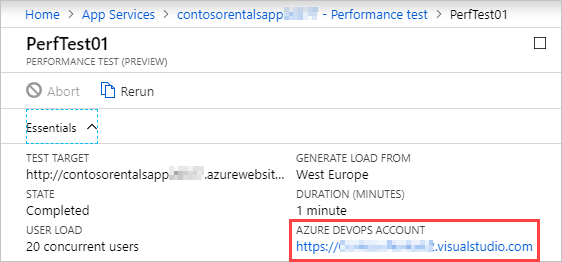

You've run basic tests in the Azure portal for the Contoso Costume Rentals app. Now you want to focus on the additional test criteria available in Azure DevOps to get help as you plan the next phase for the app. For example, you know that your potential customers don't all use the same type of browser or send the same types of page requests.

## Using load tests in Azure DevOps
If you link your Azure DevOps account to your Azure portal load tests, the results from the tests you've run so far will be saved and ready for further use and analysis in the Azure DevOps environment.

By using Azure DevOps, you can:

- Compare the results from multiple test runs.
- Rerun tests and configure new tests that use additional test parameters.

### Viewing tests
To use the Azure DevOps Portal to view tests that you've run from the Azure portal, you open a test, and then, in the **Essentials** section, select the **Azure DevOps Account** link to open a new browser tab. If you used the same sign in details for the Azure portal and Azure DevOps, selecting this link will automatically sign you in to the Azure DevOps Portal.

If this is the first time you've opened the Azure DevOps dashboard to view the tests, you'll need to select your Azure DevOps organization and then create a new project. In any project, the **Load test** section under **Test Plans** will list the test runs that you initiated from the Azure portal:

:::image type="content" source="../media/5-devops-load-test.png" alt-text="Load tests in Azure DevOps." loc-scope="azure-devops":::

>[!NOTE]
>Load tests are organization-level entities and are not linked to particular projects. If you have more than one project, you'll see that each project's Load Tests link points to the same set of load tests.

### Comparing test results

The summary data displayed for each test will look similar to what it looked like in the Azure portal. The Azure DevOps Portal does provide additional charts. To compare the results from two tests, hold the Ctrl key and select both tests, and then select **Compare two runs**. You now get a summary of the results, including a **% change from baseline** column, which indicates how the average response time and requests/sec changed between the two test runs.

:::image type="content" source="../media/5-devops-compare-tests.png" alt-text="Compare tests." loc-scope="azure-devops":::

### Configuring tests in Azure DevOps

The Azure DevOps Portal provides more test options than the Azure portal.

:::image type="content" source="../media/5-devops-configure-test.png" alt-text="Configure tests." loc-scope="azure-devops":::

- **Multiple URLs**. You can configure a test to work with more than one URL. You might, for example, configure a test with your app's home page and add URLs for other key pages, like product details and shopping cart pages.
- **Query strings**. If your app uses query strings, like `?product=sp231`, to pass parameters to your code, you can configure your tests for specific strings. This configuration can be useful if your app uses a database and you want to test the performance of specific database queries.
- **Headers**. HTTP headers are used to pass information in requests and responses. They're used for tasks like authentication and managing cookies. With Azure DevOps, you can configure performance tests with specific header information. For example, imagine that your app supports multiple languages. You could use the `lang` attribute to indicate which HTML elements on a page are in a specific language, and then test for the German language version of a page by using the `Content-Language: de` header.
- **User agents**. User agent strings are typically used to identify the browser that's issuing an HTTP request. They can be used to serve page content that's specific to browser capability. For example, the user agent for Safari on an iPad might be `Mozilla/5.0 (iPad; CPU OS 12_1_1 like Mac OS X) AppleWebKit/605.1.15 (KHTML, like Gecko) Version/12.0 Mobile/15E148 Safari/604.1`. You could specify some or all of this user agent string if you wanted to test for the performance of content designed for mobile browsers.
- **Browser mix**. Your users probably use a range of web browsers. The browser mix option configures a test to simulate a mix of Internet Explorer and Chrome browser strings in the user agent header requests sent to your app. Currently, Azure DevOps provides three mixes:
  - Internet Explorer, 80%; Chrome, 20%
  - Internet Explorer, 60%; Chrome, 40% (default)
  - Internet Explorer, 40%; Chrome, 60%
- **Load pattern**. You can configure your test to use a constant number of virtual users throughout a test, or you can use the step load pattern. When you use a step load pattern, the test will start with a certain number of users and then increase by a selected number during each additional time period. For example, you could start with 10 users and then increment by 10 users every 30 seconds. This option can be useful if you're trying to diagnose problems related to user load or determine the point at which the number of users starts to affect performance.
- **Warm-up duration**. You can specify a period of time between the start of a test run and the start of data recording. You might use this option together with the step load pattern so that test results only start recording when the number of virtual users has reached a certain load level. Setting a warm-up duration might also be useful if you're trying to identify the effect of server-side issues, like caching.

### Using recorded user actions in tests

So far, you've tested with specific URLs and assumed that these URLs reflect your users' typical interactions with your app. But there's another way. You can record all the browser clicks and scrolling from actual user sessions and then use these recordings as a basis for your performance testing. This approach can provide more realistic test results, especially if you can involve real users in the process. To use this approach, you need to record *HAR (HTTP Archive)* files.

To record a HAR file, you need to first configure your browser. For example, in Chrome, you select F12 to open the developer tools, and then, on the **Network** tab, set the recording button to on and select the **Preserve log** box:

:::image type="content" source="../media/5-chrome-devtools-settings.png" alt-text="Record a HAR in Chrome." loc-scope="third-party"::: <!-- product  is Google Chrome, no-loc -->

You can now work through a user scenario. Start from the default URL for your app and then follow the actions that a typical user would perform. In the Contoso Rentals scenario, for example, this might involve browsing for a service, checking terms, conditions, and rental locations, and then placing an order.

To finish the recording in Chrome, open the developer tools and set the recording button to off. In the shortcut menu for the URL list, select **Save as HAR with content**, and then save the file:

:::image type="content" source="../media/5-chrome-save-har-file.png" alt-text="Save HAR file in Chrome." loc-scope="azure-devops":::

To use HAR files in testing, start a new HTTP Archive-based test and import your HAR file. After the import finishes, when you open the test, all the URLs, headers, and QueryString parameters that were saved to the HAR file will be shown:

:::image type="content" source="../media/5-har-test.png" alt-text="Imported HAR file in performance test." loc-scope="azure-devops":::

You then specify the run duration and the geo-location to use and run the test.

In the next unit, you'll open your existing tests in the Azure DevOps Portal and configure new tests that use the extra features available in the Azure DevOps environment.