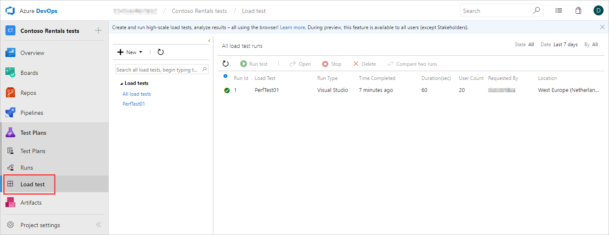
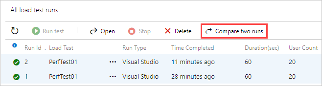
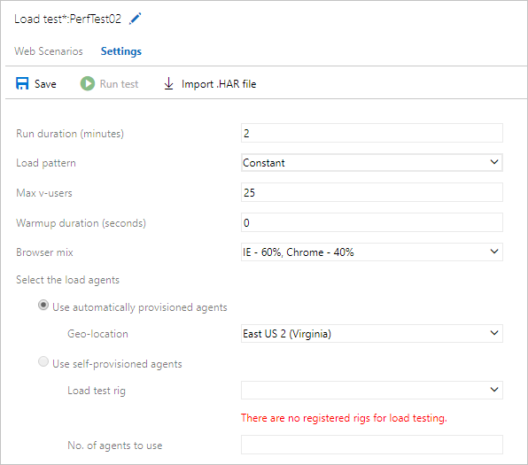
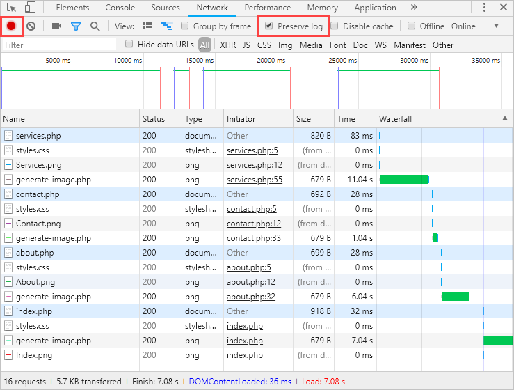
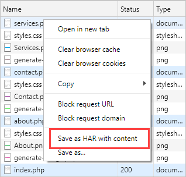
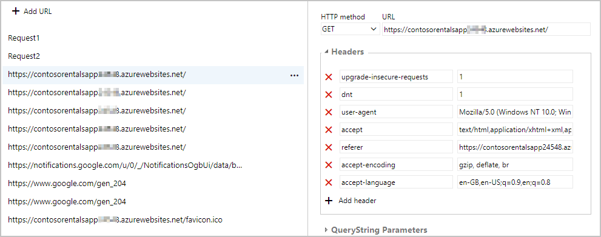

You've run basic tests in the Azure portal for the **Contoso Costume Rentals** app, but now you want to focus on what additional test criteria are available in Azure DevOps to help you as you plan the next phase for the app. For example, you know that your potential customers do not all use the same types of browser, or all send the same types of page requests.

## Using Load tests in Azure DevOps
By linking your Azure DevOps account to your Azure portal load tests, the results from all the tests you've run so far are all saved and ready for further use and analysis in the DevOps environment. 

By using Azure DevOps, you can:

- Compare the results from multiple test runs. 
- Rerun tests, and configure new tests, using additional test parameters. 

### Viewing tests
To use the Azure DevOps Portal to view tests that you've run from the Azure portal, you open a test, then in the **Essentials** section, you click the **Azure DevOps Account** link to open a new browser tab; if you've used the same sign in details for the Azure portal and Azure DevOps, clicking this link will automatically sign you in to Azure DevOps Portal.

If this is the first time that you've opened the Azure DevOps dashboard to view these tests, you'll need to select your Azure DevOps organization, and then create a new project. In any project, the **Load test** section under **Test Plans** will list the test runs that you initiated from the Azure portal.

>[!NOTE]
>Load tests are organization-level entities, and are not linked to particular projects. If you have more than one project, you'll see that each project's "Load Tests" link always points to the same set of load tests.

### Comparing test results
The summary data displayed for each test will be similar to how it is shown in the Azure portal, but the Azure DevOps Portal does provide additional charts. To compare the results from two tests, press `Ctrl`, then click both tests, and then click **Compare two runs**. You now get a summary of the results, including a **% change from baseline** column, which highlights how the average response time and requests/sec have changed between the two test runs. 

### Configuring tests in Azure DevOps
The Azure DevOps Portal provides more test options than the Azure portal.

- **Multiple URLs**. You can configure a test to work with more than one URL; you might, for example, configure a test with your app's home page, and add URLs for other key pages like product details and shopping cart.
- **Query strings**. If your app uses query strings, such as `?product=sp231`, to pass parameters to your code, you can configure your tests for specific strings. This can be useful if your app uses a database, and you'd like to test the performance of specific database queries.
- **Headers**. HTTP Headers are used to pass information in requests and responses, are used for functions such as authentication and managing cookies. With Azure DevOps, you can configure performance tests with specific header information. For example, if your app supports multiple languages, by using the `lang` attribute to indicate which HTML elements on a page are in that language, you could test for the German language version of a page by using the `Content-Language: de` header.
- **User agents**. User agent strings are typically used to identify the browser that is issuing the HTTP request, and can be used to serve page content that is specific to browser capability. For example, the user agent for Safari on an iPad might be `Mozilla/5.0 (iPad; CPU OS 12_1_1 like Mac OS X) AppleWebKit/605.1.15 (KHTML, like Gecko) Version/12.0 Mobile/15E148 Safari/604.1`, so you could specify some or all of this user agent string if you wanted to test for the performance of content designed for mobile browsers.
- **Browser mix**. In the real-world, your users are likely to be using a range of web browsers. The browser mix option configures a test to simulate a mix of Internet Explorer and Chrome browser strings in the user agent header requests sent to your app. Currently, Azure DevOps provide for three mixes:
  - IE - 80%, Chrome 20%
  - IE - 60%, Chrome 40% (default)
  - IE - 40%, Chrome 60%
- **Load pattern**. You can configure your test to use a **constant** number of virtual users throughout the test, or using the **step** load pattern, the test will start with a particular number of users, and then increase by a selected number during each additional time period; for example, start with 10 users, and then increment by 10 more users every 30 seconds. This can be useful if you are trying to diagnose problems related to user load, and to determine the point at which the number of users starts to impact performance. 
- **Warm up duration**. You can specify a period between the start of the test run and the start of data recording. You might use this option together the step load pattern, so that test results only start being recorded when the number of virtual users has reached a certain load level. Setting a warm-up duration might also be useful if you are trying to identify the impact of server-side issues, such as caching.

### Using recorded user actions in tests
So far, you've tested using specific URLs, and made the assumption that these URLs reflect your users' typical interactions with your app. But there is another way - you can record all the browser clicks and scrolling from actual user sessions, and then use these recordings as basis for your performance testing. This approach can provide far more realistic test results, especially if you can involve real users in the process; and to do this, you need to record **HAR (HTTP archive)** files.

To record a HAR file, you need to first configure your browser. For example, in Chrome, you
press **F12** to open the developer tools, and then on the **Network** tab, set the recording button to **on** and select the **Preserve log** checkbox.

You can now work through a user scenario. Start from the default URL for your app and then follow the actions that a typical user would perform. In the Contoso Rentals scenario, for example, this might involve browsing for a service, then checking terms and conditions, rental locations, and then placing an order.

To finish the recording in Chrome, open the developer tools, and then set the recording button to **off**, then in the shortcut menu for the URL list, select **Save as HAR with content**, and save the file.

To use HAR files in testing, start a new **HTTP Archive-based test**. You then import your HAR file, and after the import has completed, you can open the test and all the URLs, Headers, and QueryString Parameters that were saved to the HAR file are shown. 

You then specify the run duration and the geo-location to use, and run the test.

In the next unit, you'll open your existing tests in the Azure DevOps Portal, and configure new tests using the extra features available in the Azure DevOps environment.