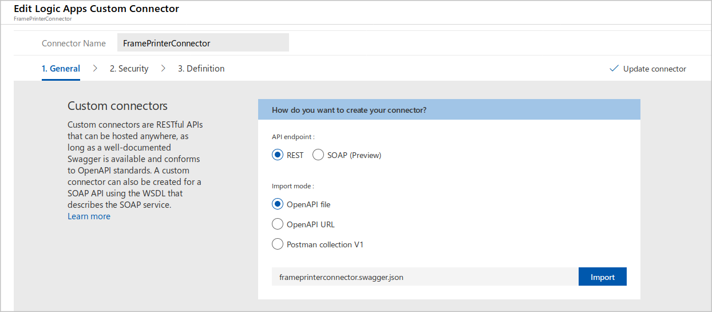

As the lead developer for a print-framing company, you want to call an in-house, custom-built Web API from your workflow in Azure Logic Apps. The API calculates a price for a picture frame based on the dimensions of the frame. To access the API from your Azure Logic Apps workflow, you'll need to create your own connector.

In this unit, you'll learn how to create and use custom connectors in an Azure Logic Apps workflow.

## Why custom connectors?

Sometimes you need more than prebuilt connectors for your workflow scenario. Suppose you have an in-house or custom API that you want to call from your workflow. The out-of-the-box connectors in Azure Logic Apps don't support this scenario. Instead, you have to create a custom connector that describes your API. Define triggers in your connector when you want your workflow to respond to an API event. Define actions in your connector when you want your workflow to make calls to your API.

## Describe a Web API for a custom connector

You can create a custom connector in the Azure portal and reference the target API. Your API must describe itself to the custom connector. That way, the connector can present the right methods and parameters to Azure Logic Apps. In your API, you can implement this description by using an **OpenAPI** definition or a **Postman** collection. Let's examine these two ways to describe an API.

### Postman app

The Postman app requires you to provide the request URL and any necessary authentication. You also specify the API Key and the content type along with the definition for the request body in JSON format. When you send the request from the Postman app, the API returns a response. The Postman app uses the response to generate a collection. You can export and use the collection to describe the API to a custom connector.

### OpenAPI definition

An OpenAPI definition file is a JSON file that lists the API's methods, parameters, and outputs. In .NET, you can create an OpenAPI file by adding the **Swashbuckle** NuGet package to your API's project. Then, add the following code below to the Web API's source code:

1. In the **Startup.cs** file, add a `using` statement for Swashbuckle:

   ```c#
   using Swashbuckle.AspNetCore.Swagger;
   ```

1. Add the following code to the **ConfigureServices** method:

   ```c#
   services.AddSwaggerGen(c =>
   {
      c.SwaggerDoc("v1", new Info { Title = "My API", Version = "v1" });
   });
   ```

1. Add the following code to the **Configure** method:

   ```c#
   // Enable middleware to serve generated Swagger as a JSON endpoint.
   app.UseSwagger();

   // Enable middleware to serve swagger-ui (HTML, JS, CSS, etc.), 
   // specifying the Swagger JSON endpoint.
   app.UseSwaggerUI(c =>
   {
      c.SwaggerEndpoint("/swagger/v1/swagger.json", "My API V1");
   });
   ```

   At deployment, this code installs the Swagger UI, which is a web page you can use to test your Web API methods. The code also generates and publishes a JSON file that describes your API and is compliant with the OpenAPI standard. You can download and use the JSON file to create a custom connector in Azure Logic Apps.

   > [!NOTE]
   > In the previous exercise, you deployed a prebuilt Web API to Azure. By default, this deployment included the preceding Swagger code. In the next exercise, you'll upload the Swagger-created OpenAPI file to the custom connector.

## Create a custom connector in the Azure portal

After you implement your description as a Postman collection or OpenAPI definition file, you can build your custom connector in the Azure portal with these high-level steps:

1. Create a new Azure resource using the **Logic Apps Custom Connector** resource type.

1. Upload the Postman collection or OpenAPI definition file.

   

1. Follow the setup wizard prompts to finish creating the connector.

   For example, you can specify the connector's name that developers see in the workflow designer. You can add descriptions to help developers to configure secure connections and correctly use the connector.

1. Save your new connector.

When you're done, you can use the connector in your Azure Logic Apps workflow. The next exercise shows you how to create your own connector.
