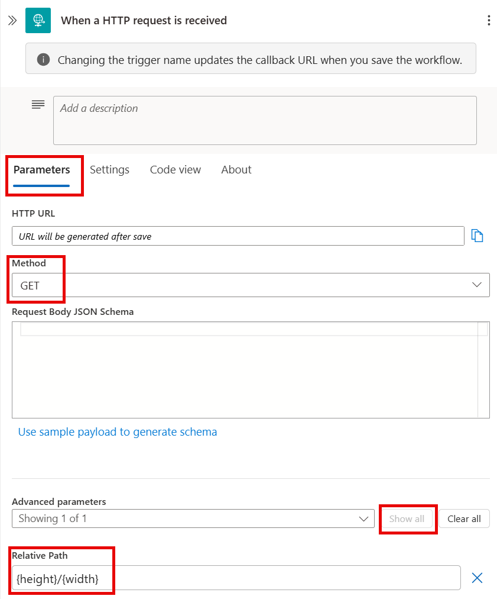
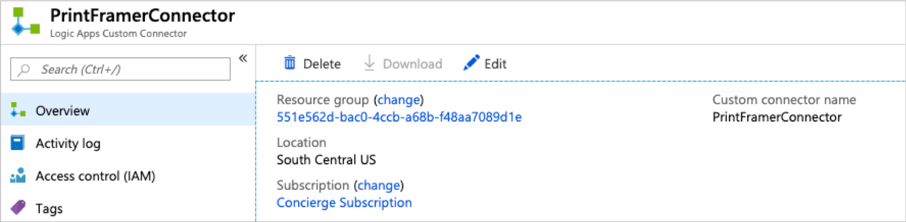
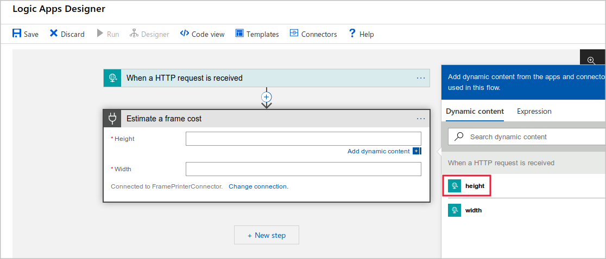
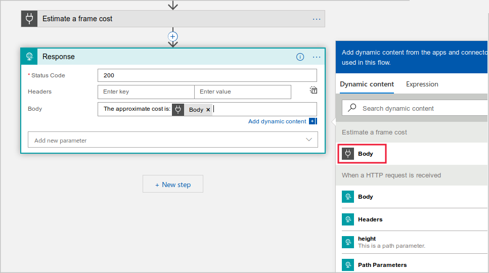

You have a Web API called Print Framer API that calculates a cost for a picture frame based on the dimensions you send to it. Developers throughout your company want to use this in their Logic Apps, but there is currently no way to make that connection.

In this exercise, you'll create a custom connector for the Print Framer API and use it to send and receive data from a Logic App to a Web API. First, we need a Logic App.

## Create a Logic App

1. In the [Azure portal](https://portal.azure.com/learn.docs.microsoft.com?azure-portal=true), select **Create a resource > Web > Logic App**.
1. In the **Logic App** window, enter the following settings, and then select **Create**:

    | Setting | Value |
    | --- | --- |
    | Name | Choose a unique name. Make a note of it, you'll need it later on. |
    | Subscription | *Concierge Subscription* |
    | Resource group | Select *Use existing* and choose *<rgn>Sandbox resource group </rgn>* |
    | Location | Select a region near you, that is also in the sandbox region listed below. |
    | Log Analytics | Off |
    | | |

    [!include]

1. When the Logic App has been created, select **All resources** and then select the Logic App. The Azure portal opens the designer for the Logic App.
1. Under **Start with a common trigger**, select **When an HTTP request is received**.
1. Select **Add a new parameter**, then **Method**, and then in the **Method** drop-down list, select **GET**.
1. Once again, select **Add a new parameter**, then **Relative path**, and then in the **Relative path** field, type `{height}/{width}`.

    

1. In the **Logic Apps Designer**, select **Save**.

We now have a basic Logic App. Let's add a custom connector so that we can call our custom PrintFramer API from our workflow.

## Create a new custom Logic Apps connector in the Azure portal

1. In the [Azure portal](https://portal.azure.com/learn.docs.microsoft.com?azure-portal=true), select **Create a resource**.
1. In the **Search the marketplace** textbox, type **Logic Apps Custom Connector**, select **Logic Apps Custom Connector**, and then **Create**.
1. In the **Logic App Custom Connector** window, enter the following settings, and then select **Create**:

    | Setting | Value |
    | --- | --- |
    | Name | PrintFramerConnector |
    | Subscription | *Concierge Subscription* |
    | Resource group | Select *Use existing* and choose *<rgn>Sandbox resource group </rgn>* |
    | Location | Select a region near you, that is also in the list of regions supported by the sandbox. |
    | | |

## Import the OpenAPI definition

Now let's use the OpenAPI file we saved early to define custom connector:

1. In the [Azure portal](https://portal.azure.com/learn.docs.microsoft.com?azure-portal=true), select **All resources** and then select **PrintFramerConnector**.
1. On the **Overview** page, select **Edit**.

    

1. In the **Custom connectors** section, select **OpenAPI file** and then  **Import**. Open the JSON file you saved in the last exercise.

## Configure the custom connector

The OpenAPI file tells the custom connector about the operations that are available in the Web API. There are a few other properties we must set for the custom connector:

1. In the **General Information** section, in the **Description** box, type **Obtain an estimate for a picture frame**. You might have to scroll down to see this part of the configuration page.
1. In the **Host** textbox, type the URL you noted earlier.
1. On the **Security** page, ensure the **No Authentication** is selected.

    > [!IMPORTANT]
    > For this demonstration, it's OK to allow access to the API without any authentication. For real-world APIs, which contain sensitive data or require a paid subscription, authentication is essential.

1. On the **Definition** page, in the **Summary** textbox, type **Estimate the cost of a picture frame.**.
1. Under **Visibility**, select **Important**.
1. At the top of the page, select **Update connector**.

## Add the custom connector to our Logic App

Now, you can add the custom connector to our Logic App.

1. In the [Azure portal](https://portal.azure.com/learn.docs.microsoft.com?azure-portal=true), select **All resources** and then click the Logic App that you created in unit 3.
1. In the Logic App resource page, select **Edit** and then select **+ New Step**.
1. In the **Choose an action** box, select the **Custom** tab, and then select **PrintFramerConnector**.
1. Under **Actions** select **Estimate the cost of a picture frame**.
1. In the **Estimate the cost of a picture frame** box, select the **Height** field, and then, select **height** from the **Dynamic content** panel on the right. The following screenshot illustrates this selection.

    

1. Select  **Width** field, and then, under **Dynamic content** select **width**.

The height and width parameters that we receive from each HTTP request that triggers our Logic App are now bound to the height and width parameters we pass to the PrintFramerConnector.

## Complete the Logic App

The final thing to add to the Logic App is something to display the results. Let's use an HTTP response to show the estimate to the user:

1. In the Logic App designer, click **+ New Step**.
1. In the **Search connectors and actions** textbox, type **Response**, and then select the **Response** action.
1. In the **Body** textbox, type "**The approximate cost of your frame is:$**".
1. In the **Dynamic content** pane to the right, select **Body** from the **Estimate the cost of a picture frame** section. This selection is illustrated in the following screenshot.

    

1. Save your changes by selecting **Save** at the top of the Logic Apps designer.

## Test the Logic App

The Logic App is now complete, and will call the Web API through the custom connector. All you have to do is make a request to the Logic App, by using the browser:

1. In the Logic Apps designer, expand the **When an HTTP request is received** box.
1. To the right of the **HTTP GET URL** textbox, click the **Copy URL** button.
1. Open a new browser tab and paste the URL into the address bar. 
1. In the pasted URL, replace the **{height}** parameter with **10**, and the **{width}** parameter with **4** and then press Enter. The page displays an approximate cost.
1. Try entering other heights and widths.

Congratulations! You've created a Logic Apps workflow that can call your in-hour PrintFramerAPi through a custom connector!
