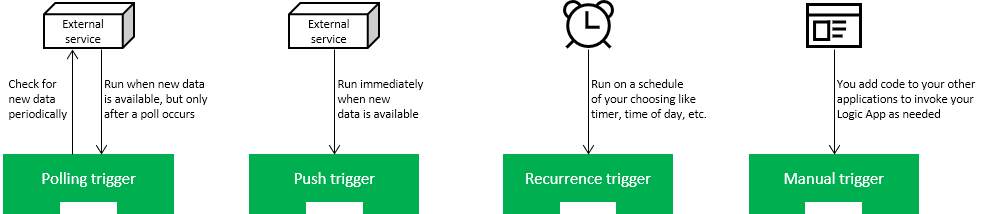
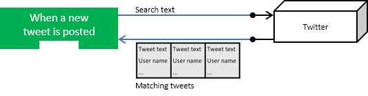
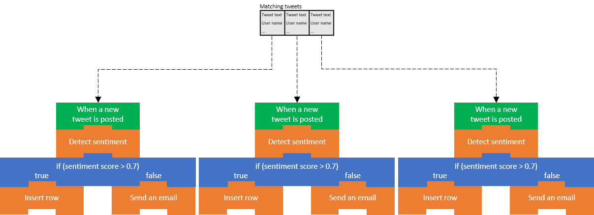

A trigger gets your Logic App started. Your job is to find the best one and configure it so your app launches when conditions are right without wasting time or money. For example, in the shoe-company scenario we would use a Twitter trigger to launch our app when tweets containing our product name are available.

In this unit, we'll examine the types of triggers and the strengths and weaknesses of the two most common options. We'll see how to create a Logic App using the Azure portal and how to add a trigger using the Logic Apps Designer.

## Trigger types

Think about the different conditions that businesses might use to launch their Logic Apps. Most of the examples we've seen are in the *data becomes available* category. For example, a new tweet is posted, a new row is inserted into a database, a new email arrives, or a new file is uploaded to your cloud storage. This category doesn't cover all cases though. Suppose you wanted to launch your Logic App every Saturday at midnight? This trigger would be great for administrative tasks like running backups or archiving old data. Logic Apps provides a built-in *recurrence* trigger to help you do exactly this type of thing. Finally, suppose you wanted total control? Imagine you need to launch your Logic App using code in your web or mobile applications? This operation is supported by the built-in *manual request* trigger.

This discussion shows that we have three broad categories of triggers: data, time, and manual. Data triggers use two different techniques to detect that new data is available: some use polling and some rely on the external service to push a notification. These two types of data triggers are so different, that we should think of them as separate categories. Altogether, we have four types of triggers, the following illustration shows a summary of the cases.

In this module, we're going to focus on the *data becomes available* style of trigger. These triggers are the most common and are perfect for the "route and process data" scenarios that we've been discussing.

## What is a polling trigger?

A *polling trigger* checks an external service for new data at a specified interval. For example, the trigger that looks for new posts in an RSS feed is implemented using polling.

When you create a polling trigger, you must provide a *Frequency* and an *Interval* to specify how often the trigger will run. The frequency is the unit of measurement and has values like *Second*, *Minute*, and *Hour*. Interval is a number that represents how often to execute with respect to the frequency. For example, a polling trigger with a frequency of *Minute* and an interval of *5* would run every five minutes.

Polling triggers force you to make a choice between how much they cost and how quickly they respond to new data. The following illustration that shows the gap between when new data becomes available and when that data is detected by the app.

In the worst case, the potential delay for detecting new data is equal to the polling interval. So why not use a smaller interval? To check for new data, the Logic Apps execution engine needs to run your app, which means you incur a cost. In general, the shorter the interval, the higher the cost but the quicker you respond to new data. The best polling interval for your Logic App depends on your business process and its tolerance for delay.

## What is a push trigger?

A *push trigger* subscribes to an event offered by the external service to receive a notification immediately when data is available. For example, the trigger that detects when a message is added to an Azure Service Bus queue is a push trigger.

> [!NOTE]
> Push triggers are implemented using Webhooks. The Logic Apps infrastructure generates a callback URL for you and registers it with the external service. This registration happens when you first create your app and again when you make changes to your app's configuration. Similarly, Logic Apps de-register the callback for you as needed; for example, if you disable or delete your app.

The nice thing about push triggers is that they don't incur any costs polling for data when there's none available. They also respond immediately when new data is ready. The following illustration shows how there's no delay between the point when the data is available and the time when the Logic App becomes aware of the new data.

If push triggers respond more quickly and cost less than polling triggers, then why not use them all the time? The reason is that not every connector offers a push trigger. Sometimes the trigger author chose not to implement push and sometimes the external service didn't support push. Generally, you'll find a connector offers either push or polling triggers but not both. In the rare cases where both options are available, consider using the push trigger because it should be more efficient.

## Trigger parameters and return values

Think about how Twitter works. At any given moment, there could be millions of new tweets. Our goal is to retrieve only the tweets that are about our product. How do we tell our Logic App to only look for tweets that contain our product name? Once it finds matching tweets, how do we access the tweets it detected? The answers to these questions are trigger parameters and trigger return values.

Trigger *parameters* are values that we give to the trigger for it to use during execution. Some parameters are required, and some are optional. For example, the Twitter "When a new tweet is posted" trigger has a required parameter called **Search text**. The SQL Server "When an item is created" trigger has one required parameter called **Table name** and several optional parameters like **Order By** and **Select Query**.

Trigger *return values* are data values that your Logic App receives after the trigger has executed. Trigger return values can either be single values or collections. For example, the Bitbucket "When a pull request is merged" trigger returns a single object that tells you the identity of the **PR**, the **Repository**, and the **Actor** who approved the merge. The Twitter "When a new tweet is posted" trigger returns an array of **TweetModel** objects, each containing values like **Tweet text**, **User name**, **Location**, and **Followers count**. The following illustration shows a collection being returned from a trigger.

You can use a loop to process each item or you can ask the trigger to split the array up for you. The default behavior for most triggers, including the Twitter trigger, is to automatically split the array. The Logic Apps execution engine will create one instance of your Logic App for each data item and the instances will run in parallel. The following illustration shows how each item in the returned array is sent to a different instance of the Logic App.

<!-- 
> [!NOTE]
> Since the size of a returned array can be large, there are limits on the number of instances that can run concurrently. By default, the maximum number of concurrent instances for array elements is 20, however, in your Logic App settings you can change this to a maximum of 50. If your returned array contains more elements than the maximum, the remaining items are queued and will run as instances finish.
-->

## How to create a Logic App in the Azure portal

You can use the Azure portal to create a Logic App. You select the **Logic App** resource type and enter the standard resource properties **Name**, **Subscription**, **Resource group**, and **Location**. After deployment completes, you can navigate to the Logic App resource.

The Logic Apps team has created several *templates* for common applications types. For example, there are templates for apps like "Post to Slack if a new tweet matches with some hashtag" and "Get daily reminders emailed to you".

When you first navigate to your newly deployed Logic App, you'll find a getting-started page that can add a common trigger to your app or generate an entire app for you from one of the templates. If any of these templates matches what you're working on, they can save you some time in getting your app set up. To do all the work yourself, there's also a **Blank Logic App** template.

After you select a starting template, you'll automatically navigate to the Logic Apps Designer.

## What is the Logic Apps Designer?

The Logic Apps Designer is a graphical tool for creating your workflows. It lets you pick from a gallery of connectors that contain the triggers and actions you can use in your app. We will use Twitter's **When a new tweet is posted** trigger and set the **Search text**, **Frequency**, and **Interval** parameters. The following screenshot shows the social-media monitor Logic App displayed in the Designer; notice that it begins with the Twitter trigger.

