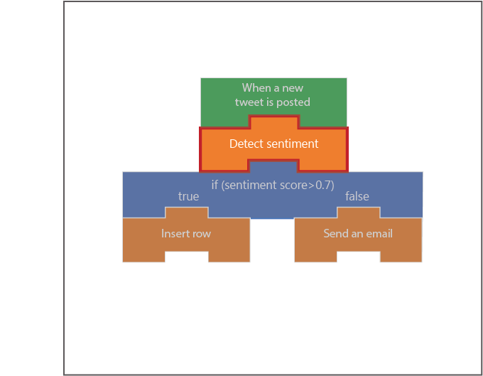

In this unit, we're going to take the tweets that were detected by the Twitter trigger and analyze the sentiment of them. We will create a Detect Sentiment action which will provide us a *Score* that represents the tone of the tweet.

## Generate Detect Sentiment API key

[Intro text]

1. In a new browser tab, navigate to **https://azure.microsoft.com/en-us/try/cognitive-services/**.

1. Select the **Language APIs** tab.

1. Select **Get API Key** in the Text Analytics section.

1. In the Guest section, select **Get started**.

1. Select the checkbox that states that you agree that the free trial is governed by the Microsoft Online Subscription Agreement.

1. Select your **Country / Region**.

1. Select the **I accept** checkbox.

1. Click **Next**.

1. Sign-in with your preferred account.

1. In the **Your APIs** section, locate your Text Analytics api key and endpoint address.

1. Save your api key and endpoint address in a text document because we'll need to use it later.

## Create a Detect Sentiment action

[Intro text]

1. Return to the Logic App designer by selecting **Logic app designer** under the Development Tools section of the left navigation bar.

1. Under the Twitter trigger, click **New step**.

1. In the **Search connectors and actions** search box, type "Text analytics".

1. Select the **Text Analytics** connector.

1. In the Actions section, select **Detect Sentiment**.

1. In the Connection Name field, type **CognitiveServicesConnection**.

1. Paste your saved api key in the **Account Key** field and your saved endpoint address in the **Site URL** field.

1. Click **Create**.

## Configure Detect Sentiment

[Intro text]

1. Select the **Text** field in the Detect Sentiment action.

1. In the Dynamic content popup, select **Original tweet text**.

1. Click **Save** in the Logic App designer.

1. In the left navigation bar, select **Overview**.

## Examine results of Detect Sentiment

[Intro text]

1. Click **Refresh** once a minute until you see a row item in the **Runs history** table.
    > [!NOTE]
    > Each item in the **Runs history** table represents a separate tweet that contained the name of the product you entered in the **Search text**.

1. Once you see a row item appear, select the item.

1. Select the Detect Sentiment action.

1. At this point you can see the text of the tweet and the score that was given to it by the Cognitive Services engine.

