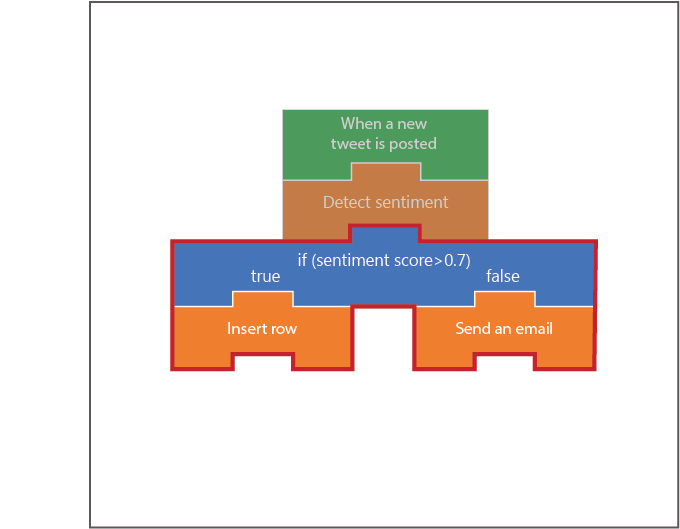

In this unit, 

## Create a Condition control action

1. Return to the Logic App designer by selecting **Logic app designer** under the Development Tools section of the left navigation bar.

1. Under the Detect Sentiment action, click **New step**.

1. In the **Search connectors and actions** search box, type "control".

1. Select the **Control** connector.

1. In the Actions section, select **Condition**.

## Configure Condition control action

Now that we have a Condition control action created, we need to specify what the condition is. Remember that the Detect Sentiment action returns a *Score* which is a number between zero and one. If the number is greater than .5 we'll consider the tweet positive, otherwise it'll be negative.

1. In the Condition action, select the leftmost **Choose a value** field.

1. In the Dynamic content popup, select **Score**.

1. Expand the drop-down menu that currently says **is equal to**.

1. Select **is greater than**.

1. Type **.5** in the rightmost Choose a value field.

## Create a SQL Server and database in Azure

1. Select **Create a resource** in the left navigation bar.

1. In the Search the Marketplace field, type **sql**.

1. Select **SQL Database**.

1. Click **Create**.

1. Enter **PositiveTweetDatabase** in the Database name field.

1. Select a **Subscription** where you would like the Logic App hosted.

1. Select the existing **Resource group** <rgn>[sandbox resource group name]</rgn>.

1. Make sure the Select source field is set to **Blank database**.

1. Select **Server**.

1. Select **Create a new server**.

1. Enter a globally unique name in the **Server name** field.

1. Enter a username in the **Server admin login** field.

1. Enter a password in the **Password** and **Confirm password** fields.

1. Select a **Location** from the available list below.

    [!include]

1. Make sure the **Allow Azure services to access server** checkbox is checked.

1. Set Advanced Threat Protection to **Not now**.

1. Click **Select**.

1. Select **Not now** for Want to use SQL elastic pool.

1. Select **Pricing tier**.

1. Select **Basic**.

1. Click **Apply**.

1. Click **Create**.

1. Once the SQL Server and database are created, select the SQL database in your <rgn>[sandbox resource group name]</rgn> resource group.

1. In the left navigation bar, select **Query editor**.

1. Login using the **Server admin login** and **Password** that you picked when creating the database.

1. Click **OK**.

1. In the **Query 1** tab, paste the following code.

    CREATE TABLE dbo.Mentions
    (
      id INT IDENTITY(1, 1) NOT NULL PRIMARY KEY,
      Content NVARCHAR(500) NULL,
      Source  NVARCHAR(500) NULL
    );

1. Click **Run**.

1. Without saving the query, return to the Logic App designer. 

## Save positive sentiment tweets in SQL database

1. In the If true section of the Condition action, select **Add an action**.

1. In the Search connectors and actions field, type **SQL**.

1. Select **SQL Server**.

1. Select **Insert row**.

1. Type **SQLConnection** in the Connection Name field.

1. Select the SQL Server that you created earlier.

1. Select the SQL Database that you created earlier.

1. Enter the **Server admin login** and **Password** that you picked when creating the database.

1. Click **Create**.

1. Select the table **Mentions** from the Name of table drop-down list.

1. Select the **Content** field.

1. In the Dynamic content popup, select **Original tweet text**.

1. Select the **Source** field.

1. In the Dynamic content popup, select **Original tweet tweeted by**.

1. Click **Save**.

## Email negative sentiment tweets to customer support

1. In the If false section of the Condition action, select **Add an action**.

1. In the Search connectors and actions field, type **Outlook**.

1. Select **Outlook.com**.

1. Select **Send an email**.

1. Click **Sign in**.

1. Sign in using a Microsoft account. If you don't have an account, you can create one now.

1. Click **Yes** to agree to let your Logic App access your email information.

1. In the To field, enter a valid email address. 

1. In the Subject field, type **Negative tweet detected from** and then in the Dynamic content popup select **Original tweet tweeted by**.

1. In the Body field, type **Contents of tweet:** and then in the Dynamic content popup select **Original tweet text**.

1. Click **Save**.

## Examine results of positive sentiment tweets

1. Return to your SQL database.

1. In the left navigation bar, select **Query editor**.

1. Login using the **Server admin login** and **Password** that you picked when creating the database.

1. Click **OK**.

1. Click **Edit Data (Preview)** on the top navigation bar.

1. Select the checkbox to agree that this feature is in preview.

1. Click **OK**.

1. Click **Refresh** every few minutes until a row is inserted into the database.

## Examine results of negative sentiment tweets

1. Logon to the email that you provided in the Outlook action.

1. Refresh the page every few minutes until a row is inserted into the database.

