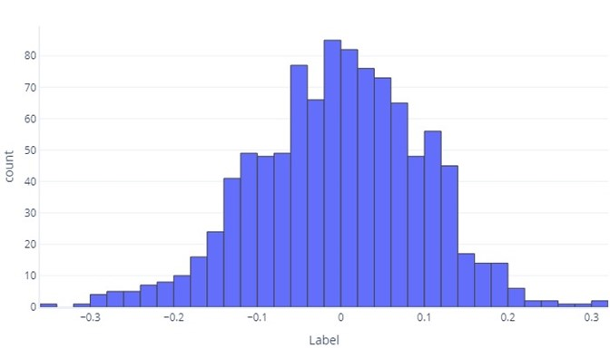
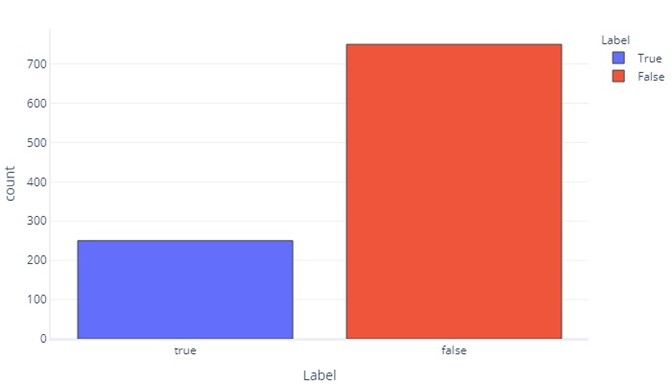
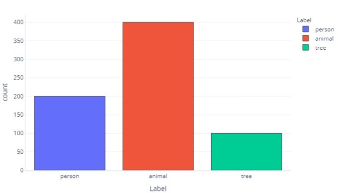
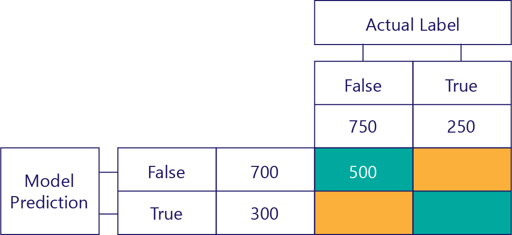
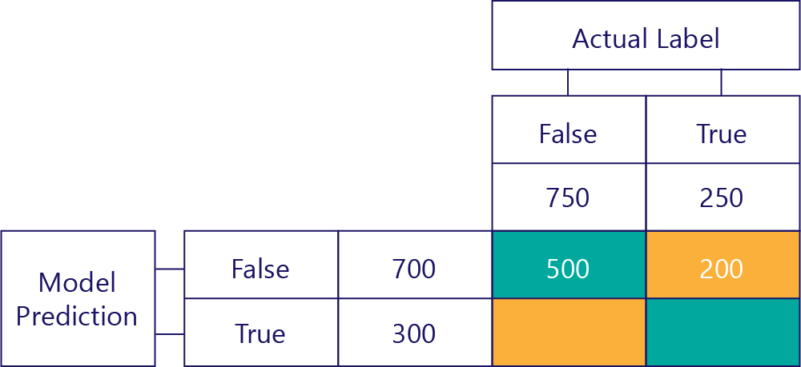
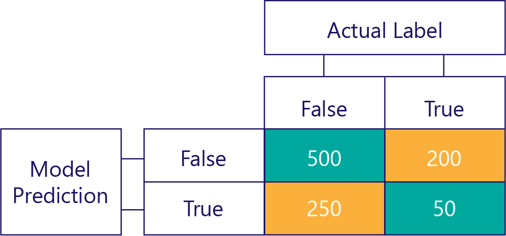
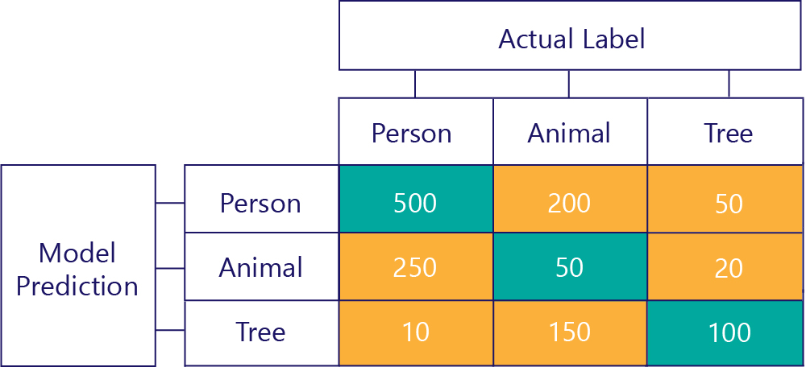

You can think of data as continuous, categorical, or ordinal (categorical but with an order). Confusion matrices are a means of assessing how well a categorical model performs. For context as to how these work, let’s first refresh our knowledge about continuous data. Through this, we can see how confusion matrices are simply an extension of the histograms we already know.

## Continuous data distributions

When we want to understand continuous data, the first step is often to see how it's distributed. Consider the following histogram:

We can see that the label is, on average, about zero, and most datapoints fall between -1 and 1. It appears as symmetrical; there are an approximately even count of numbers smaller and larger than the mean. If we wanted, we could use a table rather than a histogram, but it could be unwieldy.

## Categorical data distributions

In some respects, categorical data aren't so different from continuous data. We can still produce histograms to assess how commonly values appear for each label. For example, a binary label (true/false) might appear with frequency like so:

This tells us that there are 750 samples with "false" as a label, and 250 with "true" as the label.

A label for three categories is similar:

This tells us that there are 200 samples that are "person", 400 that are "animal", and 100 that are "tree".

As categorical labels are simpler, we can often show these as simple tables. The two preceding graphs would appear like so:

| Label      | False       |  True      |
|------------|-------------|------------|
| Count      | 750         | 250        |

And:

| Label      | Person     |  Animal    |  Tree      |
|------------|------------|------------|------------|
| Count      | 200        | 400        |  100       |

## Looking at predictions

We can look at predictions that the model makes just like we look at the ground-truth labels in our data. For example, we might see that in the test set our model predicted "false" 700 times and "true" 300 times.

| Model Prediction | Count |
|------------|-------------|
| False      | 700         |
| True       | 300         |

This provides direct information about the predictions our model is making, but it doesn’t tell us which of these are correct. While we can use a cost function to understand how often the correct responses are given, the cost function won't tell us which kinds of errors are being made. For example, the model might correctly guess all "true" values, but also guess "true" when it should have guessed "false".

## The confusion matrix

The key to understanding the model performance is to combine the table for model prediction with the table for ground-truth data labels:

The square we haven't filled out is called the confusion matrix.

Each cell in the confusion matrix tells us one thing about the model’s performance. These are True Negatives (TN), False Negatives (FN), False Positives (FP) and True Positives (TP).

Let’s explain these one by one, replacing these acronyms with actual values. Blue-green squares mean the model made a correct prediction, and orange squares mean the model made an incorrect prediction.

### True Negatives (TN)

The top-left value will list how many times the model predicted false, and the actual label was also false. In other words, this lists how many times the model correctly predicted false. Let’s say, for our example, that this happened 500 times:

### False Negatives (FN)

The top-right value tells us how many times the model predicted false, but the actual label was true. We know now that this is 200. How? Because the model predicted false 700 times, and 500 of those times it did so correctly. Thus, 200 times it must have predicted false when it shouldn't have.

### False Positives (FP)

The bottom-left value holds false positives. This tells us how many times the model predicted true, but the actual label was false. We know now that this is 250, because there were 750 times that the correct answer was false. 500 of these times appear in the top-left cell (TN):

### True Positives (TP)

Finally, we have true positives. This is the number of times that the model correctly prediction of true. We know that this is 50 for two reasons. Firstly, the model predicted true 300 times, but 250 times it was incorrect (bottom-left cell). Secondly, there were 250 times that true was the correct answer, but 200 times the model predicted false.

### The final matrix

We normally simplify our confusion matrix slightly, like so:

We’ve colored the cells here to highlight when the model made correct predictions. From this, we know not only how often the model made certain types of predictions, but also how often those predictions were correct or incorrect.

Confusion matrices can also be constructed when there are more labels. For example, for our person/ animal/tree example, we might get a matrix like so:

When there are three categories, metrics like True Positives no longer apply, but we can still see exactly how often the model made certain kinds of mistakes. For example, we can see that the model predicted that "person" 200 times when the actual correct result was "animal".
