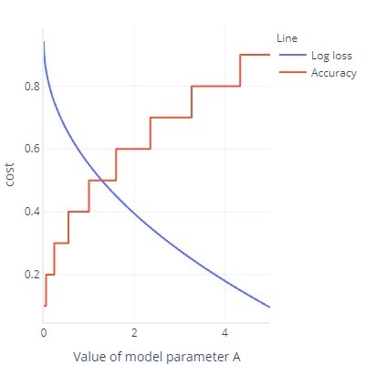

In the past few units, we’ve started to see a divide in cost functions – which teach the model – and evaluation metrics – which is how we assess the model ourselves.

## All cost functions can be evaluation metrics

All cost functions can be evaluation metrics, though not necessarily intuitive ones.
Log loss as example. Values aren't intuitive.

## Some evaluation metrics cannot be cost functions

- It is difficult for some evaluation metrics to become cost functions.
- This is due to practical and mathematical constraints.
- Sometimes things aren't easy to calculate (for example “how doggy something is”)
- Cost functions are ideally smooth. for example, accuracy is useful, but if we change our model slightly, it won’t notice it. Given that fitting is a procedure with lots of small changes, this gives the impression that alterations will not lead to improvement.
- Cost function graph with lots of flat bits
- Refresh on ROC curves from earlier. This requires changing the threshold to all sorts of values but at the end of the day, our model will only have one (0.5)

## It’s not all bad!

It can be frustrating to find that we can’t use out favorite metrics as a cost function. There is an upside, however, which is related to the fact all metrics are simplifications of what we want to achieve; none are perfect. What this means is that complex models often ‘cheat’: they find a way to get low costs without actually finding a general rule that solves our problem. Having a metric that isn't acting as the cost function gives us a ‘sanity check’ that the model has not found a way to cheat. If we know a model is taking shortcuts, we can rethink our training strategy.

We’ve seen this ‘cheating’ a few times now. For example, when models strongly overfit the training data, they are essentially ‘memorizing’ the correct answers rather than finding a general rule that we can apply successfully to other data. We use test datasets as our ‘sanity check’ to assess to check that the model has not just done this. We’ve also seen that with unbalanced data, models can sometimes just learn to always give the same response (such as ‘false’) without looking at the features, because on average this is correct and gives a small error.

Complex models find shortcuts other ways, too. Complex models can sometimes overfit the cost function itself. For example, imagine we are trying to build a model that can draw dogs. We have a cost function that checks that the image is brown, shows a furry texture, and contains an object about the right size. With this cost function, a complex model might learn to create a brown fur ball, not because it looks like a dog, but because it gives a low cost and is easy to generate. If we have an external metric that counts the number of legs and heads (which cannot be easily used as a cost function because these aren't smooth metrics) we will notice quickly if our model is cheating, and rethink how we are training it. By contrast, if our alternative metric scores well, we can have some confidence that the model has grasped the idea of what a dog should look like, rather than just tricking the cost function into getting a low value.
