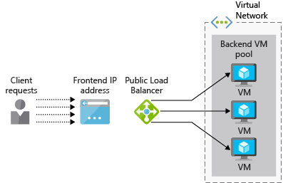

Your company wants to see if Azure Load Balancer will support your Enterprise Resource Planning (ERP) application. Your application has a web interface for users and runs on multiple web servers. Each server has a local copy of the ERP database, which is synced across all servers.

Here, you will look at how a load balancer can help provide high availability of services. You will identify the difference between the basic and standard load balancer options and see how to create a load balancer for Azure Virtual Machines.

## What is load balancing?

_Load balancing_ describes various techniques for distributing workloads across multiple devices, such as compute, storage, and networking devices. The goal of load balancing is to optimize the use of multiple resources, to make the most efficient use of these resources as an infrastructure is scaled out, and to ensure services are maintained if some components are unavailable.

Here, we'll look at Azure's load balancing support for virtual machines (VMs).

### What is high availability?

High availability (HA) measures the ability of an application or service to remain accessible despite a failure in any system component. Ideally, there will not be any noticeable loss of service.

Load balancing is fundamental to the delivery of HA because it allows multiple VMs to act as a pool of servers. The pool can continue to service requests even if some VMs crash or are taken offline for maintenance.

## What is Azure Load Balancer?

**Azure Load Balancer** is an Azure service that distributes incoming requests across multiple VMs in a pool. It distributes incoming network traffic across a set of healthy VMs and avoids any VM that is not able to respond.

 Azure Load Balancer operates at Layer-4 (TCP, UDP) of the OSI 7-layer model. It can be configured to support TCP and UDP application scenarios where the traffic is inbound to Azure VMs, as well as outbound scenarios where other Azure services are passing TCP and UDP traffic out through Azure VMs to external endpoints.

#### What is a Load Balancer?

> [!VIDEO https://www.microsoft.com/videoplayer/embed/RE2yBWo]

## Public vs. internal load balancers

An Azure Load Balancer can be either _public_ or _internal_ depending on the source of incoming requests.

A **public load balancer** handles client requests from outside the Azure infrastructure. The public IP address is assigned to the load balancer and it routes the inbound requests to a set of resources that are on a private virtual network. This approach is commonly used for making web servers highly available. The following illustration shows a public load balancer.

An **internal load balancer** processes requests from within a virtual network (or through a VPN). It distributes requests to resources within that virtual network. The load balancer, front-end IP addresses, and virtual networks are not directly accessible from the Internet. The following illustration shows an architecture containing both a public and internal load balancer. The public load balancer handles external requests while the internal load balancer forwards the requests to the internal VMs and databases for processing.

## How does Azure Load Balancer work?

Azure Load Balancer uses information configured in _rules_ and _health probes_ to determine how inbound traffic that is received on the load balancer _front end_ is distributed to VM instances in a _backend address pool_. Let's examine each of these components.

### What is the load balancer front end?

The load balancer front end is an IP configuration, containing one or more public IP addresses, that enables access to the load balancer and its applications over the Internet.

### What is the backend address pool?

Virtual machines connect to a load balancer using their virtual network interface (vNIC). The backend address pool contains the IP addresses of the vNICs that are connected to the load balancer. If you place all your VMs in an availability set, you can use this to easily add your VMs to a backend pool when you're configuring the load balancer.

### What is a health probe?

Load balancers use _health probes_ to determine which virtual machines can service requests. The load balancer will only distribute traffic to VMs that are available and operational.

A health probe monitors specific ports on each VM. You can define what type of response corresponds to "health"; for example, you might require an `HTTP 200 Available` response from a web application. By default, a VM will be marked as "unavailable" after two consecutive failures at 15-second intervals.

### Load balancer rules

Load balancer _rules_ define how traffic is distributed to backend VMs. The goal is to distribute requests fairly across the healthy VMs in the backend pool.

Azure Load Balancer uses a hash-based algorithm to rewrite the headers of inbound packets. By default, Load Balancer creates a hash from:

- Source IP address
- Source port
- Destination IP address
- Destination port
- IP protocol number

This mechanism ensures that all packets within a packet client flow are sent to the same backend VM instance. A new flow from a client will use a different randomly allocated source port. This means that the hash will change, and the load balancer may send this flow to a different backend endpoint.

## Basic vs. Standard Load Balancer SKUs

There are two versions of Azure Load Balancer: **Basic** and **Standard**. They differ in scale, features, and pricing. For example:

- Standard supports secure traffic routing over HTTPS.
- Backend pool size can be much larger in Standard (1000 vs. 100 in the Basic SKU).
- Traffic can be directed to a larger pool of endpoints, including blends of scale sets, availability sets, and VMs. The Basic SKU  is restricted to a single availability set, scale set, or VM.
- Support for High Availability (HA) ports to load-balance TCP and UDP flows on all ports simultaneously when you're using it as an internal load balancer.
- Basic is no-cost, while Standard is charged based on rules and throughput.

Standard is a superset of Basic, so any scenario suitable for Basic should also work on Standard. The Basic SKU is generally intended for prototyping and testing while Standard is recommended for production.

## Start the deployment of a basic public load balancer

To create a load-balanced VM system, you need to create the load balancer itself, create a virtual network to contain your virtual machines, and then add VMs to the virtual network.

To create the load balancer using the Azure portal, you define the following:

- Load balancer name
- Type: public or internal
- SKU: Basic or Standard
- Public IP address: dynamic or static
- Resource group and location

Your backend VMs will all be connected to the same virtual network, so you need to configure this resource next:

- Virtual network name
- Address space to use, such as 172.20.0.0/16
- Resource group
- Name for the subnet to use
- Address space for the subnet (must be within the main space), such as 172.20.0.0/24

Since we expect inbound traffic, we'll have to create some network security rules using a network security group (NSG). In this case, we'll want to open port 80 for HTTP traffic.

Finally, we then need to create and deploy the virtual machines and configure them to use your virtual network. We will also create an availability set to group them together. Availability sets define the level of fault tolerance across a group of VMs, but for load balancing, they also help you assign your VMs to backend pools.

You have now seen how to use Azure Load Balancer as part of a high-availability solution. Next, you will use these steps to deploy your own load balancer.