Recall that you work for Woodgrove Bank, and that you are about to launch online banking services. This sector is highly competitive, so you need to guarantee of a minimum of 99.99% service availability. You have determined that Azure Load Balancer with a pool of three virtual machines will meet this goal.

In this exercise, you will create a load balancer and a virtual network using the Azure portal. Since we only need one of these, the portal is an easy way to create it.

[!include]

## Create a public load balancer

1. Sign into the [Azure portal](https://portal.azure.com/learn.docs.microsoft.com?azure-portal=true) using the same account you activated the sandbox with.

1. In the sidebar, click **Create a resource**.

1. Select the **Networking** section, and then click **Load Balancer**. If you don't see that choice, you can use the search box.

    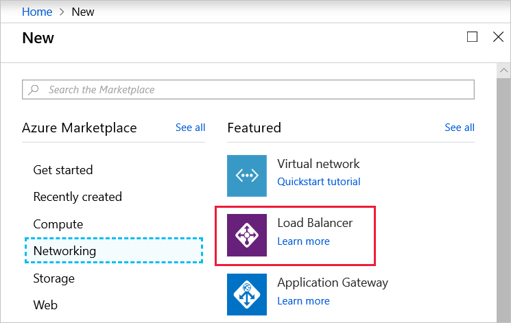

1. In the **Create load balancer** blade, enter or select the following information:
    - **Name:** _woodgrove-LB_
    - **Type:** _Public_
    - **SKU:** _Basic_
    - **Public IP address:** Select **Create new**. In the text box, type _woodgrove-LB-ip_. Leave the Assignment as _Dynamic_.
    - **Subscription:** It should already have _Concierge Subscription_ selected.
    - **Resource group:** Select **Use existing** and choose _<rgn>[Sandbox resource group name]</rgn>_.
    - **Location:** Select a region near you from the following list.

    [!include]

    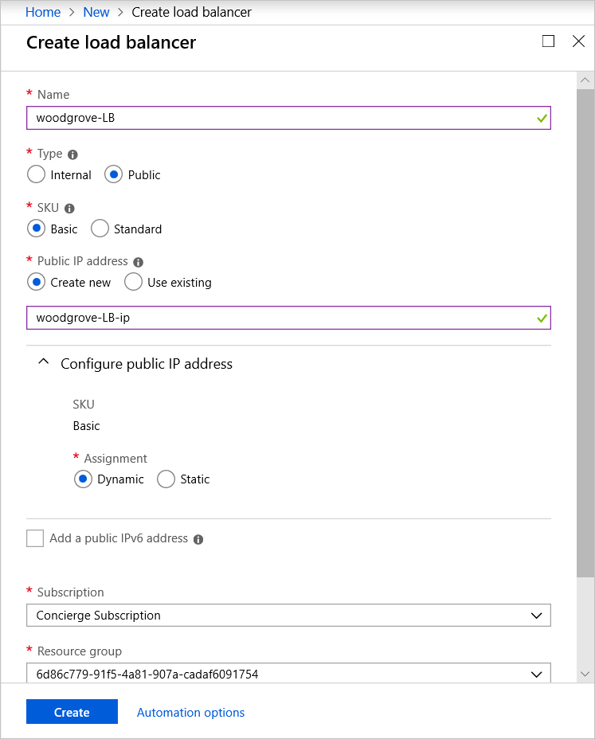

1. Click **Create**.

While the load balancer resource is being created and deployed, let's create the Azure Virtual Network we'll use for the backend subnet.

## Create a virtual network

1. In the left menu, click **Create a resource**. In the **New** blade, click **Networking**, and then click **Virtual network**.

    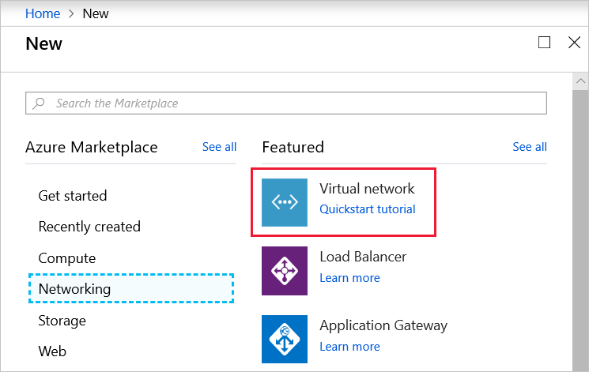

1. In the **Create virtual network** blade, enter or select the following information:
    - **Name:** _woodgrove-VNET_
    - **Address space:** _172.20.0.0/16_
    - **Subscription:** It should already have _Concierge Subscription_ selected.
    - **Resource group:** Select the existing _<rgn>[Resource Group Name]</rgn>_ resource group from the list.
    - **Subnet name:** _backendSubnet_
    - **Subnet address range:** _172.20.0.0/24_
    - **DDoS protection:** _Basic_
    - **Service endpoints:** _Disabled_

    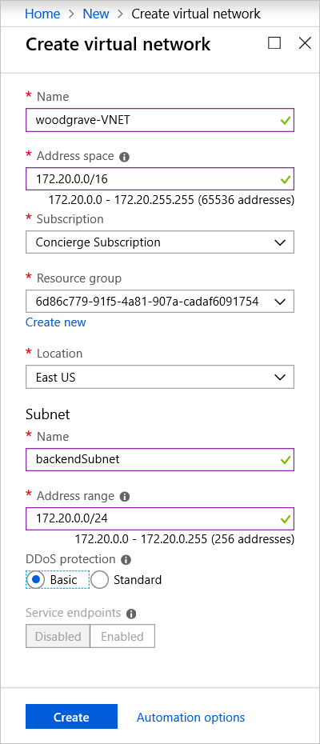

1. Click **Create**.

While the virtual network is being deployed, let's create one more thing: a network security group.

## Create and configure a network security group

1. Click **Create a resource**

1. Select the **Networking** group, and Click on the **Network security group** item.

    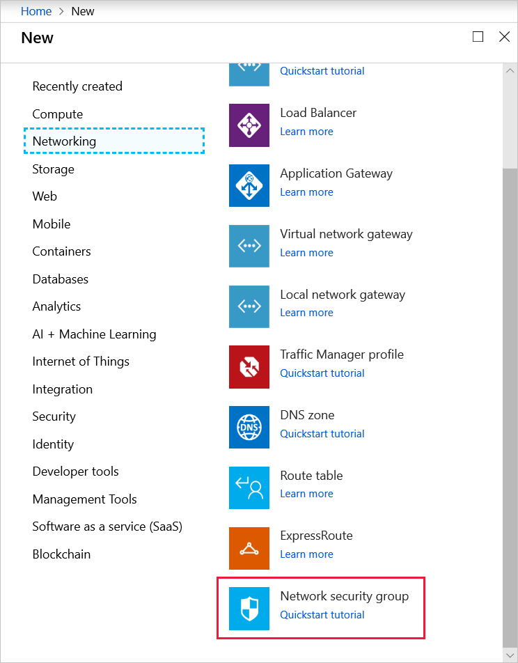

1. Give it the name **woodgrove-NSG** and put it into the Azure Sandbox resource group.

1. Make sure it's in the same location as the Azure Load Balancer.

    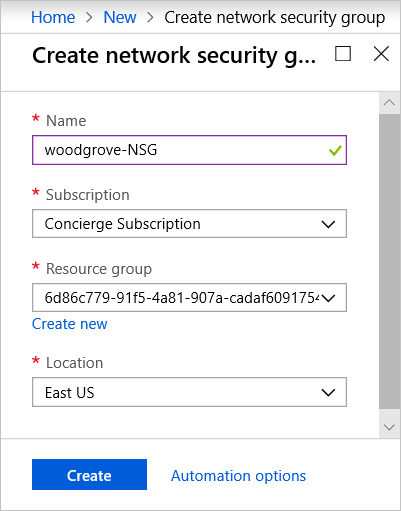

1. Click **Create**.

Wait until the load balancer, virtual network, and NSG are deployed. Then we can configure the network security.

## Configure the network security group

1. Select your new network security group - either from the deployment notification, or through the search bar at the top of the Azure portal.

    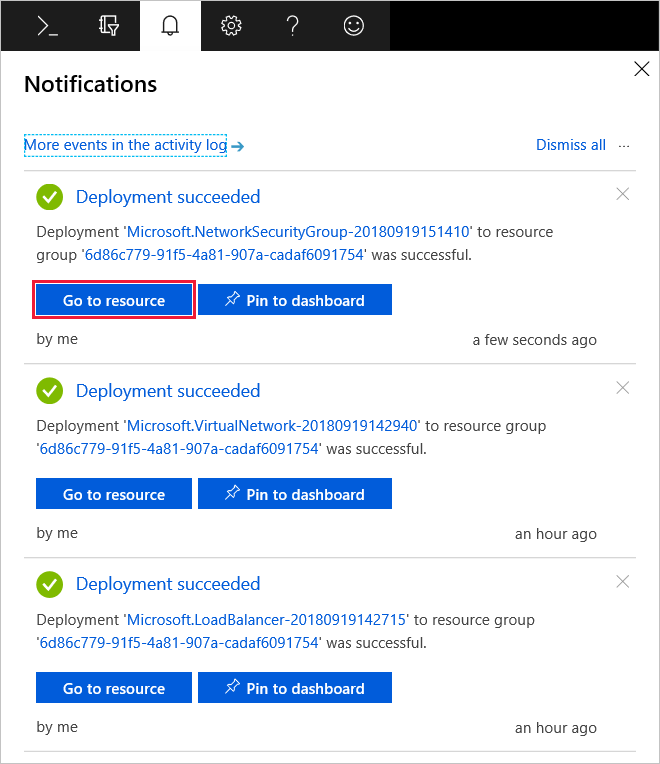

1. Select the **Settings** > **Inbound security rules** section. Notice that we have three pre-defined rules that are always applied. These rules are:
    - **AllowVnetInbound** - Allow all internal traffic flowing on the virtual network. This rule allows VMs that share the network to talk to each other.
    - **AllowAzureLoadBalancerInBound** - Allow the load balancer to "ping" services on the network to see whether they are alive.
    - **DenyAllInbound** - Deny all other traffic.

    The **DenyAllInbound** rule is particularly important - it ensures that all inbound traffic that doesn't have a higher priority rule is blocked. That's why we will need to add a new rule to allow HTTP (80) traffic for our web servers.

    > [!NOTE]
    > Priority in NSG rules goes from 0 - 65500 and rules are evaluated in order. The first matching rule becomes the decision maker. You will always want to place your rules fairly low - starting around 1000 so they take precedence over the pre-defined ones.

1. Click **Add** to add a new rule.

    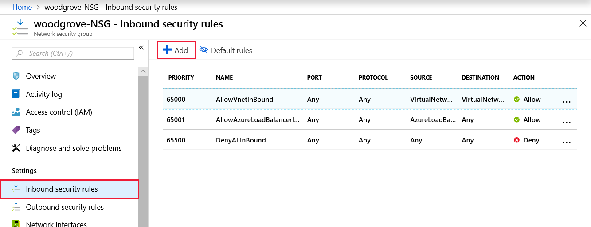

1. Click the **Basic** button at the top to switch the the "basic" view.

1. Fill in the details for the new rule.
    - Select _HTTP_ for the **Service**.
    - Set the **Priority** to _1000_.
    - Give the rule a name (or leave the default).

    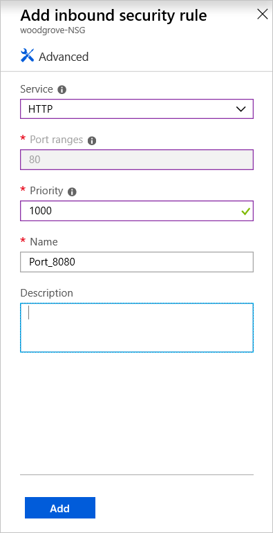

1. Click **Add** to add the rule.

    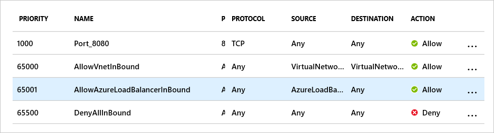

## Apply the network security group to the VNet

Next, let's apply this NSG to the virtual network.

1. Find your virtual network - you can use the search box at the top. It's named **woodgrove-VNET**.

1. Select **Settings** > **Subnets** to get to your defined subnets.

1. Click the **backendSubnet** entry to open the properties.

    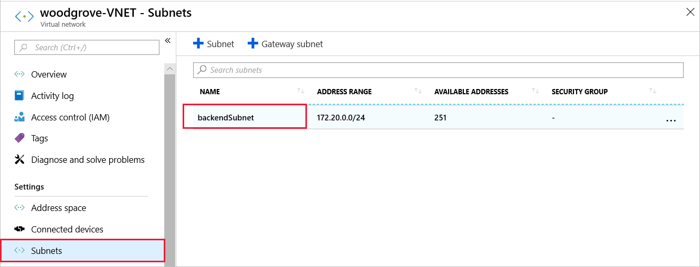

1. Click the "None" entry on the **Network security group**

    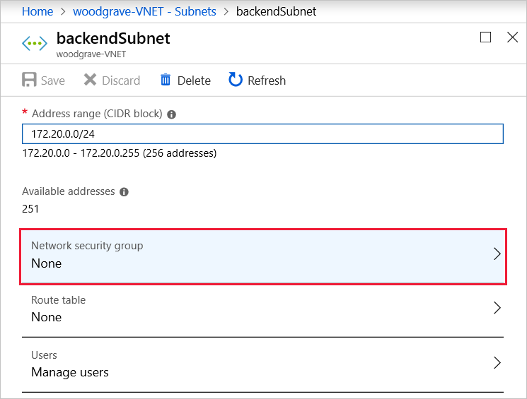

1. Select the **woodgrove-NSG** to add it to this VNET.

1. Click **Save** to apply the change.

Now that our network is ready, let's create some virtual machines to sit on this network!