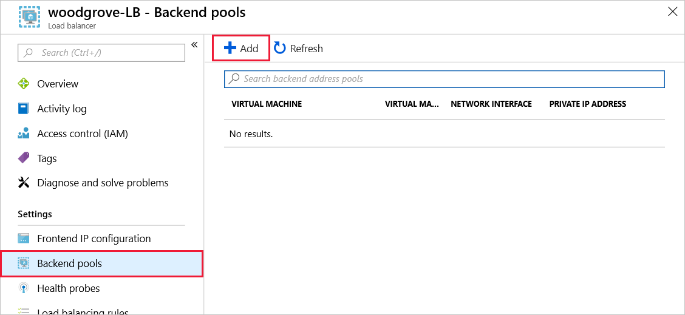
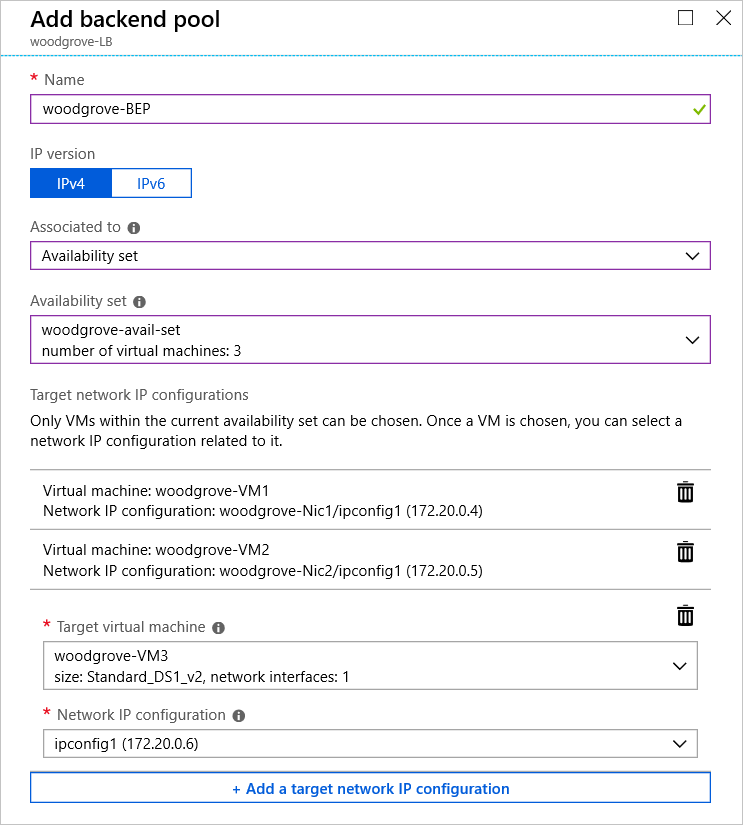

You have created the key resources for your online bank architecture. In this exercise, you will complete the setup by configuring the load-balancing rules.

Once setup is complete, you will test the load balancer by removing a VM from the pool and verifying that client requests are no longer sent to this VM.

We'll start by defining our backend pool in the load balancer. This determines where inbound requests are routed.

## Create a backend address pool

1. In the [Azure portal](https://portal.azure.com/learn.docs.microsoft.com?azure-portal=true), in the left menu, Select **All resources**. Then, in the resource list, select your load balancer (**woodgrove-LB**).

1. Select **Settings** > **Backend pools**. Notice we don't have any defined yet.

1. Click **Add** to add a new backend pool.

    

1. On the **Add backend pool** blade, add the following information:
    - Name it _woodgrove-BEP_.
    - Associated the pool to an **Availability set**.
    - For the availability set, select _woodgrove-AS_.

1. Click **Add a target network IP configuration**.

1. In the **Target virtual machine** list, select _woodgrove-VM1_.

1. In the **Network IP configuration** list for the VM, select the VM's IP address pool.

1. Repeat those steps to add _woodgrove-VM2_ and _woodgrove-VM3_ to the backend pool.

    

1. Click **OK** to close the blade.

Wait until the load balancer configuration has updated before proceeding with the exercise.

## Create a health probe for the load balancer

Next, add a health probe for HTTP over port 80.

1. On the **woodgrove-LB** blade, under **Settings**, click **Health probes**. Notice it's currently empty.

1. Click **Add** to add a new health probe.

1. On the **Add health probe** blade, set the following configuration:
    - **Name:** _woodgrove-HP_
    - **Protocol:** _HTTP_
    - **Port:** _80_
    - **Path:** _/_
    - **Interval:** _15_
    - **Unhealthy threshold:** _2_

1. Click **OK** to save the changes.

Wait until the load balancer configuration has updated before proceeding with the exercise.

## Create a load balancer rule

Finally, create a load-balancing rule for the HTTP over port 80, that associates the backend pool with the health probe.

1. On the **woodgrove-LB** blade, under **Settings**, click **Load balancing rules**.

1. Click **Add** to add a new rule.

1. On the **Add load balancing rule** blade, set the the **Name** to _woodgrove-HTTP-LBRule_.

1. Verify that the following information has been automatically entered:
    - IP Version: **IPv4**
    - Frontend IP address: **LoadBalancerFrontEnd**
    - Protocol: **TCP**
    - Port: **80**
    - Backend port: **80**
    - Backend pool: **woodgrove-BEP**
    - Health probe: **woodgrove-HP**
    - Session persistence: **None**
    - Idle timeout: **4 minutes**
    - Floating IP: **Disabled**

1. Click **OK** to save the rule.

Wait until the load balancer configuration has updated before proceeding with the exercise.

## Test the load balancer

1. Switch back to the **Overview** page of the load balancer and click the **Public IP address** link on the page to get to the IP address assigned. Alternatively, you can use **All resources** and then in the resource list, select **woodgrove-LB-ip**.

1. On the **Overview** blade, select the **IP address**, and click the **Copy** button next to it. This is the _public_ IP address for the load balancer.

    

1. Open a new browser tab and paste the IP address into the address bar of your browser. Note the name of the server and keep this tab open.

1. In the Azure portal, in the left menu, click **All resources**. Then, in the resource list, click the server you noted above.

1. On the **Overview** blade, click **Stop**, and then click **Yes**.

1. Wait until the VM has stopped, and then switch to the tab you viewed in step 3. Refresh the page.

1. The load balancer will now send your HTTP request to one of your other VMs.

In this exercise, you completed the deployment of your backend VMs and the load balancer.
