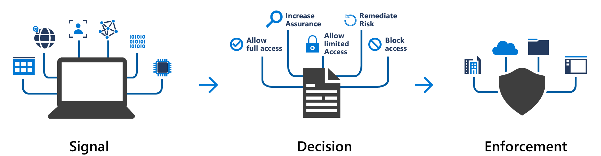
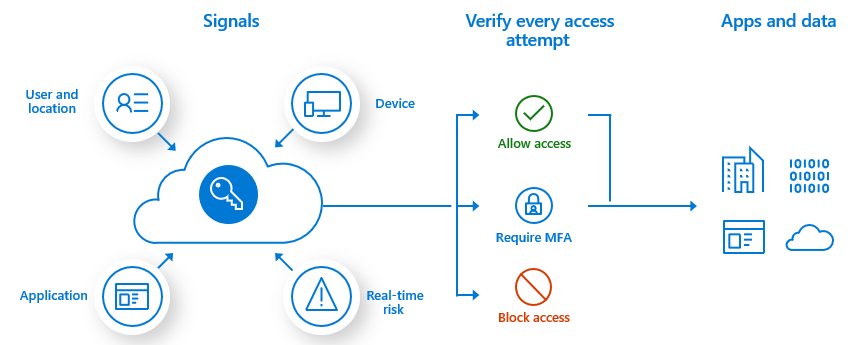
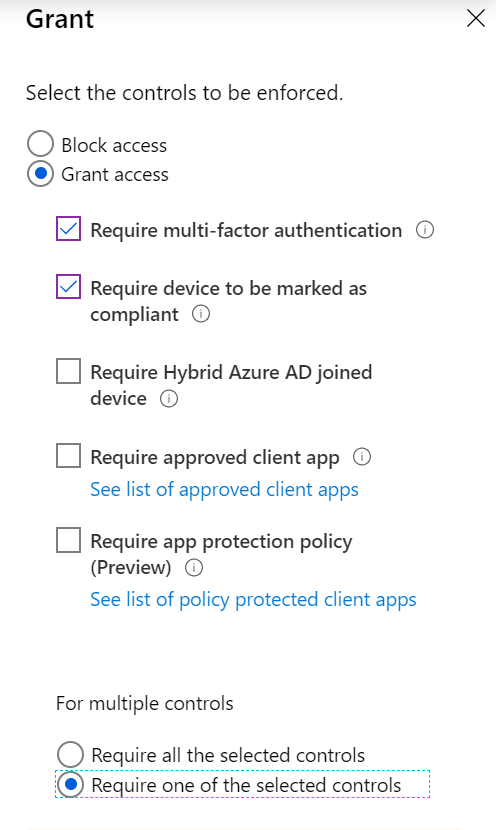

In this unit, you'll learn about device identity and registration options and how they apply to various devices. You'll learn how you can apply Conditional Access to improve access control with your devices. Finally, you'll consider the benefits and the considerations of using device identity in Azure.

## Basics of device identity

Device identity in Microsoft Entra ID helps you control the devices that you add to your organization's Microsoft Entra instance. It also helps you control the data, resources, and assets that those devices can access. It provides a framework to implement device-based Conditional Access. You can use a device-based Conditional Access policy to limit device access to your organization's assets.

Today's work environment extends beyond the controllable boundaries of your on-premises workspace. Your staff can now work in various locations, not only in their home country or region but also abroad. Users can access a broader range of technologies. Your organization owns some of these technologies, but doesn't own others.

The challenge IT staff faces is how to give users flexibility while protecting the company's data. You want to support your users and enable them to be productive wherever they're working and on whatever device they're using, but you still need to keep your organization's resources and assets safe.

Finding a balance between protecting assets and allowing users greater flexibility in the devices they use is at the heart of device identity. Every device that you want to connect to your network must be known. Tools such as Microsoft Intune can enhance what's known about a device by ensuring compliance with organizational requirements.

Combining Microsoft Entra ID with single sign-on means that users can access services and apps through any device. This solution meets your organization's need to protect its resources and assets, and gives users the flexibility they want.

## Device registration options

You have three device-registration options to add a device to Microsoft Entra ID:

- **Microsoft Entra registered**: These devices fall into the Bring Your Own Device (BYOD) category. They're typically privately owned, or they use a personal Microsoft account or another local account. This method of device registration is the least restrictive because it supports devices running Windows 10 or newer, iOS, iPadOS, Android, and macOS. Device security is typically provided from a password, a PIN, a pattern, or Windows Hello.

- **Microsoft Entra joined**: Your organization owns these devices. Users access your cloud-based Microsoft Entra instance through their work account. Device identities exist only in the cloud. This option is available only to Windows 10, Windows 11, or Windows Server 2019 devices. Windows Server 2019 Server Core installation isn't supported. Security for this option uses either a password or Windows Hello.

- **Microsoft Entra hybrid joined**: This option is similar to Microsoft Entra joined. The organization owns these devices, and they're signed in with a Microsoft Entra account that belongs to that organization. Device identities exist in the cloud and on-premises. The hybrid option is better suited to organizations that need on-premises and cloud access. This option supports Windows 8.1, 10, and 11, and Windows Server 2012 or later.

## Conditional Access

Conditional Access in Microsoft Entra ID uses data from sources known as *signals*, validates them against a user-definable rule base and chooses the best outcome to enforce your organization's security policies. Conditional Access enables device identity management, but Conditional Access policies can be complex.

At their simplest, you can think of these policies as "if-then" statements. If a user wants access to a resource, then they must fulfill the condition to complete the request. Example: A payroll manager wants to access the payroll application. The Conditional Access policy requires them to use a compliant device and to complete multifactor authentication to access the application.

Conditional Access policies are applied after a user has successfully completed first-factor authentication, typically with a username and password. These policies aren't a substitute for first-factor authentication. They're used to assess factors like device, location, and application, and to assess the risk in real time.

### Common signal types

Conditional Access uses many common signal types to make a decision on which outcome to recommend.

Signals include the following types:

- **User or group membership** provides fine-grained access to resources.
- **IP location information** uses an allowlist of trusted IP addresses and a blocklist of blocked or banned IP addresses.
- **Device** allows you to specify the type of device and its state.
- **Application** lets you control access to an application for a specific device.
- **Real-time and calculated risk detection** allows Microsoft Entra ID to identify behaviors not only during sign-in, but also throughout the user's session.
- **Microsoft Defender for Cloud Apps** provides real-time monitoring of the user's session and application access. Defender for Cloud Apps also helps you control your cloud environment.

### Common decisions

Conditional Access evaluates the signals and provides a decision:

- **Block access**, which is the most restrictive.
- **Grant access**, which is the least restrictive, but might require additional criteria before allowing access.

Those criteria can be one or more of:

- Multifactor authentication
- Device marked as compliant
- Device that's Microsoft Entra hybrid joined
- Approved application
- Need for an app protection policy

If your organization uses Microsoft Entra multifactor authentication, users don't have to do multifactor authentication when they're using a device that's mobile device management (MDM) compliant and Microsoft Entra joined. You can select the **Require one of the selected controls** option with your grant controls selected. If you need extra security for something like a payroll app, select **Require all the selected controls** to require multifactor authentication *and* a compliant device.

>[!div class="mx-imgBorder"]
>

### Commonly applied policies

Many organizations have common access concerns with which Conditional Access policies can help, such as:

- Requiring multifactor authentication for users who have administrative roles.
- Requiring multifactor authentication for Azure management tasks.
- Blocking sign-ins for users who are trying to use older authentication protocols.
- Requiring trusted locations for Microsoft Entra multifactor authentication registration.
- Blocking or granting access from specific locations.
- Blocking risky sign-in behaviors.
- Requiring organization-managed devices for specific applications.

### Selections to create a Conditional Access policy

To create a Conditional Access policy, go to **Microsoft Entra ID** > **Security** > **Conditional Access** > **New policy** in the Azure portal.

>[!div class="mx-imgBorder"]
>

To make your policy work, you must configure:

| What           | How                                  | Why |
| :--            | :--                                  | :-- |
| **Cloud apps** |Select one or more apps.  | The goal of a Conditional Access policy is to enable you to control how authorized users can access cloud apps.|
| **Users and groups** | Select at least one user or group that is authorized to access your selected cloud apps. | A Conditional Access policy that has no users and groups assigned is never triggered. |
| **Access controls** | Select at least one access control. | If your conditions are satisfied, your policy processor needs to know what to do. |

## Benefits of device identity management

Here are some of the benefits of using device identity combined with Conditional Access in Microsoft Entra ID:

- The combination simplifies the procedure for adding and managing devices in Microsoft Entra ID.
- The combination reduces the friction for users when they're switching between devices.
- Microsoft Entra ID supports MDM tools such as Microsoft Intune.
- You can use single sign-on (SSO) with any registered or joined device.

## Considerations for using device identity management

When you're evaluating device identity, consider the following factors:

- Using the Microsoft Entra joined or hybrid option limits you to using a Windows-based or Windows Server-based operating system on the device.
- Conditional Access requires a Microsoft Entra ID P1 license or a Microsoft 365 Business license.
