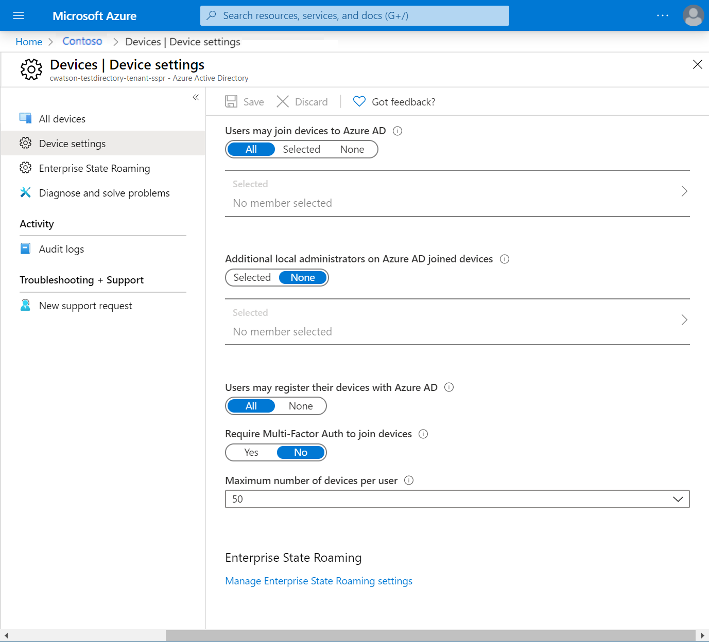
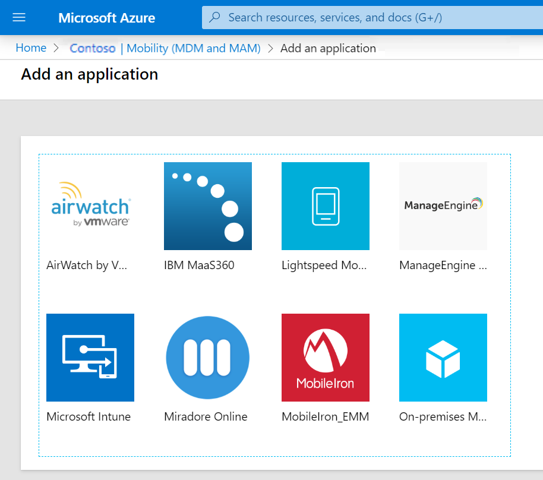
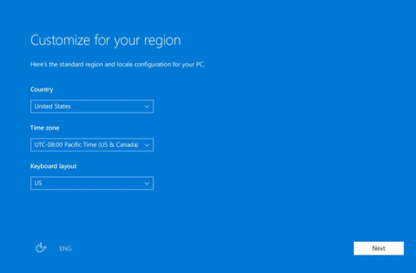
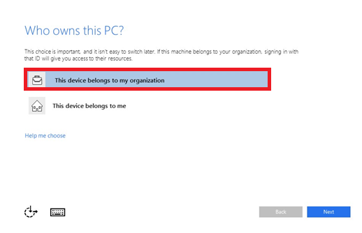

You now have a better understanding of device identity and Conditional Access. You want to investigate Microsoft Entra join and how you might use it to improve device management for both Azure and on-premises Active Directory Domain Services.

In this unit, you'll learn about Microsoft Entra join and how to use it for infrastructure and device management.

## Basics of Microsoft Entra join

With Microsoft Entra join, you can join devices to your Microsoft Entra organization without needing to sync with an on-premises Active Directory instance. Microsoft Entra join is best suited to organizations that are principally cloud based, although it can operate in a hybrid cloud and on-premises environment.

## Supported devices

Microsoft Entra join works with Windows 10, Windows 11, or Windows Server 2019 devices. Windows Server 2019 Server Core installation isn't supported. If you're using an earlier Windows operating system, you'll need to upgrade to Windows 10, Windows 11, or Windows Server 2019.

## Identity infrastructure

Decide what identity infrastructure model best supports your organization's needs:

- **Managed environment**: This environment uses pass-through authentication or password hash sync to provide single sign-on (SSO) to your devices.
- **Federated environments**: These environments require the use of an identity provider. That provider must support the WS-Trust and WS-Fed protocols for Microsoft Entra join to work natively with Windows devices. WS-Fed is required to join a device to Microsoft Entra ID. WS-Trust is needed to sign in to a Microsoft Entra joined device.
- **Smart cards and certificate-based authentication**: These methods aren't valid ways to join devices to Microsoft Entra ID. However, if you have Active Directory Federation Services configured, you can use smart cards to sign in to Microsoft Entra joined devices. We recommend that you use a service like Windows Hello for Business, which supports passwordless authentication to Windows 10 and Windows 11 devices.
- **Manual user configuration**: If you create users in your on-premises Active Directory instance, you need to synchronize the accounts to Microsoft Entra ID by using Microsoft Entra Connect. If you create users in Microsoft Entra ID, no additional setup is needed.

## Device management

Microsoft Entra join uses the mobile device management (MDM) platform to manage devices attached to Microsoft Entra ID. MDM provides a means to enforce organization-required configurations, like requiring storage to be encrypted, password complexity, software installations, and software updates.

The latest versions of Windows 10 and Windows 11 have a built-in MDM client that works with all compatible MDM systems.

There are two approaches to manage your Microsoft Entra joined devices:

- **MDM only**: All joined devices are managed exclusively through an MDM provider, like Intune. If your organization uses group policies, you'll need to review your MDM policy for support.

- **Co-management**: All joined devices use a combination of a locally installed System Center Configuration Manager agent and your MDM provider. Microsoft Intune provides co-management capabilities through Configuration Manager. You can use Configuration Manager to manage the device while MDM delivers user-management policies.

We recommend that you use the MDM-only approach to manage all Microsoft Entra joined devices.

## Considerations for resources and application access

For the best user experience and to improve access to your application, consider moving all applications and resources to Azure. Although that might be possible in some cases, it isn't always practical. In this section, we'll explore access options for your applications and resources:

- **Cloud-based applications**: Any migrated apps and all new applications will be added to the Microsoft Entra app gallery. Microsoft Entra join users can use SSO to access those applications. The majority of browsers support SSO. Microsoft Entra join provides SSO support for device access to applications that are still using Win32.

- **On-premises web applications**: You can still access any bespoke or custom-made software that's hosted on-premises through Microsoft Entra join. Access to those applications needs each user to add the app to their trusted sites or intranet zone, depending on where the app exists. This action allows the application to use Windows-integrated authentication without prompting the user to authenticate.

- **Other devices**: This option includes existing applications through earlier protocols and on-premises network shares. Both are available to Microsoft Entra joined devices through SSO if the device is connected to your domain controller.

- **Printer resources**: These resources won't automatically be available through Microsoft Entra join. Users can still connect to a printer directly by using its UNC path.

## Provisioning options

When you're deploying Microsoft Entra join, you have three choices for how devices are provisioned and joined to Microsoft Entra ID:

- **Self-service**: Requires users to manually configure the device during the Windows out-of-box experience (OOBE) for new devices, or by using the Windows settings for older devices. Self-service is better suited to users who have a strong technical background.

- **Windows Autopilot**: Allows you to preconfigure Windows devices, including automatically joining the device to your Active Directory organization, automatic MDM enrollment, and creating customer OOBE content. This approach simplifies the management and deployment of devices across your organization. You can provision and deploy your Windows devices. The user completes the OOBE as if they're a new user.

- **Bulk enrollment**: Lets you set up a provisioning package that applies to a large number of new Windows devices at the same time.

The following table shows the key features of each approach:

| Feature | Self-service | Windows Autopilot | Bulk enrollment |
| ---- | ---- | ---- | ---- |
| User interaction during setup | Yes | Yes | No |
| IT involvement | No | Yes | Yes |
| Applicable flows | OOBE and settings | OOBE only | OOBE only |
| Local admin rights to primary user | Yes | Configurable | No |
| Required OEM support | No | Yes | No |

## Device settings

In the Azure portal, you can control how new devices are joined to your organization. Go to **Microsoft Entra ID** > **Devices** > **Device settings**. From there, you can configure the following features and turn on Microsoft Entra join.

>[!div class="mx-imgBorder"]
>

|Field  |Description  |
|---------|---------|
|Users may join devices to Microsoft Entra ID   |  **All** allows for any user to join their device. **Selected** allows you to add specific users that can join devices. **None** prevents all users from joining their devices.     |
|Additional local administrators on Microsoft Entra joined devices     | Lets you specify other users to be included as local administrators on all joined devices. By default, this option is enabled. Microsoft Entra ID adds the global administrator and device administrator roles as local administrators on devices. |
|Users may register their devices with Microsoft Entra ID|Allows users to register their devices with Microsoft Entra join. If you're using Microsoft Intune or mobile device management for Microsoft 365, device registration is required. If either of these services is configured in your Microsoft Entra organization, **All** is selected and this option is disabled.|
|Require multifactor authentication to join devices |  Lets you enforce Microsoft Entra multifactor authentication when the device joins Microsoft Entra ID. For users who join devices to Microsoft Entra ID by using multifactor authentication, the device itself becomes a second factor.   |
|Maximum number of devices per user| Lets you specify the maximum number of devices a user can have in Microsoft Entra ID. If a user reaches this maximum, they need to remove a device to add a new one. |

For our scenario, we can add a pilot group of users to try AD join. In that case, choose **Users may join devices to Microsoft Entra ID** > **Selected**, then add members of your pilot group. When you're ready to deploy Microsoft Entra join to your entire Microsoft Entra organization, select **All**.

## Mobility settings

You might need to add an MDM provider before you can configure mobility settings. To add your MDM provider, go to **Microsoft Entra ID** > **Mobility (MDM and MAM)** > **Add application**.

>[!div class="mx-imgBorder"]
>

When you've added your MDM provider, you can configure the following mobility settings:

|Mobility setting  |description  |
|---------|---------|
|MDM user scope    |  Select **None**, **Some**, or **All**.  If the user *is* in the MDM scope and you have a Microsoft Entra ID P1 or P2 subscription, MDM enrollment is automated along with Microsoft Entra join. All users within the scope must have an appropriate license for your MDM. If not, the MDM enrollment fails and Microsoft Entra join is rolled back. If the user *isn't* in the MDM scope, Microsoft Entra join finishes without any MDM enrollment. The device is an unmanaged device.  |
|MDM URLs    | The three URLs related to your MDM configuration are **MDM terms of use URL**, **MDM discovery URL**, and **MDM compliance URL**. Each URL has a predefined default value. If these fields are empty, contact your MDM provider for more information.    |
|MAM settings     |  Mobile application management (MAM) does not apply to Microsoft Entra join.       |

Recall that you need to restrict access to the organization's resources to only devices that your organization manages and that your MDM system considers compliant. For our scenario, we'd want to add our organization's MDM provider and select **MDM user scope** > **All**.

## User experience when joining a Windows 10 or Windows 11 device

You've given a new device to a tech-savvy employee. They'll use the self-service approach to join the device to your Active Directory organization, which is using multifactor authentication. The following steps show you what that workflow looks like:

1. After starting the device, the employee follows the prompts to set it up, including customizing their region and selecting a language.

    >[!div class="mx-imgBorder"]
    >

1. The employee accepts the Microsoft Software License Terms.
1. The employee selects the network connection for connecting to the cloud.
1. When asked **Who owns this PC?**, the employee selects **This device belongs to my organization**.

    >[!div class="mx-imgBorder"]
    >

1. The employee signs in with the credentials that your organization has supplied.
1. The employee is prompted with a multifactor authentication challenge.
1. Microsoft Entra ID checks the configuration settings to see if the device should be enrolled in MDM.
1. When the configuration check is successful, the device is registered with the organization's Microsoft Entra instance. If MDM is being used, the device is enrolled and managed.
