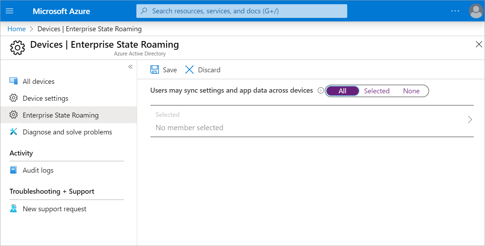
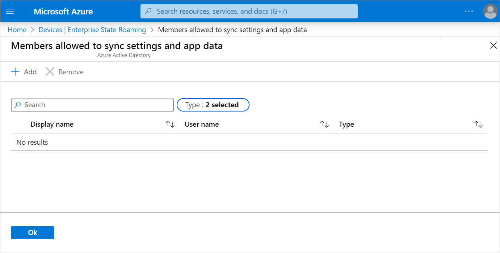

Your organization wants to improve the security of its devices. So far, you've learned how security is enhanced by using device identity and Microsoft Entra join. But you need to maintain the security seamlessly when a user switches between devices. You want to see the options that Azure offers to enable users to transition their accounts between devices. Users need to maintain data and settings without increasing technical overhead or maintenance.

In this unit, you'll learn about Enterprise State Roaming. You'll learn how to enable it, where the user's application and settings data is stored, and how long the data is stored.

## Basics of Enterprise State Roaming

Enterprise State Roaming allows users of Windows 10 and newer devices to sync settings and application data with their organization's cloud service. When you enable synchronization, it takes place automatically. You can enable all applicable device users, or select specific users or groups based on your organization's needs. With Enterprise State Roaming, users' settings and application data follow them when they switch devices.

Key benefits of using Enterprise State Roaming are:

- Separation of corporate and consumer data
- Enhanced security, because all applicable device data is encrypted through Azure Rights Management before synchronizing with the cloud. All stored data remains encrypted
- Better management and monitoring, so you decide who can sync their data and from which devices

Enterprise State Roaming requires a Premium Microsoft Entra subscription.

## Data that syncs and roams

**Windows settings**: The PC settings that are built into the Windows operating system. Generally, these settings personalize your PC. They include the following categories:

- *Theme*, which includes features such as desktop theme and taskbar settings.
- *Internet Explorer settings*, including recently opened tabs and favorites.
- *Microsoft Edge browser settings*, such as favorites.
- *Passwords*, including internet passwords, Wi-Fi profiles, and others.
- *Language preferences*, which include settings for keyboard layouts, system language, date and time, and more.
- *Ease of access features*, such as high-contrast theme, Narrator, and Magnifier.
- *Other Windows settings*, such as mouse settings.

**Application data**: Universal Windows apps can write settings data to a roaming folder. Any data written to this folder will automatically be synced. It's up to the individual app developer to design an app to take advantage of this capability.

## Enable Enterprise State Roaming

Enterprise State Roaming requires a device to authenticate with a known Microsoft Entra identity. For Microsoft Entra joined devices, this identity is the account with which the user first signed in.

1. To enable Enterprise State Roaming, go to **Microsoft Entra ID** > **Devices** > **Enterprise State Roaming** in the Azure portal.

    

1. For **Users may sync settings and app data across devices**, select **All** or **Selected**. With **Selected**, you'll add the users or groups that will have Enterprise State Roaming available.

    

## Data storage

Enterprise State Roaming stores the user data in a geographical region that's nearest to your Microsoft Entra instance. There are three geographic regions: North America (USA); Europe, the Middle East, and Africa (EMEA); and Asia-Pacific (APAC). Although tenant data will be hosted in the nearest region, user data can be hosted in one or more of these regions.

The country or region for your tenant is defined when Microsoft Entra ID is set up. It can't be changed.

## Data retention

All Enterprise State Roaming data persists in the cloud until it's explicitly deleted or becomes stale. Any deleted data is automatically kept for a maximum of 90 days. After 90 days, you can't restore the deleted data from the cloud.

### Explicit data deletion

Explicit data deletion occurs when an Azure administrator acts on a user or an organization within Microsoft Entra ID, or needs to request that specific roaming data is removed for a user.

- **User deletion**: When the administrator removes a user from Microsoft Entra ID, any associated enterprise roaming data is automatically deleted.

- **Microsoft Entra organization deletion**: When the administrator removes a directory, all user settings or data stored in that directory is automatically discarded.

- **On Request deletion**: You can use this option to remove a specific user's roaming data. The administrator needs to raise an Azure support ticket for this option.

### Stale data deletion

Any Enterprise State Roaming data that hasn't been accessed during the past year is automatically treated as stale data. Stale data is deleted from the host cloud storage. The retention period of deleted data is 90 days.

### Deleted data recovery

After the retention period elapses, data is permanently deleted from the cloud and can't be recovered, but you can restore the data from the device when it next connects to the cloud.

You can't change the data retention periods.
