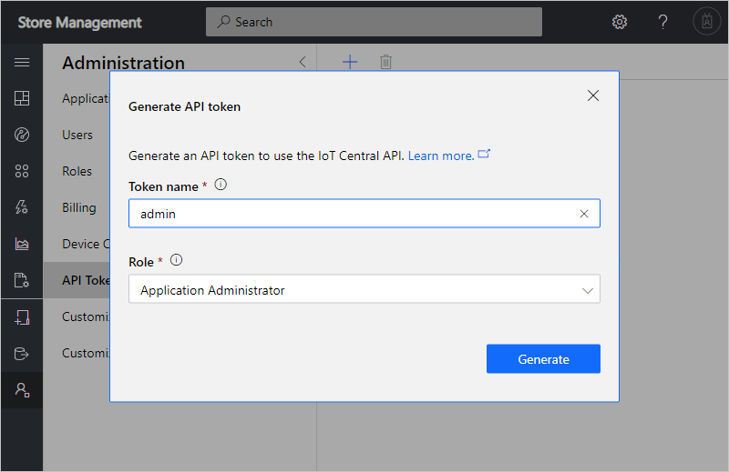
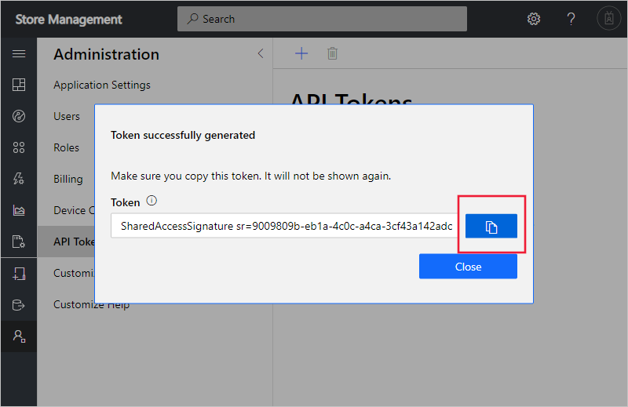

Create an IoT Central application for your devices to connect to and be managed from.

You want to create an IoT Central application to test integration with your store management application.

In this unit, you'll use the Azure CLI to create an IoT Central application from the **Preview application** template. This application template enables the preview REST API. You'll run the CLI commands in the Azure sandbox activated for this module and then navigate to the application's web UI. In the web UI, you complete the setup by generating an API token to authorize REST API calls.

## Install the Azure IoT CLI extension

The **azure-iot** CLI extension provides commands to manage IoT resources such as IoT Central applications. Run the following command in the Cloud Shell to install the extension:

```azurecli
az extension add --name azure-iot

```

## Create and configure the IoT Central application

The following steps create an IoT Central application and generate an API token to use later in this module.

1. Run the following commands in the Cloud Shell to generate a unique name for your IoT Central application and save it in an environment variable to use later:

    ```azurecli
    APP_NAME="store-manager-$RANDOM"
    echo "Your application name is: $APP_NAME"

    ```

    Make a note of the application name just in case the shell times out and loses the environment variable.

1. Run the following command in the Cloud Shell to create an IoT Central application in the sandbox:

    ```azurecli
    az iot central app create \
    --resource-group <rgn>[sandbox resource group name]</rgn> \
    --name $APP_NAME --sku ST2 --location centralus \
    --subdomain $APP_NAME --template iotc-pnp-preview \
    --display-name 'Store Management'
    echo "You can now navigate to: https://$APP_NAME.azureiotcentral.com/admin/tokens"

    ```

    Expect this command to take a minute or two to run.

1. In another browser tab or window, navigate to URL shown in the output of the last command. This page in the web UI is where you generate API tokens:

    

1. Select **Create an API token**. Enter `admin` as the **Token name** and make sure **Administrator** is selected as the **Role**. Then select **Generate**:

    

1. Copy the generated API token and save it locally in a text file. If you lose the token, you'll have to regenerate it:

    

1. Replace the `ADD YOUR TOKEN HERE` in the following command and run it the Cloud Shell. This command saves the API token in an environment variable to use later in the module. Be sure to enclose the token in double quotation marks, `"..."`:

    ```azurecli
    API_TOKEN="ADD YOUR TOKEN HERE"

    ```

1. Run the following command in the Cloud Shell to list the roles defined in your IoT Central application. The command adds an **Authorization** header with your API token to the **GET** request:

    ```azurecli
    az rest -m get -u https://$APP_NAME.azureiotcentral.com/api/preview/roles \
    --headers Authorization="$API_TOKEN"

    ```

    The output from the previous command shows the roles defined in your IoT Central application  in the sandbox environment. An IoT Central application is created with three roles: **Operator**, **Administrator**, and **Builder**. If the previous command returns an error, check that you've correctly set the **API_TOKEN** environment variable.
