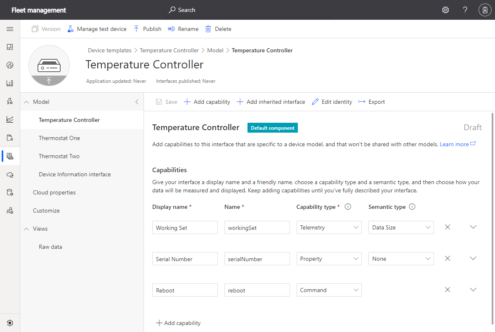
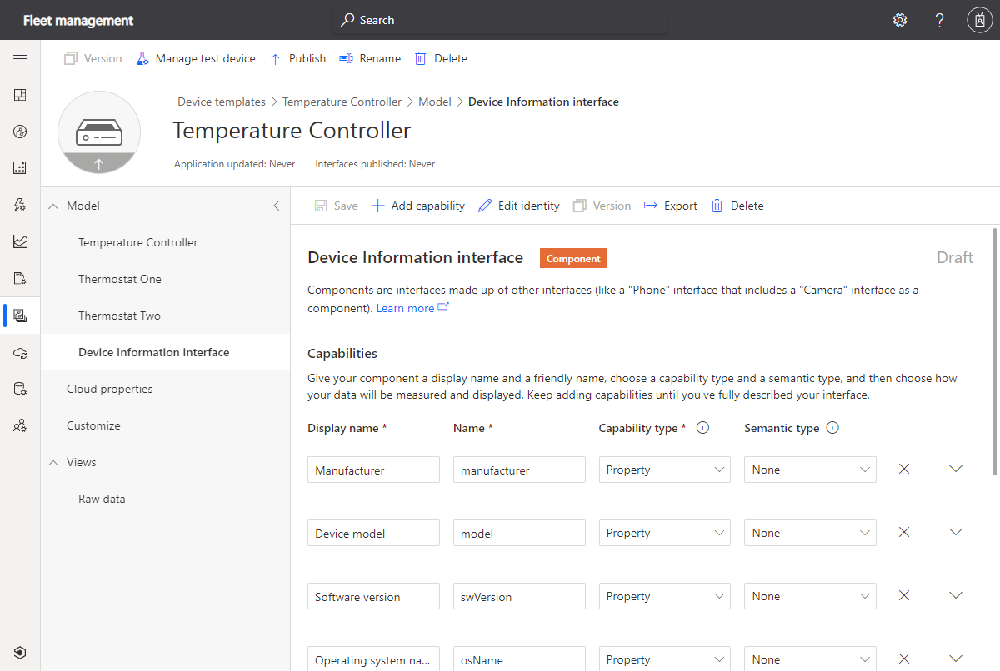

The REST API enables you to manage the devices in your IoT Central application programmatically.

To simplify the job of a fleet manager, you've been asked to integrate IoT Central device management capabilities into the existing fleet management application. Fleet managers want to use the existing fleet management application to manage devices connected your IoT Central application.

Here, you'll review the types of device and device authentication in an IoT Central application. Then you'll learn how to use the REST API to manage individual devices. In a later unit, you'll learn how to use jobs to manage devices in bulk.

## Devices and device templates

Any device that's connected to and managed by an IoT Central application is associated with a device template in the application. The *device model* in the template acts as a contract between the IoT Central application and the devices connected to it. The device template also includes information about how IoT Central displays information about the device in the web UI. For example, a device template can include definitions of dashboards to show device telemetry or to send commands to a device.

## What is a device template?

The device model section of a device template specifies the capabilities of a device you want to connect to your application. For example, a device template can specify:

- The types of telemetry, such as temperature, that your device will send to IoT Central.
- Properties, such as firmware version, that your device will report to IoT Central.
- Properties, such as target temperature, that IoT Central will set on your device.
- Commands, such as reboot, that IoT Central will send to your device.

The capabilities in a device model are grouped into interfaces. Interfaces enable you to share groups of related capabilities across templates. For example, the common *Device Information* interface defines device properties such as the manufacturer, model, and software version.

You create and manage device templates using the IoT Central web UI or the REST API. In the IoT Central web UI, you can:

- Build a device template from scratch.
- Browse the Azure IoT device catalog, and import device templates for certified devices.
- Import a JSON file that contains a device capability model and interface definitions.

To author a JSON device capability model file, use the [Digital Twins Definition Language editor for Visual Studio Code](https://marketplace.visualstudio.com/items?itemName=vsciot-vscode.vscode-dtdl).

If the device model already exists in the [device model repository](https://github.com/Azure/iot-plugandplay-models), then IoT Central can download the model and generate a device template the first time a device connects. In this scenario, you'll still need to create any cloud properties, custom device dashboards, and forms that your application needs.

The REST API doesn't use a standard device model when it creates a device template. The REST API uses an extended version that lets you include IoT Central specific definitions such as cloud properties. To learn more about the format of the JSON file the REST API uses, see the [Device Templates - Create](/rest/api/iotcentral/1.0dataplane/device-templates/create) documentation.

## Publish a device template

Before a real device can connect to your IoT Central application, you must publish the device template within the IoT Central application. After you publish a device template, you can also create simulated devices from the template.

Once a device template is published, significant changes to the device capability model or interface definitions require that you create and publish a new version of the device template.

When you use the REST API to add a device template to your application, it's automatically published.

## Manage device templates using the REST API

The IoT Central REST API lets you:

- Get a list of the device templates in the application
- Get a device template by ID
- Add a device template to your application
- Update a device template in your application
- Delete a device template in your application

## Block and unblock devices

If you suspect that a device is sending incorrect data or otherwise behaving in an unexpected way, you can block it. Blocking a device stops it from connecting to your application - a blocked device can't send telemetry, can't send property updates, or respond to synchronous commands. You can still manage the cloud properties of a blocked device, because cloud properties are stored in your IoT Central application. You can also set writable properties, although a blocked device won't receive these updates until it's unblocked.

## Real devices

Before you connect a device in the real world to an IoT Central application, you must add it in the application. When you add a device in an IoT Central application, you give the device:

- A unique ID within the application
- A friendly name

Each real device also has its own security credentials that the device uses to authenticate with the IoT Central application.

IoT Central also has options to add devices in bulk or allow devices to self-register with the application. However, a discussion of these options and what they might mean for your applications is beyond the scope of this module.

## Real device credentials

IoT Central supports two authentication types for real devices to connect:

- **Shared access signatures (SAS)**: IoT Central automatically generates SAS keys for every real device. A device can use the SAS key to authenticate with your IoT Central application.
- **X.509 certificates**: You can upload a root or intermediate certificate to an IoT Central application and use it to generate device certificates.

X.509 certificates are recommended in a production environment, but SAS keys are convenient to use in a test or proof-of-concept environment.

## Simulated devices

IoT Central can generate simulated devices from a device template. These simulated devices are useful for testing the behavior of your IoT Central application. A simulated device sends telemetry, reports property values, lets the application set property values, and responds to commands. In this module, you'll create some simulated devices to generate telemetry data to export.

## Use the REST API to manage your devices

The [IoT Central REST API for devices](/rest/api/iotcentral/1.0dataplane/devices) lets you:

- Get a list of the devices in the application
- Get a device by ID
- Create a device
- Update a device
- Delete a device
- Block and unblock a device
