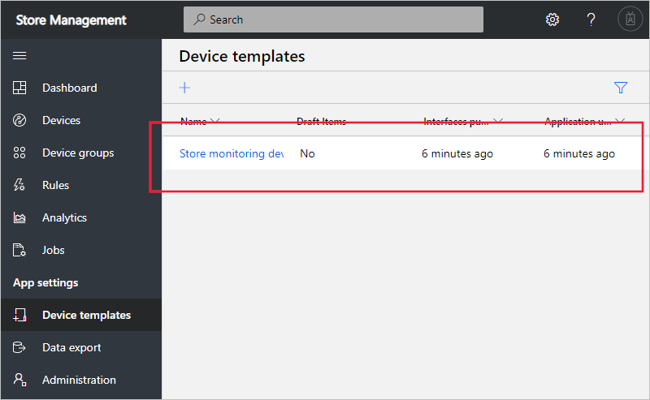
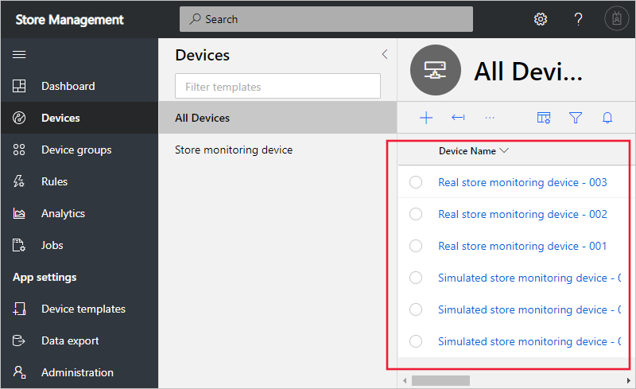

To manage device templates and devices programmatically, you use the IoT Central REST API

You want to enable your existing store management application to manage device templates and devices your IoT Central application programmatically.

In this unit, you use the IoT Central REST API to add a device template to the application and then add some real and simulated devices.

## Add a device template

Typically, the device developer provides you with the device capability model and interface definitions for the device you're using. You can import the definitions manually in the web UI or use the REST API to add the programmatically.

Run the following command in the Cloud Shell to add a device template in your IoT Central application. The template defines a store monitoring device that sends temperature and humidity telemetry, has brightness property, and responds to a reboot command:

```azurecli
az rest -m put -u https://$APP_NAME.azureiotcentral.com/api/preview/deviceTemplates/store_monitoring_device \
--headers Authorization="$API_TOKEN" --body \
'{
    "@id": "dtmi:contoso:store_monitor;1",
    "types": [
      "ModelDefinition",
      "DeviceModel"
    ],
    "displayName": "Store monitoring device",
    "capabilityModel": {
      "@id": "dtmi:contoso:store_monitor_dcm;1",
      "@type": "CapabilityModel",
      "displayName": "Environment Sensor Capability Model",
      "contents": [
        {
          "@type": [
            "Telemetry"
          ],
          "description": "Current temperature on the device",
          "displayName": "Temperature",
          "name": "temp",
          "schema": "double"
        },
        {
          "@type": [
            "Telemetry"
          ],
          "description": "Current humidity on the device",
          "displayName": "Humidity",
          "name": "humid",
          "schema": "double"
        },
        {
          "@type": [
            "Property"
          ],
          "description": "The brightness level for the light on the device. Can be specified as 1 (high), 2 (medium), 3 (low)",
          "displayName": "Brightness Level",
          "name": "brightness",
          "writable": true,
          "schema": "long"
        },
        {
          "@type": [
            "Command"
          ],
          "description": "This command reboots the device after delay seconds.",
          "displayName": "Reboot device",
          "name": "reboot",
          "request": {
            "@type": [
              "SchemaField"
            ],
            "displayName": "Seconds delay before reboot",
            "name": "delay",
            "schema": "long"
          }
        }
      ]
    },
    "solutionModel": {
      "@type": [
        "SolutionModel"
      ],
      "@id": "dtmi:contoso:store_monitor_sm;1",
      "cloudProperties": [
        {
          "@type": "CloudProperty",
          "displayName": "Store Name",
          "name": "storename",
          "schema": "string",
          "valueDetail": {
            "@type": "StringValueDetail"
          }
        }
      ],
      "initialValues": [],
      "overrides": []
    },
    "@context": [
      "dtmi:iotcentral:context;2",
      "dtmi:dtdl:context;2"
    ]
}'
```

If you navigate to your application in your browser, you can see the device template has been added to the application:



## Add simulated devices

Now that you've added a device template that specifies the capabilities of the store monitoring device you're using, you can start adding devices to your application.

Run the following commands in the Cloud Shell to add three simulated devices using the device template you added. The final command lists the devices you added and uses a query to simplify the output:

```azurecli
az rest -m put -u https://$APP_NAME.azureiotcentral.com/api/preview/devices/storemon-sim-001 \
--headers Authorization="$API_TOKEN" --body \
'{
  "instanceOf": "store_monitoring_device",
  "simulated": true,
  "displayName": "Simulated store monitoring device - 001",
  "approved": true
}'

az rest -m put -u https://$APP_NAME.azureiotcentral.com/api/preview/devices/storemon-sim-002 \
--headers Authorization="$API_TOKEN" --body \
'{
  "instanceOf": "store_monitoring_device",
  "simulated": true,
  "displayName": "Simulated store monitoring device - 002",
  "approved": true
}'

az rest -m put -u https://$APP_NAME.azureiotcentral.com/api/preview/devices/storemon-sim-003 \
--headers Authorization="$API_TOKEN" --body \
'{
  "instanceOf": "store_monitoring_device",
  "simulated": true,
  "displayName": "Simulated store monitoring device - 003",
  "approved": true
}'

az rest -m get -u https://$APP_NAME.azureiotcentral.com/api/preview/devices \
--headers Authorization="$API_TOKEN" \
--query 'value[].{ID:id, Type:instanceOf, Simulated:simulated}' -o table
```

## Add real devices

Run the following commands in the Cloud Shell to add three real devices using the device template you added. The final command lists the devices you added and uses a query to simplify the output:

```azurecli
az rest -m put -u https://$APP_NAME.azureiotcentral.com/api/preview/devices/storemon-real-001 \
--headers Authorization="$API_TOKEN" --body \
'{
  "instanceOf": "store_monitoring_device",
  "simulated": false,
  "displayName": "Real store monitoring device - 001",
  "approved": true
}'

az rest -m put -u https://$APP_NAME.azureiotcentral.com/api/preview/devices/storemon-real-002 \
--headers Authorization="$API_TOKEN" --body \
'{
  "instanceOf": "store_monitoring_device",
  "simulated": false,
  "displayName": "Real store monitoring device - 002",
  "approved": true
}'

az rest -m put -u https://$APP_NAME.azureiotcentral.com/api/preview/devices/storemon-real-003 \
--headers Authorization="$API_TOKEN" --body \
'{
  "instanceOf": "store_monitoring_device",
  "simulated": false,
  "displayName": "Real store monitoring device - 003",
  "approved": true
}'

az rest -m get -u https://$APP_NAME.azureiotcentral.com/api/preview/devices \
--headers Authorization="$API_TOKEN" \
--query 'value[].{ID:id, Type:instanceOf, Simulated:simulated}' -o table
```

If you navigate to your application in your browser, you can see the devices have been added to the application:



## Connect a real device

To connect a real device to your IoT Central application, you need the real device's credentials. You can use the REST API to retrieve the SAS key for a device from IoT Central as follows:

```azurecli
az rest -m get -u https://$APP_NAME.azureiotcentral.com/api/preview/devices/storemon-real-003/credentials \
--headers Authorization="$API_TOKEN"
```

## View device telemetry

You can use the REST API to view the last known value for a device's telemetry measurement. Run the following command to view the last known humidity value from the **storemon-sim-001** device. You may need to wait a few minutes before the simulated device starts sending telemetry and this command can run successfully:

```azurecli
az rest -m get -u https://$APP_NAME.azureiotcentral.com/api/preview/devices/storemon-sim-001/telemetry/humid \
--headers Authorization="$API_TOKEN"

```
