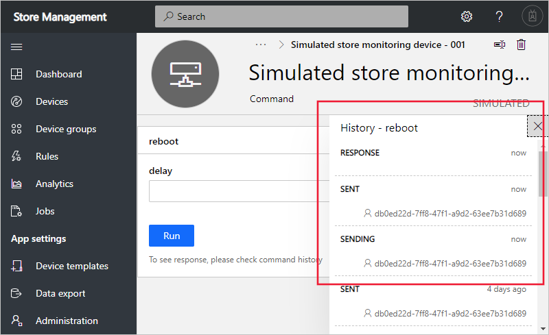

To control devices programmatically, you use the IoT Central REST API.

You want to enable your existing store management application to control devices connected your IoT Central application programmatically.

In this unit, you use the IoT Central REST API to set a writeable property on a store monitoring device and then send a reboot command to the device.

## Set a property

The store monitoring device template specified a **brightness** property in the default component:

```json
{
  "@type": "Property",
  "description": "The brightness level for the light on the device. Can be specified as 1 (high), 2 (medium), 3 (low)",
  "displayName": "Brightness Level",
  "name": "brightness",
  "writable": true,
  "schema": "long"
}
```

Run the following command in the Cloud Shell to set the **brightness** to **3** on the default component on one of the simulated devices in the application:

```azurecli
az rest -m put -u https://$APP_NAME.azureiotcentral.com/api/preview/devices/storemon-sim-001/properties \
--headers Authorization="$API_TOKEN" --body \
'{
  "brightness": 3
}'

```

The response to this request echoes the requested value for the property to confirm the device received it.

## Send a command

The store monitoring device template specified a **reboot** command in the default component:

```json
{
  "@type": "Command",
  "comment": "This command reboots the device.",
  "name": "reboot"
}
```

Run the following command in the Cloud Shell to send a reboot command to one of the simulated devices in the application. The reboot command takes a parameter that specifies the number of seconds to wait before rebooting:

```azurecli
az rest -m post -u https://$APP_NAME.azureiotcentral.com/api/preview/devices/storemon-sim-001/commands/reboot \
--headers Authorization="$API_TOKEN" --body \
'{
    "delay": 10
}'

```

If you navigate to your application in your browser, you can see the command history for the command you just called:


