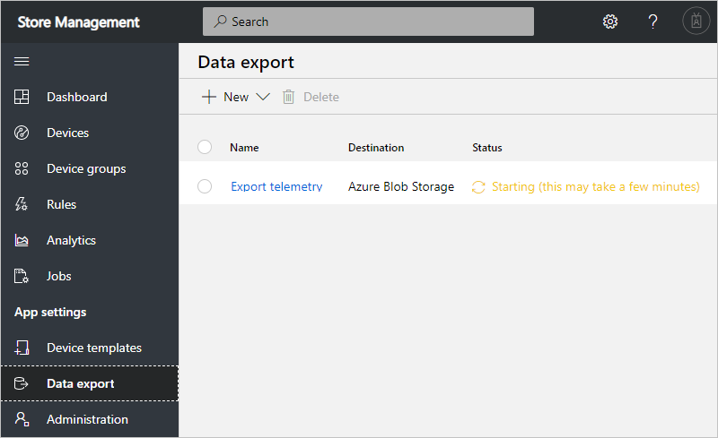

To manage data export definitions, you use the IoT Central REST API.

You want to enable your existing store management application to manage data export definitions in your IoT Central application programmatically.

In this unit, you create an Azure Storage blob container to use as an export destination. Then you use the IoT Central REST API to create a data export definition that sends device telemetry to the blob container for later analysis. Telemetry from the devices you set up previously is sent to the blob container. You view the telemetry data by downloading and viewing the blob container contents.

## Prepare the storage container

Before you can configure the data export from IoT Central, you need to set up the Azure Storage account and blob container to store the exported telemetry. You need a connection string and container name when you set up the data export in IoT Central.

Run the following commands to create storage account and container, and retrieve the connection string:

```azurecli
STORAGE_ACCOUNT="storemanagement$RANDOM"
az storage account create --name $STORAGE_ACCOUNT \
--resource-group <rgn>[sandbox resource group name]</rgn> \
--location centralus --sku Standard_LRS
az storage container create --name dataexport --account-name $STORAGE_ACCOUNT
STORAGE_CONNECTION_STRING=`az storage account show-connection-string --name $STORAGE_ACCOUNT --query "connectionString" -o tsv`
echo $STORAGE_CONNECTION_STRING

```

## Create a data export definition

Run the following command to create a data export for telemetry to the blob container. Use the **sources** array to specify the types of data to export. Add at least one of **telemetry**, **devices**, and **deviceTemplates**:

```azurecli
az rest -m put -u https://$APP_NAME.azureiotcentral.com/api/preview/continuousDataExports/storagedataexport \
--headers Authorization="$API_TOKEN" --body \
'{
    "displayName": "Export telemetry",
    "endpoint": {
        "type": "StorageEndpoint",
        "connectionString": "'$STORAGE_CONNECTION_STRING'",
        "name": "dataexport"
    },
    "enabled": true,
    "sources": [
        "telemetry"
    ]
}'

```

If you navigate to your application in your browser, you can see the data export configuration you added:



## View the data

You may need to wait a few minutes for the data export to get started in your IoT Central application before you can see any data.

You can use the following REST API call to check the status of the data exports defined in your application. When the status is **running**, the data export is sending telemetry to your blob container:

```azurecli
az rest -m get -u https://$APP_NAME.azureiotcentral.com/api/preview/continuousDataExports \
--headers Authorization="$API_TOKEN" \
--query 'value[].{Name:displayName, Status:status}' -o table
```

Run the following commands to list the blobs in the container:

```azurecli
az storage blob list --container-name=dataexport \
--connection-string "$STORAGE_CONNECTION_STRING" \
--query '[].{BlobName:name}' -o table
```

You may need to wait a few minutes before the first blob containing telemetry is available.

You see a sequence of blobs that contain telemetry. If you rerun the previous command after a few minutes, you see the number of telemetry blobs has increased.

Run the following commands to download the first telemetry blob and view its contents:

```azurecli
FIRST_BLOB=`az storage blob list --container-name=dataexport --connection-string "$STORAGE_CONNECTION_STRING" --query '[0].{BlobName:name}' -o tsv`
az storage blob download --container-name dataexport \
--connection-string "$STORAGE_CONNECTION_STRING" \
--name $FIRST_BLOB \
--file telemetry.json
cat telemetry.json | json_pp
```

The blob contains a message from one of your simulated devices. The telemetry is in the `Body` section. For example:

```json
{
   "EnqueuedTimeUtc" : "2019-10-24T08:49:32.8210000Z",
   "Body" : {
      "humid" : 23.0369107599139,
      "temp" : 91.5814283182951
   },
   "SystemProperties" : {
      "contentEncoding" : "utf-8",
      "contentType" : "application/json",
      "enqueuedTime" : "2019-10-24T08:49:32.8210000Z",
      "connectionDeviceGenerationId" : "637075032197474935",
      "connectionDeviceId" : "storemon-sim-001",
      "interfaceName" : "sensor",
      "connectionAuthMethod" : "{\"scope\":\"device\",\"type\":\"sas\",\"issuer\":\"iothub\",\"acceptingIpFilterRule\":null}"
   },
   "Properties" : {}
}
```
