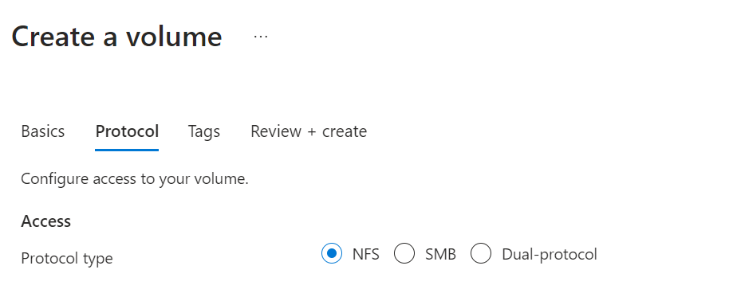
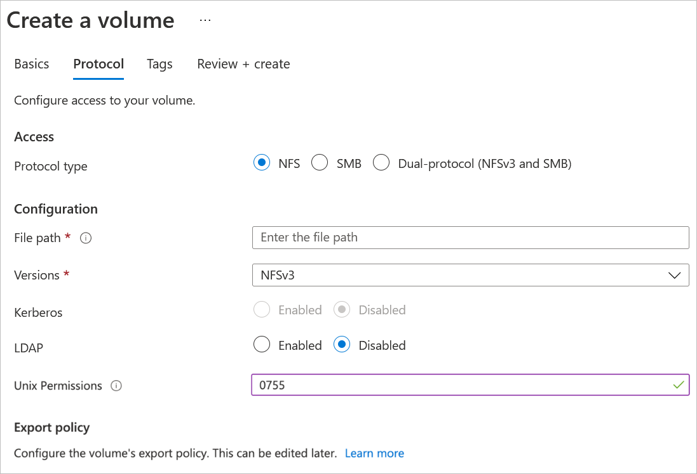

Here you learn how to create an NFS volume. Before creating a volume:

- You must have already set up a capacity pool.
- A subnet must be delegated to Azure NetApp Files.

To create an NFS volume, from the Azure NetApp Files portal, you need to select **Volumes** from the left menu. Select **+ Add volume** to create a volume.

In the **Create a Volume** window, under **Basics**, you need to provide information for the following fields:

| Setting | Description |
| --- | --- |
| Volume name | Specify the name for the volume that you are creating. Refer to [Naming rules and restrictions for Azure resources](https://learn.microsoft.com/azure/azure-resource-manager/management/resource-name-rules#microsoftnetapp) for naming conventions on volumes. |
| Capacity pool | Specify the capacity pool where you want the volume to be created. |
| Quota | Specify the amount of logical storage that is allocated to the volume. The **Available quota** field shows the amount of unused space in the chosen capacity pool that you can use to create a new volume. The size of the new volume must not exceed the available quota. |
| Large Volume | Regular volume quotas are between 50 GiB and 100 TiB. Large volume quotas range from 50 TiB to 1 PiB in size. If you intend for the volume quota to fall in the large volume range, select **Yes**. Volume quotas are entered in GiB. |
| Available throughput (MiB/S) and Max. Throughput (MiB/S) | If the volume is created in a manual QoS capacity pool, specify the throughput you want for the volume. If the volume is created in an auto QoS capacity pool, the value displayed in this field is (quota x service level throughput). |
| Enable Cool Access, Coolness Period, and Cool Access Retrieval Policy | These fields configure storage with cool access in Azure NetApp Files. |
| Virtual network | Specify the Microsoft Azure virtual network from which you want to access the volume. |
| Delegated subnet | Specify the subnet that you want to use for the volume. The subnet you specify must be delegated to Azure NetApp Files. If you have not delegated a subnet, you can select Create new on the Create a Volume page. In the Create Subnet page, specify the subnet information, and select Microsoft.NetApp/volumes to delegate the subnet for Azure NetApp Files. |
| Network features | In supported regions, you can specify whether you want to use Basic or Standard network features for the volume. |
| Encryption key source | You can select Microsoft Managed Key or Customer Managed Key as the encryption key source. |
| Availability zone | This option lets you deploy the new volume in the logical availability zone that you specify. Select an availability zone where Azure NetApp Files resources are present. |
| Show advanced section | Specify whether you want to hide the snapshot path and select a snapshot policy in the pull-down menu. |

After filling these details, you need to go to the next tab **Protocol** and complete the following actions:

- Select **NFS** as the protocol type for the volume.

- Specify a unique file path for the volume. This path is used when you create mount targets. The requirements for the path are as follows:
    - For volumes not in an availability zone or volumes in the same availability zone, it must be unique within each subnet in the region.
    - For volumes in availability zones, it must be unique within each availability zone.
    - It must start with an alphabetical character.
    - It can contain only letters, numbers, or dashes (-).
    - The length must not exceed 80 characters.
- Select the NFS version (NFSv3 or NFSv4.1) for the volume.
- If you are using NFSv4.1, indicate whether you want to enable Kerberos encryption for the volume.
- If you want to enable Active Directory LDAP users and extended groups (up to 1,024 groups) to access the volume, select the LDAP option.
- Customize Unix permissions as needed to specify change permissions for the mount path.
- Optionally, configure export policy for the NFS volume.

After entering the details, you can select **Review + Create** to review the volume details. Select **Create** to create the volume.
