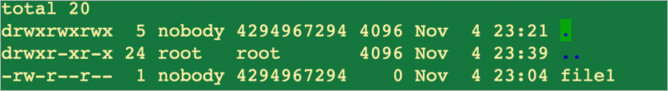
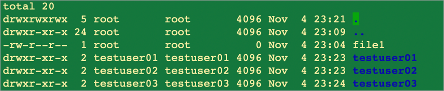
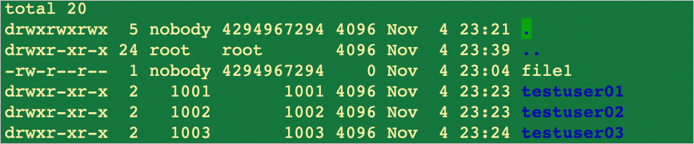
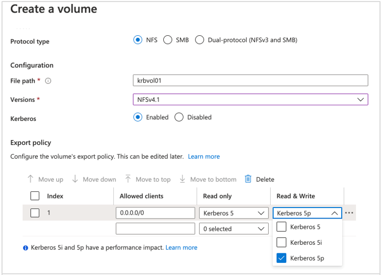
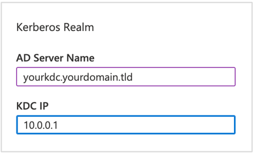

Here you learn how to configure the Linux client and how to change the Azure NetApp Files authentication domain for all non-LDAP enabled volumes.

By default, NFS clients will use the DNS domain name as the NFSv4 ID domain. You can override this setting by using the NFSv4 configuration file named **idmapd.conf**.

### Default behavior of user and group mapping for Azure NetApp Files

- The root user mapping can illustrate what happens if there is a mismatch between the Azure NetApp Files and NFS clients.
- The installation process of an application often requires the use of the root user.
- Azure NetApp Files can be configured to allow access for root.
- Consider the following directory listing example:
    - The user `root` mounts a volume on a Linux client that uses its default configuration `localdomain` for the ID authentication domain, which is different from Azure NetApp Files default configuration of `defaultv4iddomain.com`.
    - In the listing of files in the directory, `file1` is mapped to `nobody` when it should be owned by the `root` user.

    

There are two ways to adjust the authentication domain on both sides: Azure NetApp Files as NFS server and Linux as NFS clients:

- **Central user management**:
    - If you are already using a central user management system, such as Active Directory Domain Services (AD DS), you can configure Linux clients to use LDAP and set the domain configured in AD DS as authentication domain. 
    - On the server side, enable AD domain service for Azure NetApp Files and create LDAP-enabled volumes. 
    - LDAP-enabled volumes automatically use the domain configured in AD DS as their authentication domain.

- **Manually configure the Linux client**:
    - If you are not using central user management for Linux clients, manually configure Linux clients to match the default authentication domain of Azure NetApp Files for non-LDAP enabled volumes.

### Configuring NFSv4.1 ID domain on Azure NetApp Files

You can specify a desired NFSv4.1 ID domain for all non-LDAP volumes using the Azure portal.

- This setting applies to all non-LDAP volumes across all NetApp accounts in the same subscription and region. 
- It does not affect LDAP-enabled volumes in the same NetApp subscription and region.

#### Register the service

Azure NetApp Files supports the ability to set the NFSv4.1 ID domain for all non-LDAP volumes in a subscription using the Azure portal. You need to register the feature before using it for the first time. After registration, the feature is enabled and works in the background.

To register you run the following command in the Azure PowerShell:

`Register-AzProviderFeature -ProviderNamespace Microsoft.NetApp -FeatureName ANFNFSV4IDDomain`

> [!NOTE]
> You can also use Azure CLI commands `az feature register` to register the feature.

#### Configure NFSv4.1 ID domain

You can configure select NFSv4.1 ID Domain from the Azure NetApp Files subscription by selecting NFSv4.1 ID Domain and clicking **Configure**.

To use the default domain defaultv4iddomain.com, select the box next to Use Default NFSv4 ID Domain. To use another domain, uncheck the text box and provide the name of the NFSv4.1 ID domain.

To learn how to configure NFSv4.1 ID domain in NFS clients, see [Configure NFSv4.1 ID domain on Azure NetApp Files](https://learn.microsoft.com/azure/azure-netapp-files/azure-netapp-files-configure-nfsv41-domain#configure-nfsv41-id-domain-on-azure-netapp-files).

#### Behavior of other (nonroot) users and groups

Azure NetApp Files supports local users and groups (created locally on the NFS client and represented by user and group IDs) and corresponding ownership and permissions associated with files or folders in NFSv4.1 volumes. 

However, the service doesn't automatically solve mapping local users and groups across NFS clients. Users and groups created on one host may or may not exist on another NFS client (or exist with different user and group IDs) and will therefore not map correctly as outlined in the example below.

Here, Host1 has three user accounts (testuser01, testuser02, testuser03):

On Host2, no corresponding user accounts exist, but the same volume is mounted on both hosts:

To resolve this issue, either create the missing accounts on the NFS client or configure NFS clients to use the LDAP server that Azure NetApp Files uses for centrally managed UNIX identities.

### Configure NFSv4.1 Kerberos encryption for Azure NetApp Files

Azure NetApp Files supports NFS client encryption in Kerberos modes (krb5, krb5i, and krb5p) with AES-256 encryption. Here you will learn the required configurations for using an NFSv4.1 volume with Kerberos encryption.

#### NFS Kerberos Volume

Follow the same steps you use to create an NFS volume for Azure NetApp Files to create the NFSv4.1 Kerberos volume.

To create an NFSv4.1 Kerberos volume:

- Set NFS version to **NFSv4.1**.
- Set **Kerberos** to **Enabled**.
- Select Kerberos security options in export policy (**Kerberos 5**, **Kerberos 5i**, or **Kerberos 5p**).

> [!NOTE]
> You cannot modify Kerberos enablement after the volume is created.

You also need to select export policy to match the desired level of access and security option (Kerberos 5, Kerberos 5i, or Kerberos 5p) for the volume.

> [!NOTE]
> You can also modify the Kerberos security methods for the volume by clicking Export Policy in the Azure NetApp Files navigation pane.

#### Configure Active Directory connection for using Kerberos

Kerberos requires that you create at least one computer account in Active Directory. The account information you provide is used for creating accounts for both SMB and NFSv4.1 Kerberos volumes. The machine account is created automatically during volume creation.

While creating an Active Directory domain connection, under **Kerberos Realm**, enter the **AD Server Name** and **KDC IP** address.

Configuration of NFSv4.1 Kerberos creates two computer accounts in Active Directory:

- A computer account for SMB shares
- A computer account for NFSv4.1 (identified by the prefix NFS-)

After creating the first NFSv4.1 Kerberos volume, set the encryption type for the computer account by using the following PowerShell command:

`Set-ADComputer $NFSCOMPUTERACCOUNT -KerberosEncryptionType AES25`

#### Performance impact of Kerberos on NFSv4.1

You should understand the security options available for NFSv4.1 volumes, the tested performance vectors, and the expected performance impact of Kerberos. See [Performance impact of Kerberos on NFSv4.1 volumes](https://learn.microsoft.com/azure/azure-netapp-files/performance-impact-kerberos) for details.
