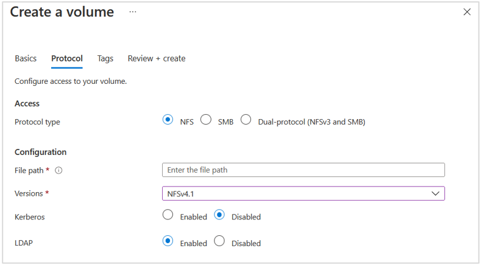
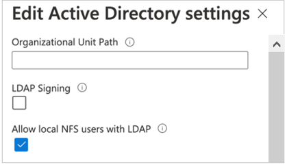
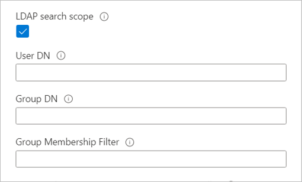

When you create an NFS volume, you can enable the LDAP with extended groups feature for the volume. This feature enables Active Directory LDAP users and extended groups (up to 1,024 groups) to access files and directories in the volume.

Azure NetApp Files interacts with LDAP by querying for attributes such as usernames, numeric IDs, groups, and group memberships for NFS protocol operations.

To enable Active Directory Domain Services (AD DS) LDAP authentication for NFS volumes:

- LDAP volumes require an Active Directory configuration for LDAP server settings. Ensure that Active Directory LDAP server is configured and running.
- Follow steps in Create an NFS volume for Azure NetApp Files to create an NFS volume. During the volume creation process, under the Protocol tab, enable the LDAP option.

You can enable local NFS client users not present on the Windows LDAP server to access an NFS volume that has LDAP with extended groups enabled. To do so, enable **Allow local NFS users with LDAP** as follows:

- Select Active Directory connections. On an existing Active Directory connection, select the context menu (three dots), and select **Edit**.
- On the Edit Active Directory settings window, select **Allow local NFS users with LDAP**.

    

If you have large topologies, and you use Unix security style with a dual-protocol volume or LDAP with extended groups, you can use the LDAP Search Scope option to avoid access denied errors on Linux clients for Azure NetApp Files.

The LDAP Search Scope option is configured through the Active Directory Connections page.

