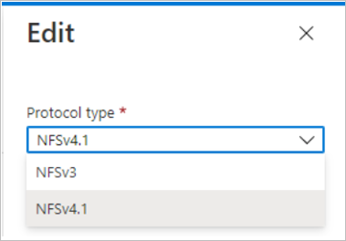

Azure NetApp Files provides an option to convert an NFS volume between NFSv3 and NFSv4.1.

If an existing NFS volume exported through NFSv3 requires a protocol change to use NFSv4.1 features and performance, you can convert from NFSv3 to NFSv4.1. Likewise, you can convert an NFSv4.1 volume to NFSv3.

The conversion involves application downtime where clients are not able to access the volume. Plan for the following activities:

- Before conversion, you need to unmount the volume from all clients. This operation might require shutdown of your applications that access the volume.
- After successful volume conversion, you need to reconfigure each of the clients that access the volume before you can remount the volume.

> [!NOTE]
> The option to convert an NFS volume between NFSv3 and NFSv4.1 is in preview. If you are using this option for the first time, register the option before using it.

To register the feature run the below command in Azure PowerShell:

`Register-AzProviderFeature -ProviderNamespace Microsoft.NetApp -FeatureName ANFProtocolTypeNFSConversion`

### Convert from NFSv3 to NFSv4.1

In this example, you have an NFSv3 volume but want to use NFSv4.1 features. You are not using an LDAP integration or plan to use Kerberos for NFSv4.1.

Before converting an NFS volume, unmount it from clients in preparation.

In the Azure portal, navigate to the NFS volume to convert, and select **Edit**. In the Edit window, select **NFSv4.1** in the Protocol type pull-down.

It takes some time to complete the conversion. After completion, you can reconfigure the Linux clients to use NFSv4.1 protocol. On all clients, change the NFS protocol version in your mount command (that is, `/etc/fstab`) from `vers=3` to `vers=4.1`. Then, remount the volume on the clients.

### Convert from NFSv4.1 to NFSv3

In this example, you have an existing NFSv4.1 volume that you want to convert to NFSv3.

Converting a volume from NFSv4.1 to NFSv3 results in all NFSv4.1 features such as ACLs and file locking to become unavailable.

Before converting an NFS volume, you need to unmount it from the clients in preparation and change the export policy to read-only.

In the Azure portal, navigate to the NFS volume that you want to convert, select **Edit**, and in the Edit window select **NFSv3** in the Protocol type pull-down.

It will take a while to complete the operation. Once done, you can reconfigure your Linux client to enable NFSv4.1 protocol. On all clients, change the NFS protocol version in your mount command (that is, `/etc/fstab`) from `vers=4.1` to `vers=3`. Then remount the volume on the clients.

You can change the read-only export policy back to the original export policy.
