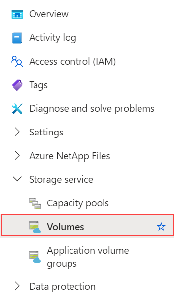
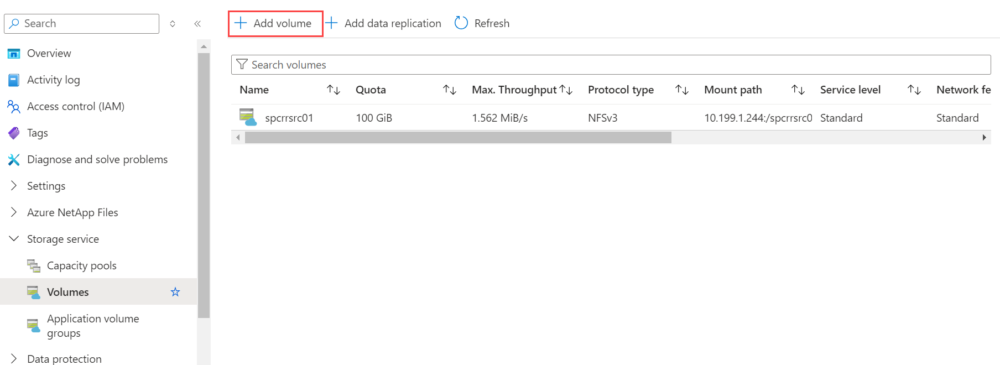
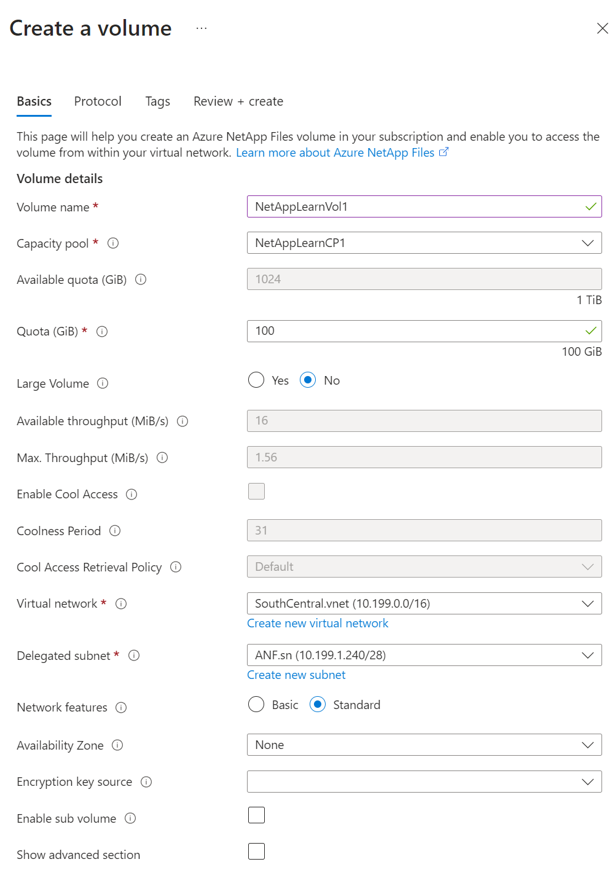
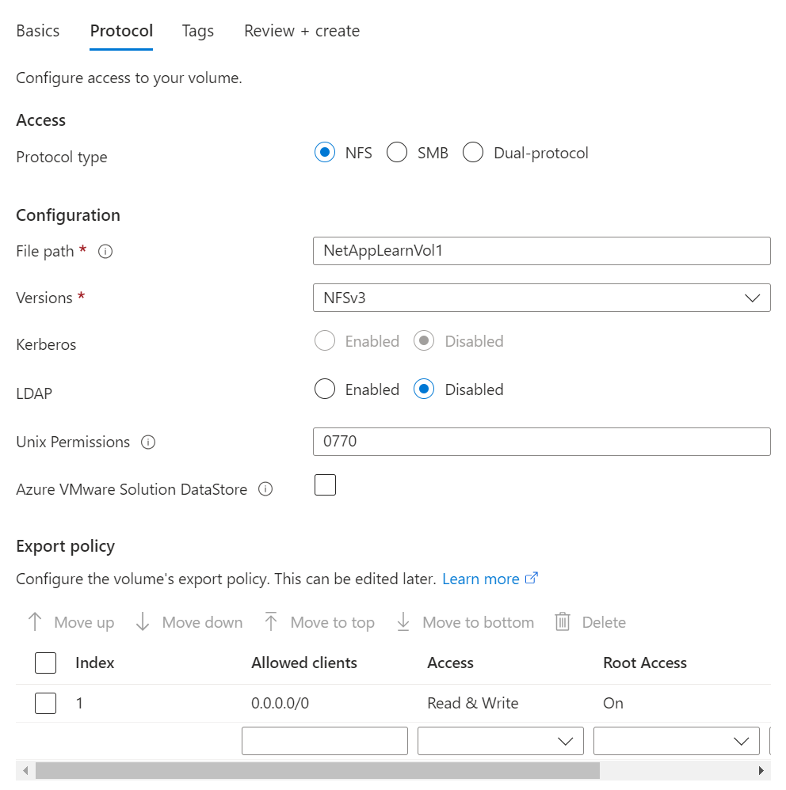
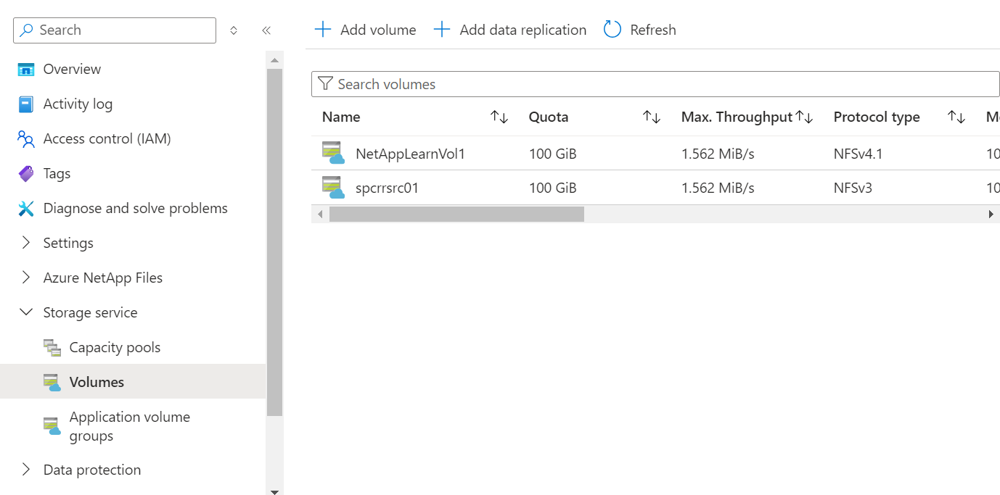
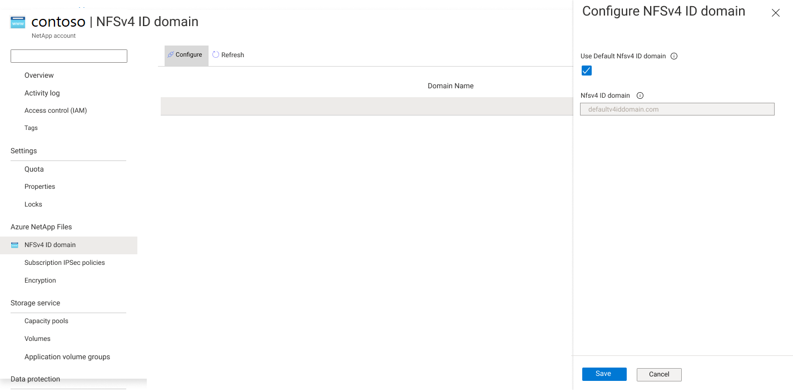
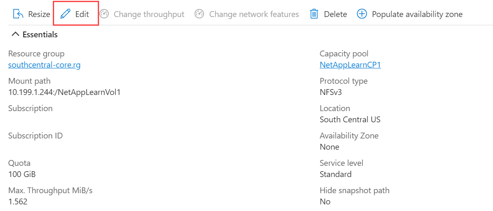

In this exercise, you will create NFS volumes for Azure NetApp Files, configure ID domain, and convert NFS volumes between NFSv3 and NFSv4.1.

### Task 1 - Create an NFS volume in Azure NetApp Files

In this task, you use the Azure portal to create an NFS volume and verify it.

1. In the Azure portal, go to your NetApp account. From the navigation pane, select **Volumes**.

   

2. Select **+ Add volume** to create a volume.

    

3. In the Create a Volume window, select **Create**, and provide information for the following fields under the Basics tab:

   - Volume name: NetAppLearnVol1
   - Capacity pool: NetAppLearnCP1
   - Quota: 100 GiB
   - Large Volume: No
   - Throughput (MiB/S): Default
   - Enable Cool Access, Coolness Period, and Cool Access Retrieval Policy: Default
   - Virtual network: Select a vnet from the dropdown
   - Delegated subnet: Select the available subnet from the dropdown
   - Network features: Standard
   - Availability zone: None
   - Encryption key source: Nil

    

4. Select the **Protocol** tab then complete the following actions:

   - Protocol type: NFS
   - File path: Specify a unique file path for the volume
   - Versions: NFSv3 (select NFSv3 or NFSv4.1)
   - Kerberos: Kerberos will be enabled for NFSv4.1
   - LDAP: Disabled
   - Unix Permissions: 0770 (default value)
   - Export policy: Leave as it is

    

5. Select **Review + Create** tab to review the volume details. Select **Create** to create the volume.
6. Verify that the volume you created appears in the Volumes page.

    

### Task 2 - Configure NFSv4.1 ID domain on Azure NetApp Files

In this task, you set the NFSv4.1 ID domain for all non-LDAP volumes in a subscription by using the Azure portal. Before using the feature for the first time you need to register for the feature.

1. To register for the service for the first time, run the following command in Azure PowerShell:

   ` Register-AzProviderFeature -ProviderNamespace Microsoft.NetApp -FeatureName ANFNFSV4IDDomain`

2. After registering the feature, under the Azure NetApp Files subscription, select **NFSv4.1 ID Domain**.
3. Select **Configure**.
4. To use default domain `defaultv4iddomain.com`, select the box next to **Use Default NFSv4 ID Domain**. To use another domain, clear the box and provide the name of the NFSv4.1 ID domain.
5. Select **Save**.

### Task 3 - Convert an NFS volume between NFSv3 and NFSv4.1

In this task, you convert an NFS volume between supported versions. If you use this option for the first time, register it before use.

#### Convert an NFS volume from NFSv3 to NFSv4.1

1. To register to the service, run the following command in Azure PowerShell:

   `Register-AzProviderFeature -ProviderNamespace Microsoft.NetApp -FeatureName ANFProtocolTypeNFSConversion`

2. Before converting the volume, you need to unmount it from the clients in preparation. To unmount an NFS volume on a Linux client, run the example command below:

   `sudo umount /path/to/vol1`

3. Convert the NFS version:
    1. In the Azure portal, navigate to the NFS volume that you want to convert and select it.
    2. Select **Edit**.
        

    3. In the Edit window that appears, select NFSv4.1 in the Protocol type pull-down.
    4. Click **Yes** to confirm the edit operation.
    
        

4. It takes some time for the conversion operation to complete.
5. Reconfigure your Linux client to enable NFSv4.1 protocol. See [Configure NFSv4.1 default domain for Azure NetApp Files](https://learn.microsoft.com/azure/azure-netapp-files/azure-netapp-files-configure-nfsv41-domain)
6. On all clients, change the NFS protocol version in your mount command (that is,  `/etc/fstab`) from `vers=3` to `vers=4.1`.
7. Remount the volume on clients using `sudo mount /path/to/vol1`.
8. On the clients, run `mount -v` and locate your volume in the list. Verify in the output that the version shows `nfsvers=4.1`.

### Convert an NFS volume from NFSv4.1 to NFSv3

1. Before converting the volume, you need to unmount it from the clients in preparation. To unmount an NFS volume on a Linux client:
    - Run the command `sudo umount /path/to/vol1` on the client to unmount the volume.
    - Change the export policy to read-only.
2. Convert the NFS version:
    1. In the Azure portal, navigate to the NFS volume that you want to convert.
    2. Select **Edit**.
    3. In the Edit window that appears, select NFSv3 in the Protocol type pull-down.

    

3. It takes some time for the conversion operation to complete.
4. On all clients, change the NFS protocol version in your mount command (that is, `/etc/fstab`) from `vers=4.1` to `vers=3`.
5. Remount the volume on clients using `sudo mount /path/to/vol1`.
6. On the clients, run `mount -v` and locate your volume in the list. Verify in the output that the version shows `nfsvers=3`.
7. Change the read-only export policy back to the original export policy.
