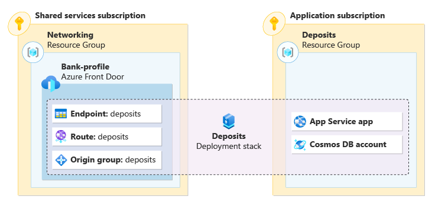

Azure resources managed by a deployment stack are called _managed resources_. The resources are defined in the template file used in the creation of the stack.

As you prepare for the next sprint for the deposits application, you want to know more about how resources are managed by a deployment stack. You're exptecting rapid and frequent changes to the application as features are tested in development. Before you plan for adding, modifying, and deleting resources to the application, you need to know how these resources are managed.

In this unit, you learn about managed resources and the _action on unmanage_ parameter. This parameter determines how Azure handles resources that are no longer managed by the stack.

## Managed resources

Before we get into updating deployment stacks, let's take a look at how resources are managed by a stack. When you create a deployment stack, the stack becomes responsible for managing the resources described in the template file. These resources are known as managed resources. As long as a resource is defined in a template file, it is considered a managed resource. Think of deployment stacks as a series of pointers that groups your application's resources into a single unit.



What happens to a resource that is no longer managed by the deployment stack? If a resource is no longer defined in a template file and the stack is updated, the resource can become detached or deleted. A detached resource is a resource that is no longer managed by the stack, but the resource continues to exist within Azure. A deleted resource is a resource that is no longer managed by the stack, and is deleted from Azure.

For example, let's consider our Bicep file from the last module.

:::code language="bicep" source="code/1-template.bicep" range="1-4, 18-42":::

The template file defines an app servie plan and a web app. Let's say that we need to remove the existing web app from our application. We edit our Bicep file, removing the code that references our web app.

:::code language="bicep" source="code/1-template.bicep" range="1-4, 21-33":::

::: zone pivot="cli"

To apply the changes, we need to update the deployment stack. To update a deployment stack using Azure CLI, use the `az stack group create` command.

```azurecli
az stack group create \
    --name stack-deposits \
    --resource-group rg-depositsApplication \
    --template-file ./main.bicep \
    --action-on-unmanage detachAll \
    --deny-settings-mode none
```

> [!NOTE]
> Azure CLI does not have a dedicated command to update a deployment stack. Use the create command to update the stack.

After the update operation is complete, the app service plan is the only resource managed by the stack. In our command, we used `--action-on-unmanage detachAll` to specify how Azure handles resources that are no longer managed by a deployment stack. In this case, the web app is detached from the deployment stack, but it still exists in the resource group.

::: zone-end

::: zone pivot="powershell"

To apply the changes, we need to update the deployment stack. To update a deployment stack using Azure PowerShell, use the `Set-AzResourceGroupDeploymentStack` command.

```azurepowershell
Set-AzResourceGroupDeploymentStack `
    -Name stack-deposits `
    -ResourceGroupName rg-depositsApplication `
    -TemplateFile ./main.bicep `
    -ActionOnUnmanage DetachAll `
    -DenySettingsMode None
```

After the update operation is complete, the app service plan is the only resource managed by the stack. In our command, we used `-ActionOnUnmanage DetachAll` to specify how Azure handles resources that are no longer managed by a deployment stack. In this case, the web app is detached from the deployment stack, but it still exists in the resource group.

::: zone-end

## Action on Unmanage

You're able to control how Azure handles detached resources, resource groups, and management groups with a property known as the _action on unmanage_ parameter. This parameter can be set when creating, modifying, or deleting a deployment stack.

All three operations have the ability to set the behavior of the _action on unmanage_ parameter. Keep in mind that the value set last takes precedence.

::: zone pivot="cli"

For example, if a deployment stack is created with the parameter set as `--action-on-unmanage detachAll`, Azure will detach any resources no longer managed by the stack. If a subsequent update operation is run and the parameter is set as `--action-on-unmanage deleteAll`, the behavior will default to `deleteAll`.

There are three possible values for the `--action-on-unmanage` parameter:

- `deletell` - deletes resources, resource groups, and management groups
- `deleteResources` - deletes resources, but detaches resource groups and management groups
- `detachAll` - detaches all resources, resource groups, and management groups

> [!NOTE]
> In this module, we are working with resrouce group scoped deployment stacks. In this situation, the resource group is not managed by the stack. > The 'delete all' value for the _action on unmanage_ parameter doesn't detele the resource group where the stack exists. It is necessary to delete the resource group after the stack and its resources are deleted.

Let's take a look at the json output when using the Azure CLI `az stack group show` command with values set for the `--action-on-unmanage` parameter. Notice the behavior for resources, resource groups, and management groups.

1. `--action-on-unmanage deleteAll`

    ```json
    "actionOnUnmanage": {
        "managementGroups": "delete",
        "resourceGroups": "delete",
        "resources": "delete"
    },
    ```

2. `--action-on-unmanage deleteResources`

    ```json
    "actionOnUnmanage": {
        "managementGroups": "detach",
        "resourceGroups": "detach",
        "resources": "delete"
    },
    ```

3. `--action-on-unmanage detachAll`

    ```json
    "actionOnUnmanage": {
        "managementGroups": "detach",
        "resourceGroups": "detach",
        "resources": "detach"
    },
    ```

::: zone-end

::: zone pivot="powershell"

For example, if a deployment stack is created with the parameter set as `-ActionOnUnmanage DetachAll`, Azure will detach any resources no longer managed by the stack. If a subsequent update operation is run and the parameter is set as `-ActionOnUnmanage DeleteAll`, the behavior will default to `DeleteAll`.

There are three possible values for the `-ActionOnUnmanage` parameter:

- `DeleteAll` - deletes resources, resource groups, and management groups
- `DeleteResources` - deletes resources, but detaches resource groups and management groups
- `DetachAll` - detaches all resources, resource groups, and management groups

> [!NOTE]
> In this module, we are working with resrouce group scoped deployment stacks. In this situation, the resource group is not managed by the stack. > The 'delete all' value for the _action on unmanage_ parameter doesn't detele the resource group where the stack exists. It is necessary to delete the resource group after the stack and its resources are deleted.

Let's take a look at the json output when using the Azure CLI `az stack group show` command with values set for the `--action-on-unmanage` parameter. Notice the behavior for resources, resource groups, and management groups.

1. `-ActionOnUnmanage DeleteAll`

    ```powershell
    resourcesCleanupAction        : delete
    resourceGroupsCleanupAction   : delete
    managementGroupsCleanupAction : delete
    ```

2. `-ActionOnUnmanage DeleteResources`

    ```powershell
    resourcesCleanupAction        : delete
    resourceGroupsCleanupAction   : detach
    managementGroupsCleanupAction : detach
    ```

3. `-ActionOnUnmanage DetachAll`

    ```powershell
    resourcesCleanupAction        : detach
    resourceGroupsCleanupAction   : detach
    managementGroupsCleanupAction : detach
    ```

::: zone-end
