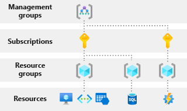
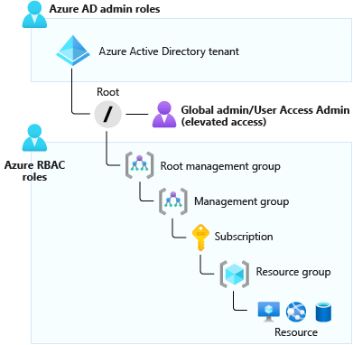

Azure resources and Microsoft Entra ID have independent permission systems. You use Azure roles to manage access to virtual machines, storage, and other Azure resources. You use Microsoft Entra roles to manage access to Microsoft Entra resources, such as user accounts and passwords.

In this unit, you'll look at the essential aspects of Azure roles and Microsoft Entra roles. You'll explore the various scopes available to you. You'll then identify the right roles to assign, depending on the scenario.

## Azure roles

Azure role-based access control (Azure RBAC) is the system that allows control over who has access to which Azure resources and what those people can do with those resources. You can achieve control by assigning roles to users, groups, or applications at a particular scope. A role might be described as a collection of permissions.

With Azure RBAC, you can allow one user or a set of users to access resources in a subscription. You can also separate responsibility for certain resources according to the specializations within your team. For example, you might want to grant your organization's data scientists access to Azure Machine Learning and any associated resources, such as Azure SQL Database, or you might want to grant access to Azure Blob storage within a dedicated Machine Learning resource group. By granting specific access, you isolate these resources from team members who don't have the required skills or resource needs.

You can specify fine-grained permissions for applications so that a marketing web app has access to only the associated marketing database and storage account. For managers or team members who are higher up in the organization, you could grant access to all resources in a resource group, a subscription for management purposes, and an overview of billing and consumption.

Azure RBAC has many built-in roles, and you can create custom roles.

Here are four examples of built-in roles:

- **Owner**: Has full access to all resources, including the ability to delegate access to other users
- **Contributor**: Can create and manage Azure resources
- **Reader**: Can view only existing Azure resources
- **User Access Administrator**: Can manage access to Azure resources

## Identify the right scope

You can apply Azure roles at four levels of scope: management groups, subscriptions, resource groups, and resources. The following diagram illustrates the hierarchy of these four levels.

Azure management groups help you manage your Azure subscriptions by grouping them together. If your organization has many subscriptions, you might need a way to efficiently manage access, policies, and compliance for those subscriptions. Azure management groups provide a level of scope above subscriptions.

Azure subscriptions help you organize access to Azure resources and determine how resource usage is reported, billed, and paid for. Each subscription can have a different billing and payment setup, so you can have different subscriptions and plans by office, department, project, and so on.

Resource groups are containers that hold related resources for an Azure solution. A resource group includes those resources that you want to manage as a group. You can decide which resources belong in a resource group based on what makes the most sense for your organization.

The scope is important, and establishes which resources should have a specific type of access applied to them. Imagine that someone in your organization needs access to virtual machines. You could use the *Virtual Machine Contributor* role, which allows that person to manage virtual machines only within a specific resource group. You can limit the role's scope to a specific resource, resource group, subscription, or management group level.

By combining an Azure role and a scope, you can set finely tailored permissions for your Azure resources.

## Microsoft Entra roles

Microsoft Entra ID also has its own set of roles that apply mostly to users, passwords, and domains. These roles have different purposes. Here are a few examples:

- **Global Administrator**: Can manage access to administrative features in Microsoft Entra ID. A person in this role can grant administrator roles to other users, and they can reset a password for any user or administrator. By default, whoever signs up for the directory is automatically assigned this role.

- **User Administrator**: Can manage all aspects of users and groups, including support tickets, monitoring service health, and resetting passwords for certain types of users.

- **Billing Administrator**: Can make purchases, manage subscriptions and support tickets, and monitor service health. Azure has detailed billing permissions in addition to Azure RBAC permissions. The available billing permissions depend on the agreement you have with Microsoft.

## Differences between Azure roles and Microsoft Entra roles

The main difference between Azure roles and Microsoft Entra roles is the areas they cover. Azure roles apply to Azure resources, and Microsoft Entra roles apply to Microsoft Entra resources (particularly users, groups, and domains). Also, Microsoft Entra ID has only one scope: the directory. The Azure RBAC scope covers management groups, subscriptions, resource groups, and resources.

The roles share a key area of overlap. A Microsoft Entra Global Administrator can elevate their access to manage all Azure subscriptions and management groups. This greater access grants them the Azure RBAC User Access Administrator role for all subscriptions of their directory. Through the User Access Administrator role, the Global Administrator can give other users access to Azure resources.

In our scenario, you need to grant full Azure RBAC management and billing permissions to a new manager. To achieve this, you'll temporarily elevate your access to include the User Access Administrator role. You can then grant the new manager the Owner role so that they can create and manage resources. You'll also set the scope to the subscription level so that the manager can do this for all resources in the subscription.

The following diagram shows what resources the Global Administrator can view when their permissions are elevated to User Access Administrator.

