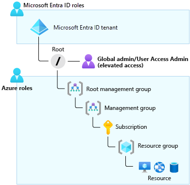

The marketing department's Azure subscription administrator recently left the organization. As Global Administrator, you don't have access to this subscription. You now need to grant administrator access for the subscription to another person in the marketing department.

In this unit, you'll explore when you might need to elevate your own access.

## When to elevate access

By default, a Global Administrator doesn't have access to Azure resources. The Global Administrator for Microsoft Entra ID can temporarily elevate their permissions to the Azure role of User Access Administrator. This action grants the Azure role-based access control (Azure RBAC) permissions they need to manage Azure resources. The User Access Administrator is assigned at the scope of root. The role can view all resources in and assign access to any subscription or management group in that Microsoft Entra organization.

The following diagram shows what resources the Global Administrator can view when their permissions are elevated to User Access Administrator.



As Global Administrator, you might need to elevate your permissions to:

- Regain lost access to an Azure subscription or management group.
- Grant another user or yourself access to an Azure subscription or management group.
- View all Azure subscriptions or management groups in an organization.
- Grant an automation app access to all Azure subscriptions or management groups.

After the Global Administrator elevates their permissions to User Access Administrator, they can then grant other users the Azure RBAC permissions that they need to control and manage Azure resources. When the task is complete, the Global Administrator should revoke their own elevated permissions.

## Assign a user administrative access to an Azure subscription

To assign a user administrative access to a subscription, you must have `Microsoft.Authorization/roleAssignments/write` and `Microsoft.Authorization/roleAssignments/delete` permissions at the subscription scope. Users with the subscription Owner or User Access Administrator role have these permissions.

In the next unit, you'll learn how to assign a role by using the Azure portal after you've elevated your permissions to User Access Administrator. However, you can also assign roles by using Azure PowerShell, the Azure CLI, or the REST API.

In the following sections, let's briefly review the commands you would use to assign the Owner role in Azure PowerShell or the Azure CLI.

### Assign the role by using Azure PowerShell

The following command shows how to assign the Owner role to a user at the subscription scope by using Azure PowerShell:

```PowerShell
  New-AzRoleAssignment `
    -SignInName rbacuser@example.com `
    -RoleDefinitionName "Owner" `
    -Scope "/subscriptions/<subscriptionID>"
  ```

### Assign the role by using the Azure CLI

The following command shows how to assign the Owner role to a user at the subscription scope by using the Azure CLI:

```azurecli
  az role assignment create \
    --assignee rbacuser@example.com \
    --role "Owner" \
    --scope /subscriptions/<subscription_id>/resourceGroups/<resource_group_name> \
    --subscription <subscription_name_or_id>
```
