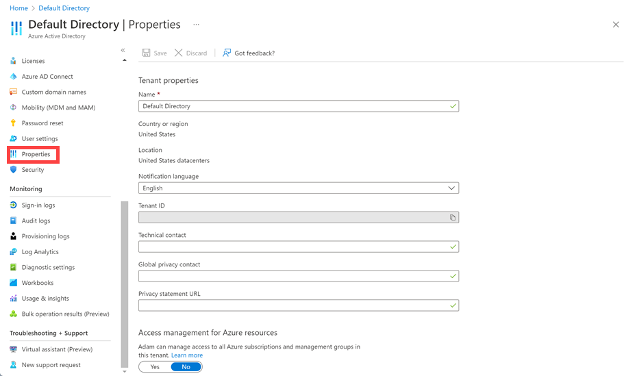
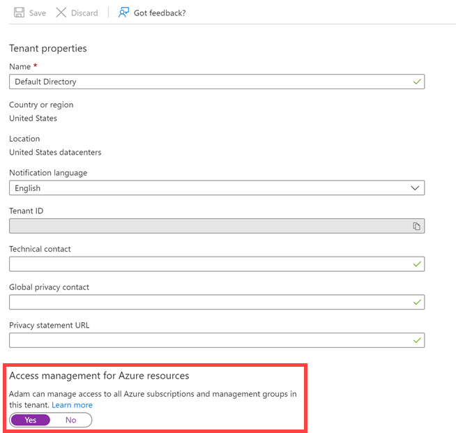
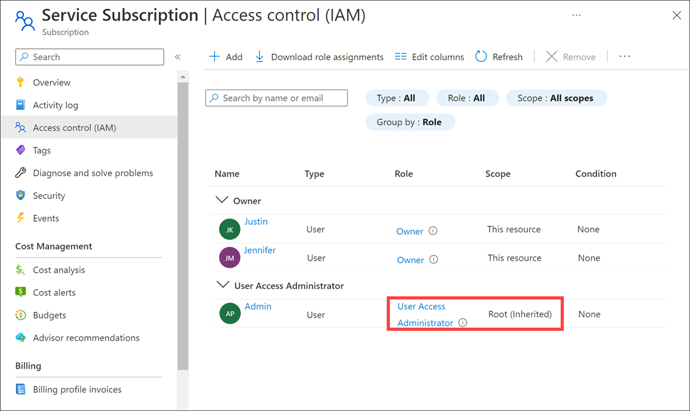

Your organization needs to grant administrator access for a subscription to a new administrator. The previous administrator left the company without assigning administrator access to another employee. No one else has access to this subscription.

In this unit, you'll temporarily elevate your own permissions to get access to this subscription. You'll look at how to assign subscription ownership to the new administrator. You'll then revoke your elevated access.

This exercise is optional. To complete it, you need access to an Azure subscription where you have the Global Administrator role for your account. If you don't have an Azure subscription, create a [free account](https://azure.microsoft.com/free/?azure-portal=true) before you begin.

## Elevate your access

1. Sign in to the [Azure portal](<https://portal.azure.com/learn.docs.microsoft.com?azure-portal=true>) as Microsoft Entra Global Administrator.

1. Select **Microsoft Entra ID**, then select the **Properties** tab.

    

1. Under **Access management for Azure resources**, select **Yes**.

    

1. Select **Save**.
1. Sign out of the Azure portal and sign in again to refresh your access.

### Verify that you have the User Access Administrator role

1. At the top of the Azure portal, search for **Subscriptions**.
1. Select the relevant subscription. Now that you have elevated access at the root scope, you should see all subscriptions in your directory.
1. Select **Access control (IAM)** > **Role assignments**.
1. Under **User Access Administrator**, ensure that you have the **Root (inherited)** scope.

    

## Assign a user as an administrator of a subscription

Because you're using your own subscription, you might want to walk through the following procedure without saving the Owner role assignment in step 5.

1. At the top of the **Access control (IAM)** pane, select **Add**.
1. Select **Add role assignment**.
1. On the **Role** tab, select the **Owner** role.
1. At the bottom of the page, select **Next**.
1. On the **Members** tab, select **+ Select members**.

    :::image type="content" source="../media/4-add-owner-role.png" alt-text="Screenshot of the Member tab on the Add role assignment page. ":::

1. On the **Select members** page, enter the username or email address of the user to whom you want to grant access and select **Select**.
1. Select **Next**.
1. Select **Review + Assign**.
1. If you want to complete the Owner role assignment, select **Review + Assign**. Otherwise, close the page.

## Revoke your elevated access

1. In the Azure portal, select **Microsoft Entra ID** > **Properties**.
1. Under **Access management for Azure resources**, select **No**.
1. Select **Save**.
1. Sign out of the Azure portal and sign in again to refresh your access.
