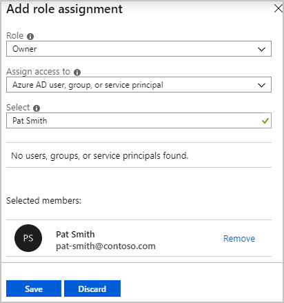

Your organization needs to grant administrator access for a subscription to a new administrator. The previous administrator left the company and didn't assign administrator access to another employee. No one else has access to this subscription.

In this unit, you'll elevate your access to get access to this subscription. You'll look at how to assign subscription ownership to the new administrator. You'll then revoke the elevated access.

This exercise is optional. To complete the exercise, you need access to an Azure subscription where you have the Global Administrator role for your account. If you don't have an Azure subscription, create a [free account](https://azure.microsoft.com/free/?azure-portal=true) before you begin.

## Elevate your access

1. Sign in to the [Azure portal](<https://portal.azure.com/learn.docs.microsoft.com?azure-portal=true>) as the Azure AD Global Administrator.
1. Select **Azure Active Directory** > **Properties**.
    
1. Under **Access management for Azure resources**, select **Yes**.
    
1. Select **Save**.
1. Sign out and sign back in to Azure to refresh your access.

### Verify that you have the User Access Administrator role

1. Search for **Subscriptions** from the top of the Azure portal.
1. Select the relevant subscription. Now that you have elevated access at the root scope, you should see all subscriptions in your directory.
1. Select **Access control (IAM)** > **Role assignments**.
    
1. Scroll down to the **USER ACCESS ADMINISTRATOR** section, and check that you have the **Root (inherited)** scope.

## Assign a user as an administrator of a subscription

Because you're using your own subscription, you might want to just walk through these steps and not save the Owner role assignment in the last step.

1. On the Access control (AIM) pane, at the top, select **+ Add**.
1. Select **Add role assignment**.
1. Set the **Role** field to **Owner**.
1. In the **Select** field, use the username or email of the users you want to grant access to. Select that user.

    
1. If you want to complete the Owner role assignment, select **Save**. Otherwise, select **Discard**.

## Remove your elevated access

1. In the Azure portal, select **Azure Active Directory** > **Properties**.
1. Under **Access management for Azure resources**, select **No**.
1. Select **Save**.
1. Sign out and sign back in to Azure to refresh your access.
