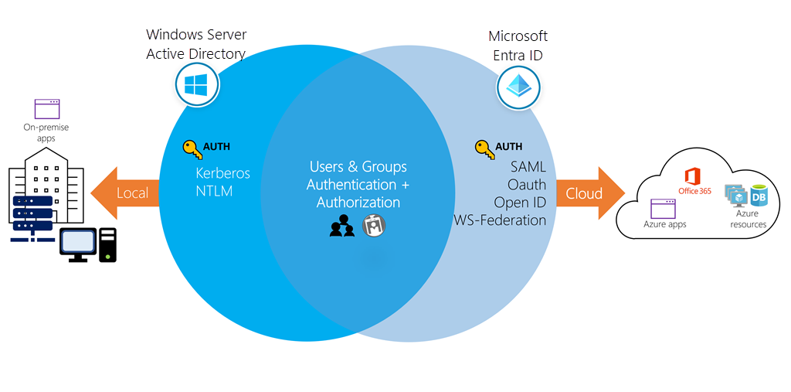
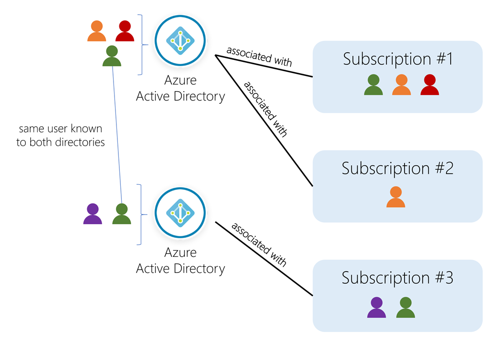
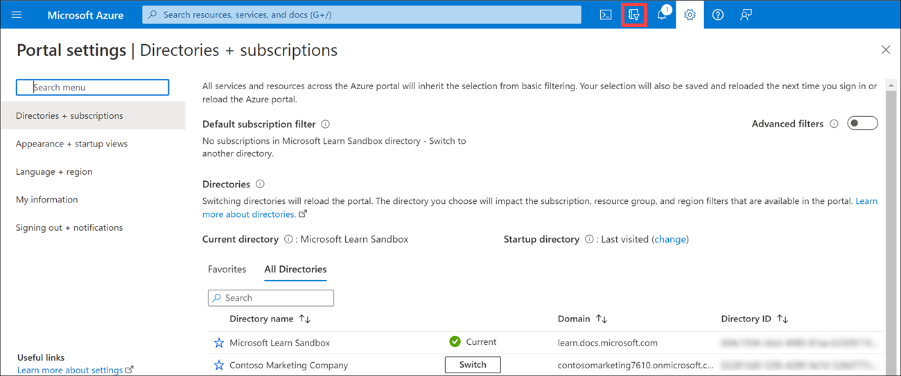
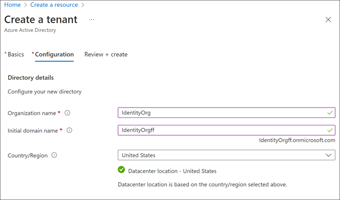
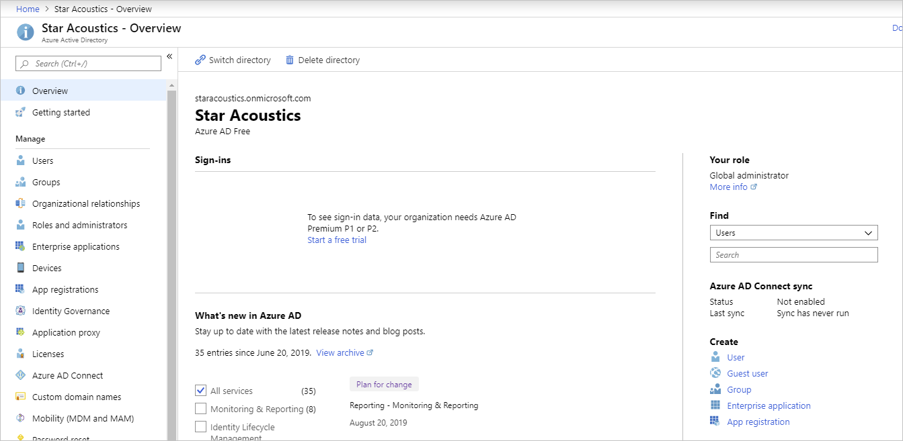

While they share a similar name, Azure AD is _not_ a cloud version of Windows Server Active Directory. It's also not intended as a complete replacement for an on-premises Active Directory. Instead, if you're already using a Windows AD server, you can connect it to Azure AD to extend your directory into Azure. This approach allows users to use the same credentials to access local and cloud-based resources.

A user can also use Azure AD  independently of Windows AD. Smaller companies can use Azure AD as their only directory service to control access to their applications and SaaS products, such as Microsoft 365, Salesforce, and Dropbox.

> [!NOTE]
> Keep in mind that this approach doesn't provide a completely centralized administrative model - for example, local Windows machines would authenticate using local credentials. Users can write applications to use Azure AD and provide authentication and authorization to be administered by a user in a single place.

## Directories, subscriptions, and users

Microsoft offers several cloud-based offerings today - all of which can use Azure AD to identify users and control access.

- Microsoft Azure
- Microsoft 365
- Microsoft Intune
- Microsoft Dynamics 365

When a company or organization signs up to use one of these offerings, they are assigned a default _directory_, an instance of Azure AD. This directory holds the users and groups that will have access to each of the services the company has purchased. This default directory can be referred to as a _tenant_. A tenant represents the organization and the default directory assigned to it.

_Subscriptions_ in Azure are both a billing entity and a security boundary. Resources such as virtual machines, websites, and databases are associated with a single subscription. Each subscription also has a single account _owner_ responsible for any charges incurred by resources in that subscription. If your organization wants a subscription billed to another account, you can transfer the subscription. A subscription is associated with a **single Azure AD directory**. Multiple subscriptions can trust the same directory, but a subscription can only trust one directory.

Users and groups can be added to multiple subscriptions - this allows the user to create, control, and access resources in the subscription. When you add a user to a subscription, the user must be known to the associated directory as shown in the following image.

If you belong to multiple directories, you can switch the current directory you are working in through the **Directory + subscription** button in the Azure portal header.

You can also decide how the default directory is selected: last visited or a specific directory. You can also set the default filter for displayed subscriptions. Default filters are useful if you have access to several subscriptions but typically only work in a few of them.

## Create a new directory

An organization (tenant) has one associated default Azure AD directory. However, owners can create additional directories to support the development or testing purposes or because they want to have separate directories to synchronize with their local Windows Server AD forests.

> [!IMPORTANT]
> The steps to create a new directory follow; however, unless you are an owner of your Azure account, this option won't be available to you. The Azure Sandbox doesn't allow you to create new Azure AD directories.

1. Sign in to the [Azure portal](https://portal.azure.com?azure-portal=true).

1. Select **Create a resource**, then select **Identity** from the Azure Marketplace, and then select **Azure Active Directory** from the list. Select **Create**.

1. Choose an *organization name* for the directory to help distinguish it from your other directories. The directory to be created will be used in production; choose a name for the directory that your users will recognize as your organization's name. You can change the name later if you want.

1. Enter the *domain name* associated with it. Azure will give a validation error unless the domain is not known. The default domain name will always have the suffix `.onmicrosoft.com`. You can not change the default domain. If you choose to, you can add a custom domain owned by your organization so defined users can use a traditional company email such as `john@contoso.com`.

1. Select in what country the directory should reside. The country will identify the region and data center where the Azure AD instance will live;  you can not change it later.

    

1. Select **Create** to create the new directory. A free tier directory where you can add users will be created, create roles, register the apps and devices, and control licenses.

After you have created the directory, you can navigate to the dashboard that lets you control all directory aspects.

Let's explore one of the primary elements you'll work with in Azure AD: **users**.
