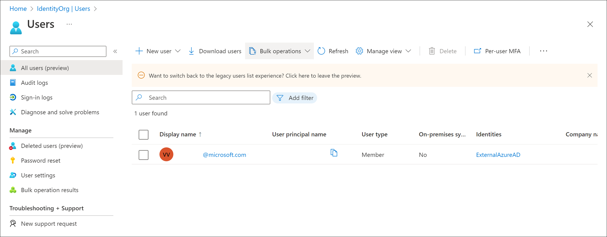
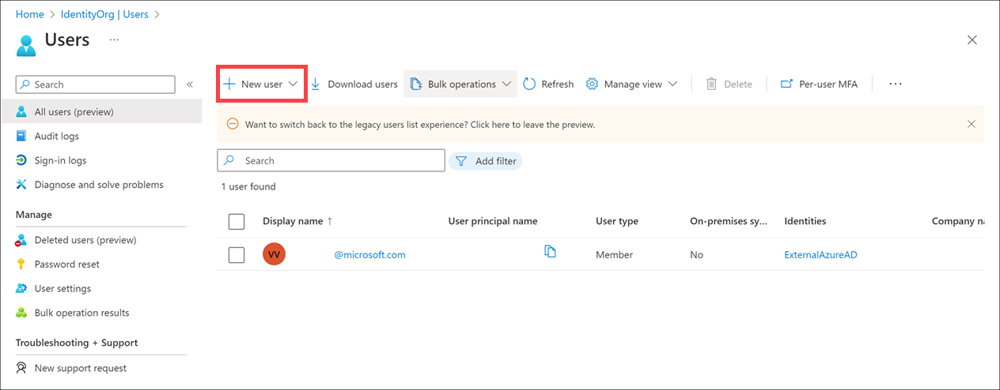
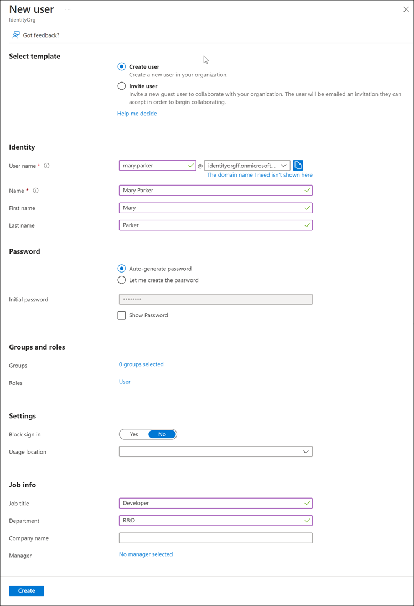
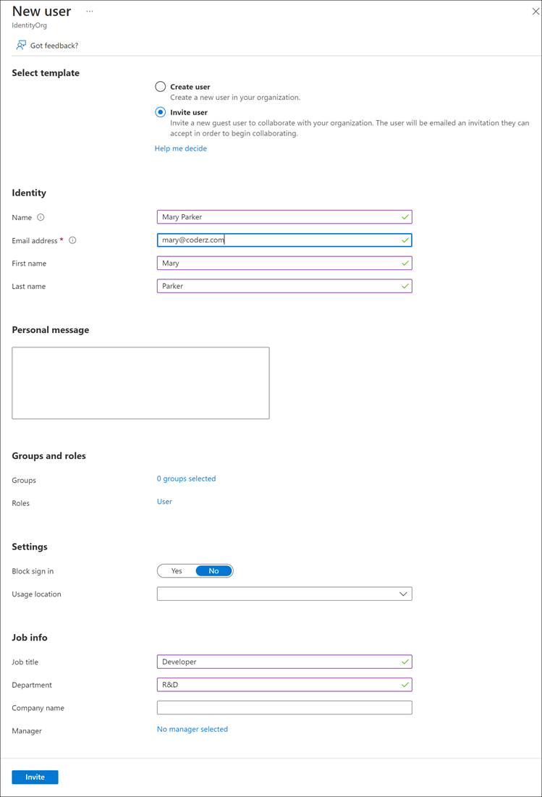

Every user who needs access to Azure resources needs an Azure user account. A user account contains all the information needed to authenticate you during the sign-in process. Once authenticated, Azure AD builds an access token to authorize you, determine what resources you can access, and determine what you can do with those resources.

You can use the **Azure Active Directory** dashboard in the Azure portal to work with user objects. Keep in mind that you can only work with a single directory at a time, but you can use the **Directory + Subscription** pane to switch directories. The dashboard also has a **Switch directory** button in the toolbar, which makes it easy to switch to another available directory.

## View users

To view the Azure AD users, in the left menu pane, under **Manage**, select **Users**. The **All Users** pane appears. Take a minute to access the portal and view your users. Notice the **User type** and **Identities** columns, as shown in the following screenshot:



Typically, Azure AD defines users in three ways:

- **Cloud identities**: These users exist only in Azure AD. Examples are administrator accounts and users that you manage yourself. Their source is **Azure Active Directory** or **External Azure Active Directory** if the user is defined in another Azure AD instance, but needs access to subscription resources controlled by this directory. When these accounts are removed from the primary directory, they are deleted.

- **Directory-synchronized identities**: These users exist in an on-premises Active Directory. A synchronization activity that occurs via **Azure AD Connect** brings these users in to Azure. Their source is **Windows Server AD**.

- **Guest users**: These users exist outside Azure. Examples are accounts from other cloud providers and Microsoft accounts, such as an Xbox LIVE account. Their source is **Invited user**. This type of account is useful when external vendors or contractors need access to your Azure resources. Once their help is no longer necessary, you can remove the account and all of their access.

## Add users

You can add cloud identities to Azure AD in multiple ways:

- Syncing an on-premises Windows Server Active Directory
- Using the Azure portal
- Using the command line
- Other options

### Sync an on-premises Windows Server Active Directory

Azure AD Connect is a separate service that allows you to synchronize a traditional Active Directory with your Azure AD instance. This is how most enterprise customers add users to the directory. The advantage to this approach is users can use single sign-on (SSO) to access local and cloud-based resources.

### Use the Azure portal

You can manually add new users through the Azure portal. This is the easiest way to add a small set of users. You need to be in the **User Administrator** role to perform this function.

1. To add a new user with the Azure portal, in the top menu bar, select **New user**, then select **Create new user**.

    

1. In addition to **Name** and **User name**, you can add profile information, like **Job Title** and **Department**.

    

    The default behavior is to create a new user in the organization. The user will have a username with the default domain name assigned to the directory such as alice@staracoustics.onmicrosoft.com.

1. You can also *invite* a user into the directory. In this case, an email is sent to a known email address, and an account is created and associated with that email address if the user accepts the invitation.

    

    The invited user will need to create an associated Microsoft account (MSA) if that specific email address isn't associated with one, and the account will be added to the Azure AD as a guest user.

### Use the command line

If you have a lot of users to add, a better option is to use a command-line tool. You can run the `New-AzureADUser` Azure PowerShell command to add cloud-based users.

```powershell
# Create a password object
$PasswordProfile = New-Object -TypeName Microsoft.Open.AzureAD.Model.PasswordProfile

# Assign the password
$PasswordProfile.Password = "<Password>"

# Create the new user
New-AzureADUser -AccountEnabled $True -DisplayName "Abby Brown" -PasswordProfile $PasswordProfile -MailNickName "AbbyB" -UserPrincipalName "AbbyB@contoso.com"
```

The command will return the new user object you created.

```output
ObjectId                             DisplayName UserPrincipalName UserType
--------                             ----------- ----------------- --------
f36634c8-8a93-4909-9248-0845548bc515 Abby Brown  AbbyB@contoso.com Member
```

If you prefer a more standard command-line interface, you can use the Azure CLI:

```azurecli
az ad user create --display-name "Abby Brown" \
                  --password "<password>" \
                  --user-principal-name "AbbyB@contoso.com" \
                  --force-change-password-next-login true \
                  --mail-nickname "AbbyB"
```

Command-line tools allow you to add users in bulk through scripting. The most common approach for this is to use a comma-separated values (CSV) file. You can either manually create this file or export the file from an existing data source.

If you're planning to use a CSV, here are some things to think about:

- **Naming conventions**: Establish or implement a naming convention for usernames, display names, and aliases. For example, a username might consist of the last name, followed by a period (.), followed by the first name; for example, Smith.John@contoso.com.

- **Passwords**: Implement a convention for the initial password of a newly created user. Determine how new users will receive their passwords in a security-enhanced way. A commonly used method is generating a random password and then emailing it to the new user or their manager.

To use a CSV with Azure PowerShell:

1. Run the `Connect-AzureAD` command to create an Azure PowerShell connection to your directory. Connect with an admin account that has privileges on your directory.

1. Create new password profiles for the new users. The passwords for the new users need to conform to the password complexity rules you have set for your directory.

1. Use `Import-CSV` to import the CSV. You need to specify the path and file name of the CSV.

1. Loop through the users in the file, constructing the user parameters needed for each user. Example parameters are User Principal Name, Display Name, Given Name, Department, and Job Title.

1. Run the `New-AzureADUser` command to create each user. Be sure to enable each account.

### Other options

You can also add users to Azure AD programmatically using the Microsoft Graph API, or through the Microsoft 365 Admin Center and the Microsoft Intune Admin console if you're sharing the same directory.
