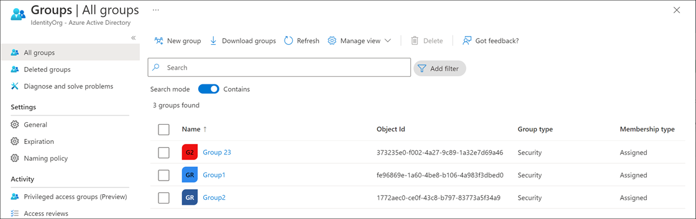
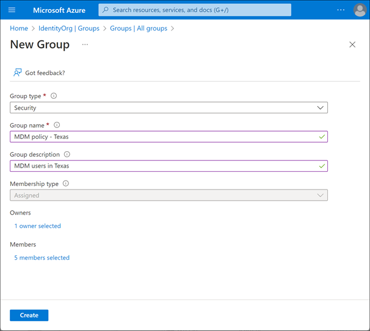
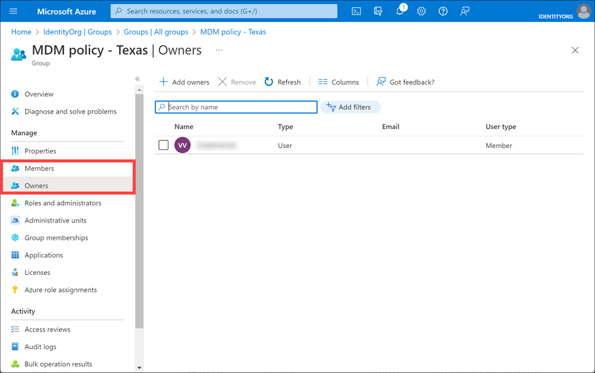

An Azure AD group helps organize users making it easier to manage permissions. Using groups lets the resource owner (or Azure AD directory owner), assign a set of access permissions to all the members of the group, instead of having to provide the rights one-by-one. Groups allow us to define a security boundary and then add and remove specific users to grant or deny access with a minimum amount of effort. Even better, Azure AD supports the ability to define membership based on rules - such as what department a user works in, or the job title they have.

Azure AD allows you to define two different types of groups.

1. **Security groups**. These are the most common and are used to manage member and computer access to shared resources for a group of users. For example, you can create a security group for a specific security policy. By doing it this way, you can give a set of permissions to all the members at once, instead of having to add permissions to each member individually. This option requires an Azure AD administrator.

1. **Microsoft 365 groups**. These groups provide collaboration opportunities by giving members access to a shared mailbox, calendar, files, SharePoint site, and more. This option also lets you give people outside of your organization access to the group. This option is available to users as well as admins.

## View available groups

You can view all groups by selecting **Groups** under the **Manage** section from the Azure AD dashboard. A new Azure AD install won't have any groups defined.



## Add groups to Azure AD

The same options are available to create groups in Azure AD as we saw with users. The Azure portal is the easiest way to create groups. You must select the group type (Security or Microsoft 365), assign a unique group name, description and a _membership type_.



The membership type field can be one of three values:

1. **Assigned (static)**. The group will contain specific users or groups that you select.

1. **Dynamic user**. You create rules based on characteristics to enable attribute-based dynamic memberships for groups. For example, if a user’s department is Sales, that user will be dynamically assigned to the Sales group. You can set up a rule for dynamic membership on security groups or on Microsoft 365 groups. If the user's department changes in the future, they are automatically removed from the group. This feature requires an Azure AD Premium P1 license.

1. **Dynamic device**. You create rules based on characteristics to enable attribute-based dynamic memberships for groups. For example, if a user’s device is associated with the Service department, that device will be dynamically assigned to the Service group. You can set up a rule for dynamic membership on security groups or on Microsoft 365 groups. If the device's association with a particular department changes in the future, it are automatically removed from the group. This feature requires an Azure AD Premium P1 license.

Finally, you can select group owner(s) that can administer the group, and member(s) that will belong to the group. Both of these can contain other groups as well as individual users.

### Script group creation

You can also use Azure PowerShell to add a group using the **New-AzureADGroup** command as shown below.

```powershell
New-AzureADGroup -Description "Marketing" -DisplayName "Marketing" -MailEnabled $false -SecurityEnabled $true -MailNickName "Marketing"
```

## Change membership for a group

Once a group is created, you can add or remove users (or groups) from it by editing the group membership by selecting the group and using the options under the **Manage** section.


