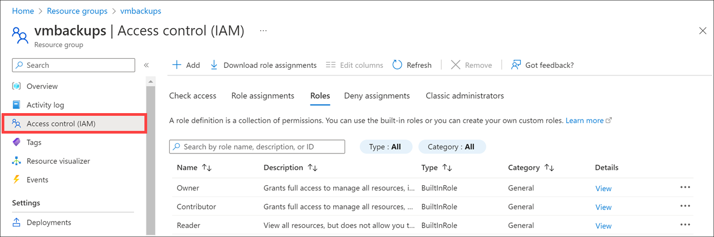

## Built-in roles for Azure Resources (uses PowerShell)

Azure provides several *built-in roles* to cover the most common security scenarios. To understand how the roles work, let's examine three roles that apply to all resource types:

* **Owner**: Has full access to all resources, including the right to delegate access to others.
* **Contributor**: Can create and manage all types of Azure resources, but can’t grant access to others.
* **Reader**: Can view existing Azure resources.

## Role definitions

Each role is a set of properties defined in a JavaScript Object Notation (JSON) file. This role definition includes a **Name**, **ID**, and **Description**. It also includes the allowable permissions (**Actions**), denied permissions (**NotActions**), and scope (for example, read access) for the role.

For the Owner role, that means all actions, indicated by an asterisk (*); no denied actions; and all scopes, indicated by a forward slash (/).

You can get this information using the PowerShell `Get-AzRoleDefinition Owner` cmdlet.

```powershell
Get-AzRoleDefinition Owner
```

This code should produce the following output:

```output
Name             : Owner
Id               : 8e3af657-a8ff-443c-a75c-2fe8c4bcb635
IsCustom         : False
Description      : Lets you manage everything, including access to resources.
Actions          : {*}
NotActions       : {}
DataActions      : {}
NotDataActions   : {}
AssignableScopes : {/}
```

Try the same for the **Contributor** and **Reader** roles to see the actions allowed and denied.

## Examine the built-in roles

Next, let's explore some of the other built-in roles.

1. Open the [Azure portal](https://portal.azure.com?azure-portal=true).

1. On the Azure home page, select **Resource groups** in the left-hand menu.

1. Select a resource group. Your *Resource group* pane appears.

1. In the left menu pane, select the **Access control (IAM)**. The **Access control (IAM)** pane appears for your resource group.

1. On the interior menu bar, select the **Roles** tab as follows to see the list of available roles.

    

## What's a role definition?

A role definition is a collection of permissions. A role definition lists the operations the role can perform, such as **read, write, and delete**. It can also list the operations that can't be performed or operations related to underlying data.

As previously described, a role definition has the following structure:

| Name                 | Description |
|----------------------|-------------|
| `Id`                 | Unique identifier for the role, assigned by Azure |
| `IsCustom`           | True if a custom role, False if a built-in role |
| `Description`        | A readable description of the role |
| `Actions []`         | Allowed permissions; `*` indicates all |
| `NotActions []`      | Denied permissions |
| `DataActions []`     | Specific allowed permissions as applied to data, for example `Microsoft.Storage/storageAccounts/blobServices/containers/blobs/read` |
| `NotDataActions []`  | Specific denied permissions as applied to data.|
| `AssignableScopes []`| Scopes where this role applies; `/` indicates global, but can reach into a hierarchical tree |

This structure is represented as JSON when used in role-based access control (RBAC) or from the underlying API. For example, here's the **Contributor** role definition in JSON format.

```json
{
  "Name": "Contributor",
  "Id": "b24988ac-6180-42a0-ab88-20f7382dd24c",
  "IsCustom": false,
  "Description": "Lets you manage everything except access to resources.",
  "Actions": [
    "*"
  ],
  "NotActions": [
    "Microsoft.Authorization/*/Delete",
    "Microsoft.Authorization/*/Write",
    "Microsoft.Authorization/elevateAccess/Action"
  ],
  "DataActions": [],
  "NotDataActions": [],
  "AssignableScopes": [
    "/"
  ]
}
```

### Actions and NotActions

You can tailor the `Actions` and `NotActions` properties to grant and deny the exact permissions you need. These properties are always in the format: `{Company}.{ProviderName}/{resourceType}/{action}`.

As an example, here are the actions for the three roles we looked at previously:

| Built-in Role | Actions | NotActions |
| ------------- |---------| -------|
|Owner (allow all actions)|`*`| - |
|Contributor (allow all actions except writing or deleting role assignments)|`*`|`Microsoft.Authorization/*/Delete, Microsoft.Authorization/*/Write, Microsoft.Authorization/elevateAccess/Action`|
|Reader (allow all read actions)|`*/read`| - |

The wildcard (`*`) operation under `Actions` indicates that the principal assigned to this role can perform all actions; or in other words, this role can manage everything, including actions defined in the future, as Azure adds new resource types. With the **Reader** role, only the `read` action is allowed.

The operations under `NotActions` are subtracted from `Actions`. With the **Contributor** role, `NotActions` removes this role's ability to manage access to resources, and also removes assigning access to resources.

### DataActions and NotDataActions

Data operations are specified in the `DataActions` and `NotDataActions` properties. You can specify data operations separately from the management operations. This prevents current role assignments with wildcards (`*`) from suddenly having access to data. Here are some data operations that you can specify in `DataActions` and `NotDataActions`:

* Read a list of blobs in a container
* Write a storage blob in a container
* Delete a message in a queue

You can only add data operations to the `DataActions` and `NotDataActions` properties. Resource providers identify which operations are data operations by setting the `isDataAction` property to `true`.  Roles that don't have data operations can omit these properties from the role definition.

These actions work exactly like their management cousins. You can specify the actions you want to allow (or `*` for all), then provide a list of specific actions to remove in the `NotDataActions` collection. Here are some examples; you can find the [full list of actions and data actions in the resource provider documentation](/azure/role-based-access-control/resource-provider-operations):

| Data operation | Description |
|----------------|-------------|
| `Microsoft.Storage/storageAccounts/blobServices/containers/blobs/delete` | Delete blob data |
| `Microsoft.Compute/virtualMachines/login/action` | Log in to a VM as a regular user |
| `Microsoft.EventHub/namespaces/messages/send/action` | Send messages on an event hub |
| `Microsoft.Storage/storageAccounts/fileServices/fileshares/files/read` | Return a file/folder or list of files/folders |
| `Microsoft.Storage/storageAccounts/queueServices/queues/messages/read` | Read a message from a queue |

### Assignable Scopes

Defining the **Actions** and **NotActions** properties is not enough to fully implement a role. You also need to properly scope your role.

The **AssignableScopes** property of the role specifies the scopes (subscriptions, resource groups, or resources) within which the role is available for assignment. You can make the custom role available for assignment just in the subscriptions or resource groups that need it, thus avoiding cluttering the user experience for the rest of the subscriptions or resource groups.

Here are some examples:

| To | Use Scope |
|-|-|
| Restrict to a subscription | `"/subscriptions/{sub-id}"` |
| Restrict to a specific resource group on a specific subscription | `"/subscriptions/{sub-id}/resourceGroups/{rg-name}"` |
| Restrict to a specific resource | `"/subscriptions/{sub-id}/resourceGroups/{rg-name}/{resource-name}"` |
| Make a role available for assignment in two subscriptions | `"/subscriptions/{sub-id}", "/subscriptions/{sub-id}"` |

## Create roles

Microsoft Entra ID comes with built-in roles that are likely to cover 99% of what you'll ever want to do. It's preferable to use a built-in role if possible. However, you can create custom roles if you find it necessary.

> [!NOTE]
> Custom role creation requires Microsoft Entra ID P1 or P2; you can't create custom roles in the free tier.

You can create a new role through several mechanisms:

* **Azure portal**: You can use the Azure portal to create a custom role by selecting **Microsoft Entra ID** > **Roles and administrators** > **New custom role**.

* **Azure PowerShell**: You can use the `New-AzRoleDefinition` cmdlet to define a new role.

* **Azure Graph API**: You can use a REST call to the Graph API to programmatically create a new role.

This module's Summary section includes a link to the documentation for all three approaches.
