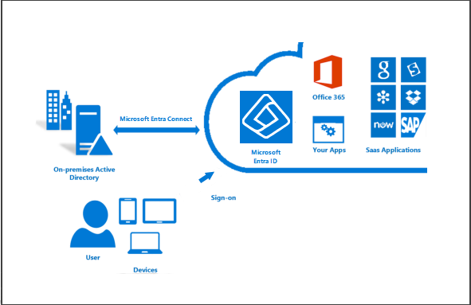

Companies that use an on-premises Windows Server Active Directory solution can integrate their existing users and groups with Microsoft Entra ID with **Microsoft Entra Connect**. This is a free tool you can download and install to synchronize your local AD with your Azure directory.

With Microsoft Entra Connect, you can provide your users with a common identity for Microsoft 365, Azure, and SaaS applications integrated with Microsoft Entra ID in a hybrid identity environment.

## What's included in Microsoft Entra Connect?

Microsoft Entra Connect provides several components that you can install to create a hybrid identity system.

* **Sync services**: This component is responsible for creating users, groups, and other objects. It also makes sure that identity information for your on-premises users and groups matches that in the cloud.
* **Health monitoring**: Microsoft Entra Connect Health supplies robust monitoring and a central location in the Azure portal for viewing this activity.
* **AD FS**: Federation is an optional part of Microsoft Entra Connect that you can use to configure a hybrid environment via an on-premises AD FS infrastructure. Organizations can use this to address complex deployments such as domain join SSO, enforcement of the Active Directory sign-in policy, and smart card or third-party multifactor authentication.
* **Password hash synchronization**: This feature is a sign-in method that synchronizes a hash of a user’s on-premises Active Directory password with Microsoft Entra ID.
* **Pass-through authentication**: This allows users to sign in to both on-premises and cloud-based applications using the same passwords. This reduces IT helpdesk costs, because users are less likely to forget how to sign in. This feature provides an alternative to **Password hash synchronization** that allows organizations to enforce their security and password complexity policies.

## Benefits

Integrating your on-premises directories with Microsoft Entra ID makes your users more productive by supplying a common identity for accessing both cloud and on-premises resources. Users and organizations get the following advantages:

* Users can use a single identity to access both on-premises applications and cloud services such as Microsoft 365.
* A single tool provides an easy deployment experience for synchronization and sign-in.
* Integration provides the newest capabilities for your scenarios. Microsoft Entra Connect replaces older versions of identity integration tools such as DirSync and Azure AD Sync.

## Installing

Installing and configuring Microsoft Entra Connect is not a trivial task, and requires some initial planning and decisions before you begin. Microsoft has a full [Installation guide](/entra/identity/hybrid/connect/how-to-connect-install-roadmap) to help you prepare, install, configure and test your AD Connect setup.
