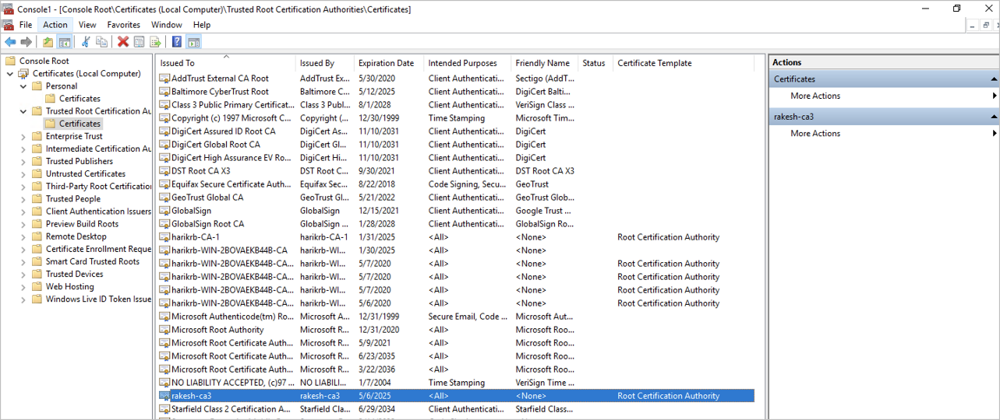

You can use LDAP over TLS to secure communication between an Azure NetApp Files volume and the Active Directory LDAP server. You can enable LDAP over TLS for NFS, SMB, and dual-protocol volumes of Azure NetApp Files.

### Considerations

- DNS PTR records must exist for each AD DS domain controller assigned to the AD Site Name specified in the Azure NetApp Files Active Directory connection.
- PTR records must exist for all domain controllers in the site for AD DS LDAP over TLS to function properly.

### Generate and export root CA certificate

If you do not have a root CA certificate, you need to generate one and export it for use with LDAP over TLS authentication.

1. Follow Install the Certification Authority to install and configure AD DS Certificate Authority.
2. Follow View certificates with the MMC snap-in to use the MMC snap-in and the Certificate Manager tool.

    Use the Certificate Manager snap-in to locate the root or issuing certificate for the local device. You should run the Certificate Management snap-in commands from one of the following settings:

    - A Windows-based client that has joined the domain and has the root certificate installed
    - Another machine in the domain containing the root certificate

3. Export the root CA certificate.

    Root CA certificates can be exported from the Personal or Trusted Root Certification Authorities directory, as shown in the following examples:

Ensure that the certificate is exported in the Base-64 encoded X.509 (.CER) format:

### Enable LDAP over TLS and upload root CA certificate

1. Go to the NetApp account used for the volume and select **Active Directory connections**. Then, select **Join** to create a new AD connection or **Edit** to edit an existing AD connection.
2. In the **Join Active Directory** or **Edit Active Directory** window that appears, select the **LDAP over TLS** checkbox to enable **LDAP over TLS** for the volume. Then select **Server root CA Certificate** and upload the generated root CA certificate to use for LDAP over TLS.

Ensure that the certificate authority name can be resolved by DNS. This name is the "Issued By" or "Issuer" field on the certificate:

If you uploaded an invalid certificate, and you have existing AD configurations, SMB volumes, or Kerberos volumes, an error like the following occurs:

`Error updating Active Directory settings The LDAP client configuration "ldapUserMappingConfig" for Vservers is an invalid configuration.`

To resolve the error condition, upload a valid root CA certificate to your NetApp account as required by the Windows Active Directory LDAP server for LDAP authentication.

### Disable LDAP over TLS

Disabling LDAP over TLS stops encrypting LDAP queries to Active Directory (LDAP server). There are no other precautions or impact on existing ANF volumes.

1. You need to select Active Directory connections from the NetApp account. Then select Edit to edit the existing AD connection.
2. In the Edit Active Directory window that appears, you can deselect the LDAP over TLS checkbox and select Save to disable LDAP over TLS for the volume.

