In this exercise, you create, manage, and modify Active Directory connections. You use LDAP over TLS to secure communication between an Azure NetApp Files volume and the Active Directory LDAP server. You learn to join a Linux virtual machine (VM) to a Microsoft Entra Domain Services.

### Task 1 – Create an Active Directory connection

In this task, you create an Active Directory connection using the Azure NetApp Files portal.

1. From your NetApp account, select **Active Directory connections** then **Join**.

    [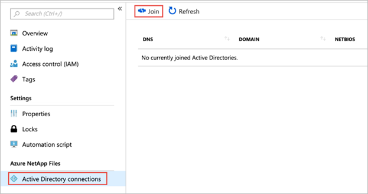]( ../media/active-directory-connections.png#lightbox)

2. In the Join Active Directory window, provide the following information, based on the Domain Services you want to use.

    - Primary DNS (required)
    - Secondary DNS
    - AD DNS Domain Name (required)
    - AD Site Name (required)
    - SMB server (computer account) prefix (required)
    - Organizational unit path

    [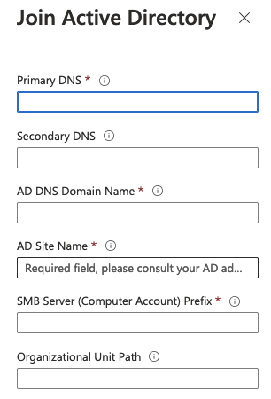](../media/ex-join-ad.png#lightbox)

    - AES Encryption
    - LDAP Signing

    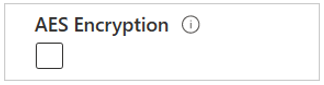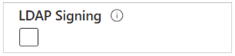

    - Allow local NFS users with LDAP
    - LDAP over TLS
    - Server root CA Certificate
    - LDAP Search Scope, User DN, Group DN, and Group Membership Filter (By checking LDAP search scope, you can see the other options).

    :::image type="complex" source="../media/ex-ldap-configuration.png" alt-text="Screenshot of the Join Active Directory configuration showing LDAP settings":::
       It shows settings such as Allow local NFS users with LDAP checkbox, LDAP over TLS checkbox, Server root CA Certificate file selector, LDAP search scope (enabled), User DN, Group DN, and Group Membership Filter
    :::image-end:::

    - Preferred server for LDAP client
    - Encrypted SMB connections to Domain Controller
    - Backup policy users
    - Security privilege users

    [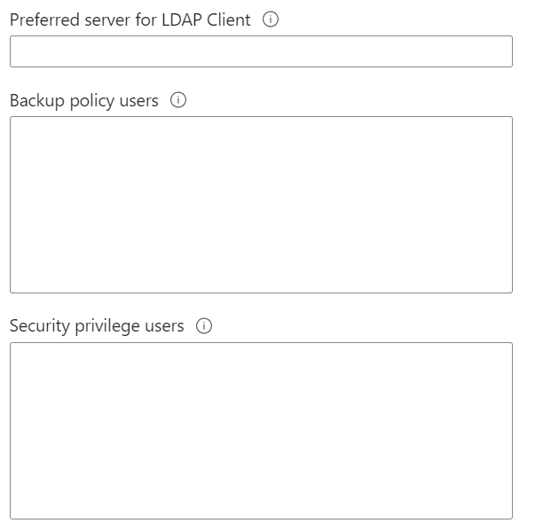](../media/ex-preferred-ldap-server.png#lightbox)

    - Administrators privilege users

    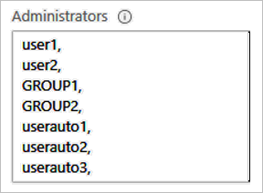

    - Credentials, including your username and password.

    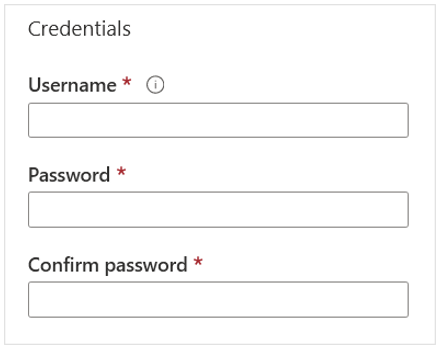

3. Once you finish entering all the information, select **Join**.

    The Active Directory connection you created appears.

    [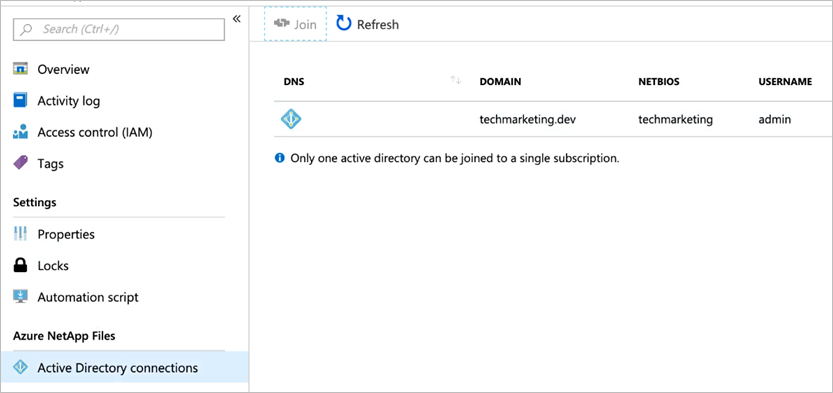](../media/ad-created-connections.png#lightbox)

### Task 2: Modify Active Directory connections for Azure NetApp Files

In this task, you modify the existing Active Directory connection that you created in the previous step.

1. Select Active Directory connections. Then, select **Edit** to edit an existing AD connection.

    [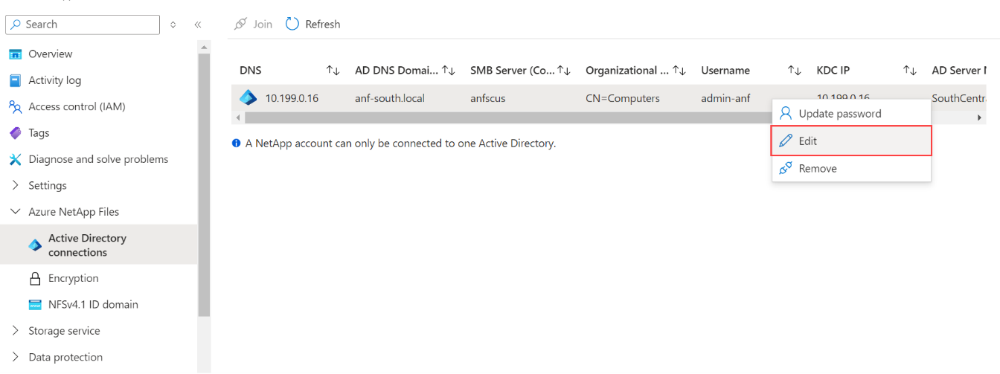](../media/modify-ad-connections.png#lightbox)

2. In the Edit Active Directory window that appears, modify Active Directory connection configurations as needed.

    [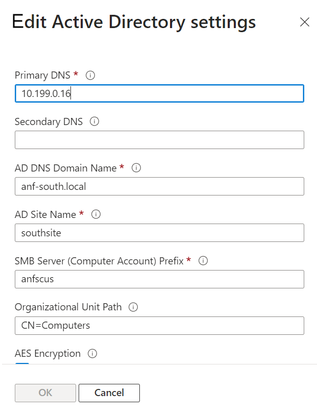](../media/ex-edit-ad-settings.png#lightbox)

     You can also modify LDAP settings, such as enabling LDAP over TLS and uploading the root CA certificate.

3. Click **OK**, after making the changes.

### Task 3: Configure AD DS LDAP over TLS for Azure NetApp Files

In this task, you use LDAP over TLS to secure communication between an Azure NetApp Files volume and the Active Directory LDAP server. First, you need to generate root CA certificate and export it for use with LDAP over TLS authentication. And you enable LDAP over TLS and upload root CA certificate.

#### Generate and export root CA certificate

If you don't have a root CA certificate, you need to generate one and export it for use with LDAP over TLS authentication.

Follow [Install the Certification Authority](https://learn.microsoft.com/windows-server/networking/core-network-guide/cncg/server-certs/install-the-certification-authority) to install and configure AD DS Certificate Authority.

Follow [View certificates with the MMC snap-in](https://learn.microsoft.com/dotnet/framework/wcf/feature-details/how-to-view-certificates-with-the-mmc-snap-in) to use the MMC snap-in and the Certificate Manager tool.

#### Export the root CA certificate

Root CA certificates can be exported from the Personal or Trusted Root Certification Authorities directory.

1. Select **Certificates** from Personal directory.

    [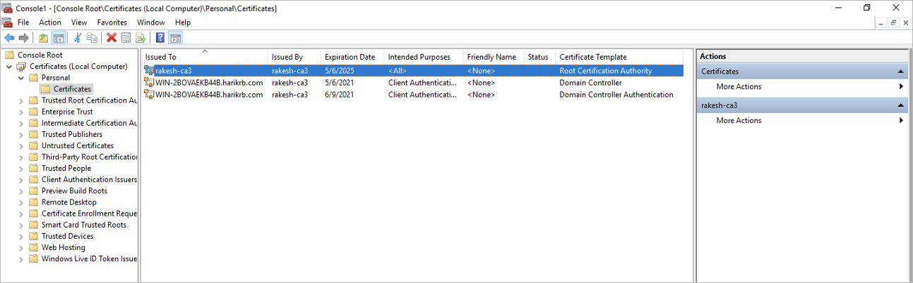](../media/personal-ca-certificates.png#lightbox)

2. Select the root certificate from the list and click **All Tasks**. Select **Export**.

    [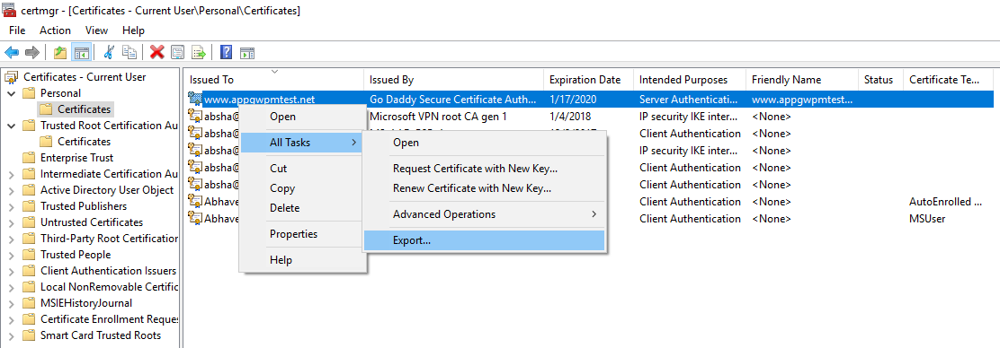](../media/ex-export-root-ca.png#lightbox)

3. Select **No, do not export the private key**, and then click **Next**.

    [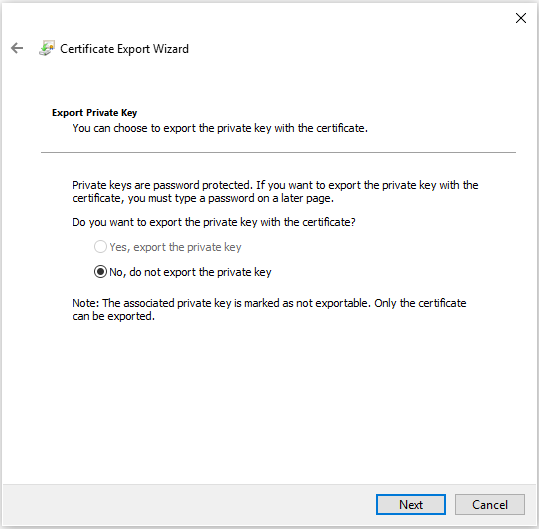](../media/ex-certificate-export-wizard.png#lightbox)

4. On the Export File Format page, select **Base-64 encoded X.509 (.CER)**, and then click **Next**.

    [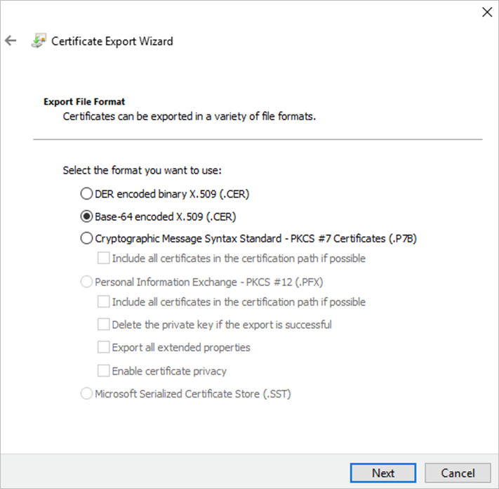](../media/ex-base-64-encoded.png#lightbox)

5. For File to Export, **Browse** to the location to which you want to export the certificate. For **File name**, name the certificate file. Then, click **Next**.

    [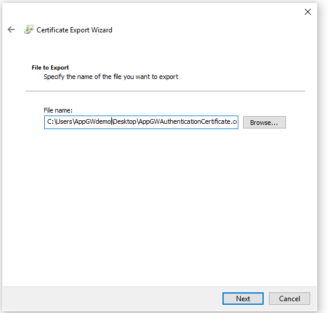](../media/ex-file-name.png#lightbox)

6. Click **Finish** to export the certificate. Your certificate is successfully exported.

    [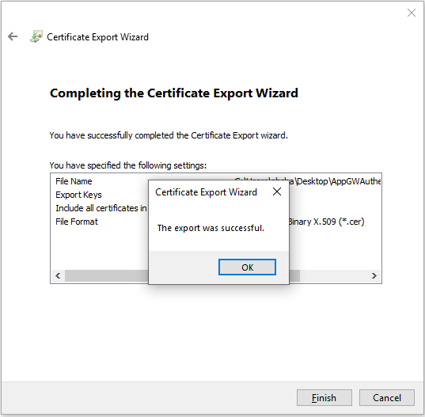](../media/ex-certificate-export-success.png#lightbox)

#### Enable LDAP over TLS and upload root CA certificate

1. Go to the NetApp account used for the volume and under Azure NetApp Files, select **Active Directory** connections.
2. Right click on the existing Active Directory connection from the list and select **Edit** to edit the connection.
3. In the **Edit Active Directory** window that appears, select the **LDAP over TLS** checkbox to enable LDAP over TLS for the volume.

4. Then select **Server root CA Certificate** and upload the generated root CA certificate to use for LDAP over TLS.

    [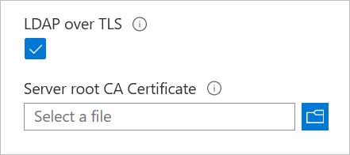](../media/ldap-over-tls-checkbox.png#lightbox)

5. Click **OK** for changes to take effect.
6. Ensure that the certificate authority name can be resolved by DNS. This name is the "Issued By" or "Issuer" field on the certificate:

    [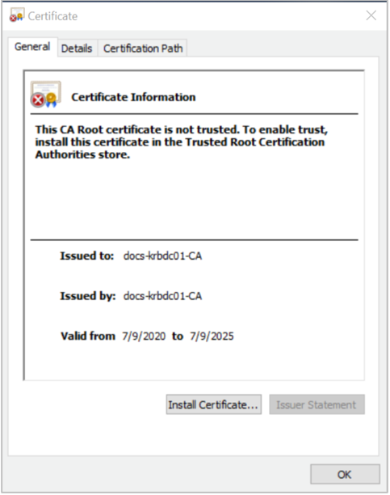](../media/ca-root-certificate-info.png#lightbox)

#### Disable LDAP over TLS

Disabling LDAP over TLS stops encrypting LDAP queries to Active Directory (LDAP server). There are no other precautions or impact on existing ANF volumes.

1. Go to the NetApp account and select **Active Directory connections** under Azure NetApp Files. Then right-click on the existing AD connection and select Edit to edit it.
2. In the **Edit Active Directory** window that appears, deselect the LDAP over TLS checkbox and select **OK** to disable LDAP over TLS for the volume.

    [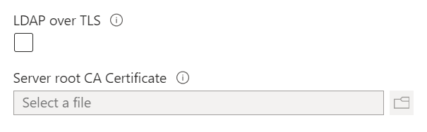](../media/ex-disable-ldap.png#lightbox)

### Task 4: Configure AD DS LDAP over TLS for Azure NetApp Files

In this task, you join a Linux virtual machine (VM) to a Microsoft Entra Domain Services. Once joined, the user accounts and credentials can be used to sign in, access, and manage servers.

1. Configure `/etc/resolv.conf` with the proper DNS server.

    For example:

    `[root@reddoc cbs]# cat /etc/resolv.conf`

    `search contoso.com`

    `nameserver 10.6.1.4(private IP)`

2. Add the NFS client record in the DNS server for the DNS forward and reverse lookup zone.

3. To verify DNS, use the following commands from the NFS client:

    `# nslookup [hostname/s client(s)]`

4. Install packages:

    `yum update`
    `sudo yum -y install realmd sssd adcli samba-common krb5-workstation chrony nfs-utils`

5. Configure the NTP client.

    RHEL 8 uses chrony by default. Following the configuration guidelines in [Using the Chrony suite to configure NTP](https://access.redhat.com/documentation/en-us/red_hat_enterprise_linux/7/html/system_administrators_guide/ch-configuring_ntp_using_the_chrony_suite).

6. Join the Active Directory domain:

    `sudo realm join $DOMAIN.NAME -U $SERVICEACCOUNT --computer-ou="OU=$YOUROU"`

    For example:

    `sudo realm join CONTOSO.COM -U ad\_admin --computer-ou="CN=Computers"`
