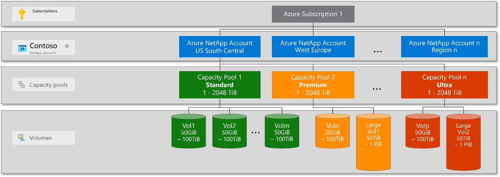
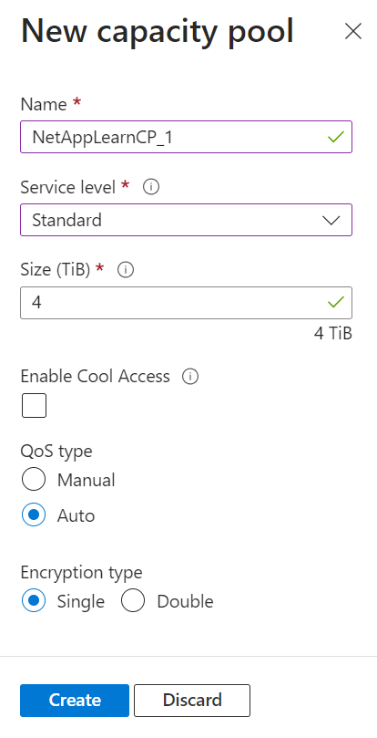

### Capacity pools

A capacity pool is measured by its provisioned capacity. A capacity pool can have only one service level. Each capacity pool can belong to only one NetApp account. However, you can have multiple capacity pools within a NetApp account. You can configure any service-level capacity pool with the cool access option.

You can't move a capacity pool across NetApp accounts. You can't delete a capacity pool until you delete all volumes within the capacity pool.

To create a capacity pool, go to the Azure portal. From the navigation pane, select **Capacity pools**.

- Select **+ Add pools** to create a new capacity pool. The New Capacity Pool window appears.

- You need to provide the following information while creating a new capacity pool:

| Setting | Description |
| --- | --- |
| **a. Name** | Specify the name for the capacity pool. The capacity pool name must be unique for each NetApp account. |
| **b. Service level** | This field shows the target performance for the capacity pool. Specify the service level for the capacity pool: Ultra, Premium, or Standard. |
| **c. Size** | Specify the size of the capacity pool that you're purchasing. The minimum capacity pool size is 1 TiB. You can change the size of a capacity pool in 1-TiB increments. |
| **d. Enable cool access** | This option specifies whether volumes in the capacity pool support cool access. This option is supported for all service levels. |
| **e. QoS** | Specify whether the capacity pool should use the Manual or Auto QoS type. **Note**: Setting QoS type to Manual is permanent. You cannot convert a manual QoS capacity pool to use auto QoS. |
| **f. Encryption type** | Specify whether you want the volumes in this capacity pool to use single or double encryption. |

- Once you finish entering the details click **Create**. The Capacity pools page shows the configurations for the capacity pool.
