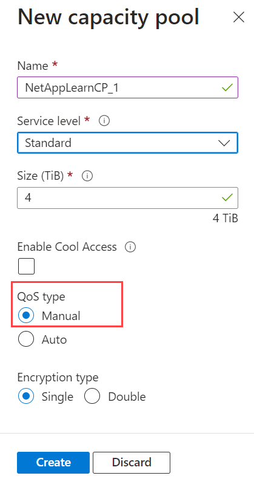
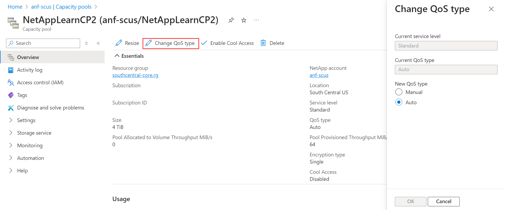
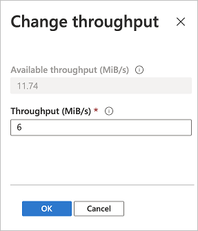

Here you learn how to manage a capacity pool that uses the manual QoS type.

The QoS type is an attribute of a capacity pool. Azure NetApp Files provides two QoS types of capacity pools:

- **Automatic (or auto) QoS type** - In an auto QoS capacity pool, throughput is assigned automatically to the volumes in the pool, proportional to the size quota assigned to the volumes. The default QoS type is set to auto.
- **Manual QoS type** - In a manual QoS capacity pool, you can assign the capacity and throughput for a volume independently. When you create a capacity pool, you can specify the capacity pool to use the manual QoS type. You can also change an existing capacity pool to use the manual QoS type.

### Set up a new manual QoS capacity pool

To create a new capacity pool using the manual QoS type, you follow the same steps used to create a new capacity pool. In the New Capacity Pool window, select the Manual QoS type.

### Change a capacity pool to use manual QoS

You can change a capacity pool that currently uses the auto QoS type to use the manual QoS type. Setting QoS type to Manual is permanent. You cannot convert a manual QoS capacity pool to use auto QoS.

Choose the capacity pool that you want to change to using manual QoS and select **Change QoS type**. Then set **New QoS Type** to **Manual.** Select **OK**.

### Modify the allotted throughput of a manual QoS volume

If a volume is contained in a manual QoS capacity pool, you can modify the allotted volume throughput as needed.

1. From the Volumes page, select the volume whose throughput you want to modify.
2. Select **Change throughput**. Specify the **Throughput (MiB/S)** that you want. Select **OK**.

