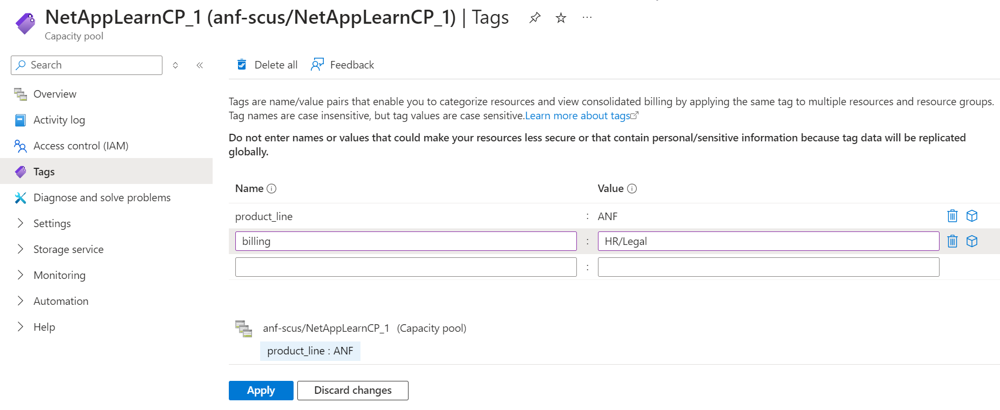
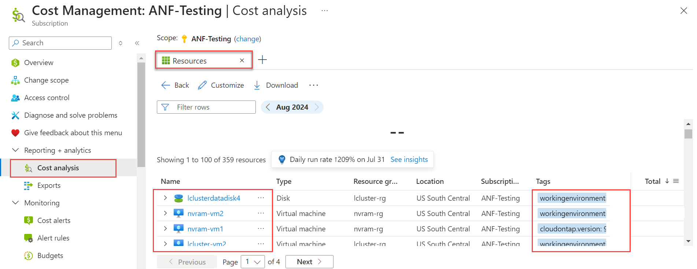
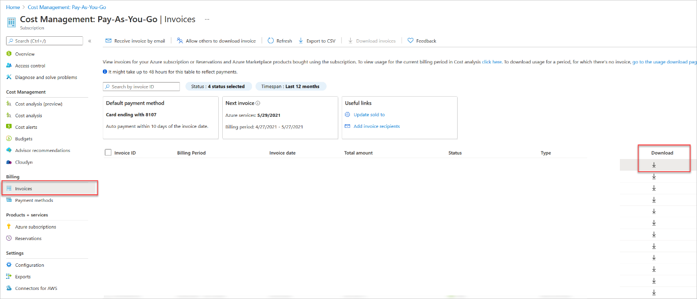
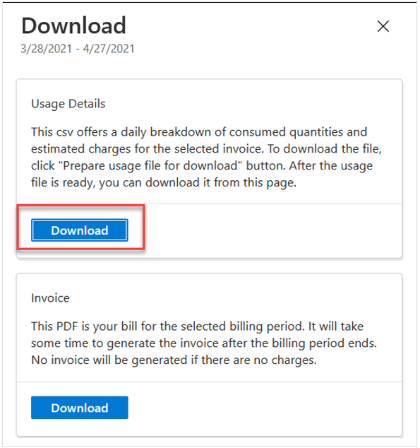
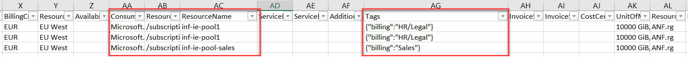

Tags are name and value pairs that enable you to categorize resources and view consolidated billing. You can apply the same tag to multiple resources and resource groups. Using tags helps you manage Azure NetApp Files billing and expenses.

> [!NOTE]
> Billing tags are assigned at the capacity pool level, not volume level.

To add or edit a tag on a capacity pool, go to the **capacity pool** and select **Tags.**

- You need to fill in the **Name** and **Value** pair for the tag on a capacity pool.

You can display and download information about tagged resources by using the Microsoft Cost Management portal:

- Click **Cost Analysis** under **Reporting + analytics** and select the **Resources** view.

- To download an invoice, select **Invoices** and then the **Download** button.

- In the Download window that appears, download usage details. The downloaded csv file includes capacity pool billing tags for the corresponding resources.

