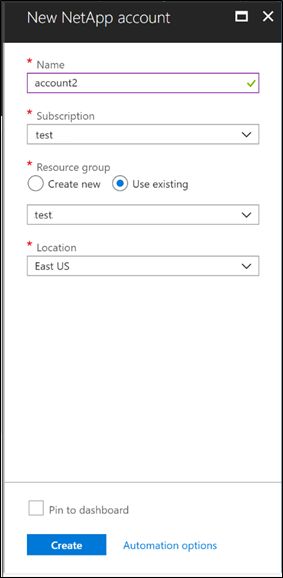

Creating a NetApp account enables you to set up a capacity pool so that you can create a volume. You use the Azure NetApp Files pane to create a new NetApp account.

- A NetApp account serves as an administrative grouping of the constituent capacity pools.
- A NetApp account isn't the same as your general Azure storage account.
- A NetApp account is regional in scope.
- You can have multiple NetApp accounts in a region, but each NetApp account is tied to only a single region.

You need to first sign in to the Azure portal and access the Azure NetApp Files pane by using one of the following methods:

- Search for Azure NetApp Files in the Azure portal search box.
- Select All services in the navigation, and then filter to Azure NetApp Files.

From the Azure NetApp Files pane, you can select **+ Add** to create a new NetApp account. In the New NetApp account window, provide the following information for your NetApp account:

- **Account name**: Specify a unique name for the subscription.
- **Subscription**: Select a subscription from your existing subscriptions.
- **Resource group**: Use an existing resource group or create a new one.
- **Location**: Select the region where you want the account and its child resources to be located.

    
