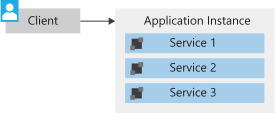

Fabrikam integrated their new drone service into their existing application. They realize that this solution isn't a good long-term plan for their application. The existing system is a monolithic architecture, but what exactly does that mean?

## What is a monolithic architecture?

A monolithic architecture is an architecture where all components for an application are colocated within a single unit. This unit is typically constrained within a single runtime instance of the application. Traditional applications often consist of a web interface, a services layer, and a data layer. In a monolithic architecture, these layers are combined on an instance of the application.

Monolithic architectures are often suitable solutions for small applications, but they can become unwieldy as the application grows. What was originally a small application can quickly become a complex system that's difficult to scale, difficult to deploy to, and difficult to innovate on.

All the services are contained within a single unit. This arrangement brings challenges as their business, and subsequent system load, grows. Some of these challenges are:

- Difficult to scale services independently.
- Complex to develop and manage deployments as the codebase grows, which slows releases and new feature implementation.
- The architecture is tied to a single technology stack, which limits innovation in new platforms and SDKs.
- Data schema updates can be increasingly difficult.

These challenges can be addressed by looking at alternative architectures, such as a microservices architecture.

## What is a microservices architecture?

A microservices architecture consists of services that are small, independent, and loosely coupled. Each service can be deployed and scaled independently.

A microservice is small enough that a single small team of developers can write and maintain it. Because services can be deployed independently, a team can update an existing service without rebuilding and redeploying the entire application.

Each service is typically responsible for its own data. Its data structure is isolated, so upgrades or changes to schema aren't dependent on other services. Requests for data typically are handled through APIs and provide a well-defined and consistent access model. Internal implementation details are hidden from service consumers.

Because each service is independent, they can use different technology stacks, frameworks, and SDKs. It's common to see services rely on REST calls for service-to-service communication by using well-defined APIs instead of remote procedure calls (RPCs) or other custom communication methods.

Microservice architectures are technology agnostic, but you often see containers or serverless technologies used for their implementation. Continuous deployment and continuous integration (CI/CD) is frequently used to increase the speed and quality of development activities.

### Benefits of a microservices architecture

Why would you choose a microservices architecture? There are several primary benefits to a microservices architecture:

- Agility
- Small code, small teams
- Mix of technologies
- Resiliency
- Scalability
- Data isolation

#### Agility

Because microservices are deployed independently, it's easier to manage bug fixes and feature releases. You can update a service without redeploying the entire application and rolling back an update if something goes wrong. In many traditional applications, if a bug is found in one part of the application, it can block the entire release process. As a result, new features might be held up waiting for a bug fix to be integrated, tested, and published.

#### Small code, small teams

A microservice should be small enough that a single feature team can build, test, and deploy it. Small code bases are easier to understand. In a large monolithic application, code dependencies tend to become tangled over time. Adding a new feature requires touching code in many places. A microservices architecture minimizes dependencies by not sharing code or data stores. That makes it easier to add new features.

Small team sizes also promote greater agility. The "two-pizza rule" says that a team should be small enough that two pizzas can feed the team. Obviously, that's not an exact metric and depends on team appetites! But the point is that large groups tend to be less productive because communication is slower, management overhead goes up, and agility diminishes.

#### Mix of technologies

Teams can pick the technology that best fits their service. They can use a mix of technology stacks as appropriate. Each team can evolve the technologies that support their service independently. Services can use different development languages, cloud services, SDKs, and more, because of this independence. Teams can pick the best options for their service, while minimizing any external effect on consumers of the service.

#### Resiliency

If an individual microservice becomes unavailable, it doesn't disrupt the entire application, as long as any upstream microservices are designed to handle faults correctly (for example, by implementing circuit breaking). The benefit to your users or service consumers is an always-on experience for your application.

#### Scalability

A microservices architecture allows each microservice to be scaled independently of the others. You can scale out subsystems that require more resources without scaling out the entire application. This arrangement improves the overall performance of your application. It also helps to minimize costs. You can add more resources to only the services that need them, instead of scaling up your entire application.

#### Data isolation

A microservices architecture improves the ability to perform data schema updates because only a single microservice is affected. In a monolithic application, schema updates can become challenging. Different parts of the application might all touch the same data, which makes any alterations to the schema risky. With a microservices architecture, you can update a schema but keep your API surface intact. Service consumers then have the same experience regardless of the underlying data architecture.

### Potential challenges of a microservices architecture

There are many benefits to a microservices architecture, but it's not a fix-all. A microservices architecture has its own set of challenges:

- Complexity
- Development and testing
- Lack of governance
- Network congestion and latency
- Data integrity
- Management
- Versioning
- Skill set

#### Complexity

A microservices application has more moving parts than the equivalent monolithic application. Each service is simpler, but the entire system as a whole is more complex. With service discovery, orchestration, and automation tools, there can be more pieces to manage in the overall application.

#### Development and testing

Writing a small service that relies on other dependent services requires a different approach from writing for a traditional monolithic or layered application. Existing tools aren't always designed to work with service dependencies. Refactoring across service boundaries can be difficult. It's also challenging to test service dependencies, especially when the application is evolving quickly.

#### Lack of governance

The decentralized approach to building microservices has advantages, but it can also lead to problems. You might end up with so many different languages and frameworks that the application becomes hard to maintain. It might be useful to put some project-wide standards in place, without overly restricting teams' flexibility. The need for uniform standards especially applies to cross-cutting functionality, such as logging and metrics.

#### Network congestion and latency

The use of many small, granular services can result in more interservice communication. If the chain of service dependencies gets too long, for example, service A calls B, which calls C..., the extra latency of these network calls can become a problem. Design your APIs carefully. Avoid overly chatty APIs, think about serialization formats, and look for places to use asynchronous communication patterns.

#### Data integrity

Each microservice is responsible for its own data persistence. As a result, data consistency can be a challenge. Embrace eventual consistency where possible. You can also end up with duplicated data and a sprawling data architecture. This situation can increase raw storage costs and data platform service costs with service and data duplication.

#### Management

Success with microservices requires a mature DevOps culture. Correlated logging across services can be challenging. Typically, logging must correlate multiple service calls for a single user operation.

#### Versioning

Updates to a service must not break services that depend on it. Multiple services could be updated at any given time. Without careful design, you might have problems with backward or forward compatibility. Services that lag on adopting new API versions can increase the resources and maintenance required for older APIs.

#### Skill set

Microservices are highly distributed systems. These distributed systems often require a different skill set to properly develop, manage, and maintain. Carefully evaluate whether the team has the skills and experience to be successful. Allow for the time and planning that your teams need to evolve their abilities.

## When should you choose a microservices architecture?

Based on this background information, what situations is a microservices architecture best suited for?

- Large applications that require a high release velocity.
- Complex applications that need to be highly scalable.
- Applications with rich domains or many subdomains.
- An organization that consists of small development teams.
