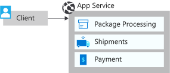

We talked a bit about monolithic and microservices architectures. Now, let's deploy a monolithic application and dive further into how we can evolve it into a microservices architecture.

Fabrikam recently added the drone service into their existing application.

In this exercise, we deploy a monolithic application on Azure App Service, and enable Azure Monitor to get visibility into telemetry and application performance.



## Deploy a monolithic application on Azure App Service

Let's start by deploying the application. First, we need to create the Azure resources to host the application.

1. Run the following command to deploy the resources that are needed for this application. This deployment takes a few minutes.

    ```azurecli
    az deployment group create \
        --resource-group <rgn>[sandbox resource group]</rgn> \
        --template-uri https://raw.githubusercontent.com/MicrosoftDocs/mslearn-microservices-architecture/master/deployment/azuredeploy.json
    ```

1. Now that we have the resources created, let's deploy the application. First, run the following command to pull down the source code from the sample repository.

    ```azurecli
    git clone https://github.com/MicrosoftDocs/mslearn-microservices-architecture.git ~/mslearn-microservices-architecture
    cd ~/mslearn-microservices-architecture/src/before
    ```

1. Run the following command to zip up the application code, which we use to deploy to the app service.

    ```bash
    zip -r DroneDelivery-before.zip .
    ```

1. Run the following command to set a variable with the name of your app service.

    ```bash
    APPSERVICENAME="$(az webapp list \
                        --resource-group <rgn>[sandbox resource group]</rgn> \
                        --query '[].name' \
                        --output tsv)"
    ```

1. Run the following command to configure the app service to run a build as part of the deployment.

    ```azurecli
    az webapp config appsettings set \
        --resource-group <rgn>[sandbox resource group]</rgn> \
        --name $APPSERVICENAME \
        --settings SCM_DO_BUILD_DURING_DEPLOYMENT=true
    ```

1. And now, run the following command to deploy the application to App Service. This deployment takes a few minutes to finish.

    ```azurecli
    az webapp deployment source config-zip \
        --resource-group <rgn>[sandbox resource group]</rgn> \
        --name $APPSERVICENAME \
        --src DroneDelivery-before.zip
    ```

1. After the deployment finishes, confirm that the deployment is successful by visiting the website of your app service. Run the following command to get the URL, and select it to open the page.

    ```bash
    echo https://$(az webapp config hostname list \
                    --resource-group <rgn>[sandbox resource group]</rgn> \
                    --webapp-name $APPSERVICENAME \
                    --query [].name \
                    --output tsv)
    ```

    :::image type="content" source="../media/3-web-site-before.png" alt-text="Screenshot of the Drone Delivery website." loc-scope="other":::

## Perform a load test against the application

Now, let's test out the performance of the application in its monolithic architecture.

1. On the home page for your deployed application, select **Send Requests**. This action simulates the submission of 100 requests through the application.

1. For the first request, you see a result of around 8 to 12 seconds to process 100 messages. If you refresh the page, and resubmit if prompted, this number might drop by about half. It still takes around five seconds per request.

    :::image type="content" source="../media/3-performance-test.png" alt-text="Screenshot of the Drone Delivery website after running the performance test." loc-scope="other":::

Fabrikam suspects that the monolithic architecture is preventing heavily used services from scaling, which leads to the poor performance seen here.
