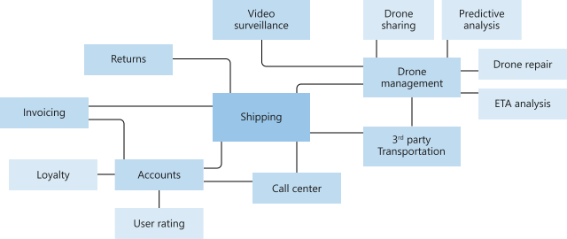
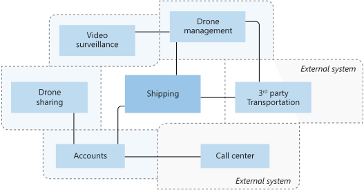
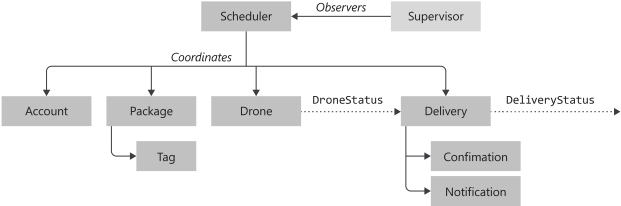
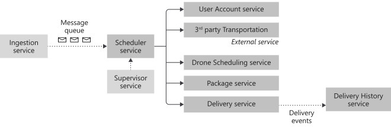

To move their application to a microservices architecture, Fabrikam needs to evaluate their current application and determine the scope and boundary of each microservice. For this evaluation, they're going to use the *domain-driven design* (DDD) framework. Let's see how they apply it to their application.

> [!NOTE]
> This article doesn't show a complete and comprehensive domain analysis. We deliberately kept the example brief to illustrate the main points. For more information about DDD, see the "Learn more" section in the summary at the end of this module.

## What is domain-driven design?

DDD is an approach to system design originally introduced by Erik Evans in the 2005 book *Domain-Driven Design: Tackling Complexity in the Heart of Software*. This approach includes three key elements:

- Focus on the core domain and domain logic.
- Structure the design on a model of the domain.
- Drive iterative collaboration between the technical teams and business partners to constantly improve the system.

DDD provides a framework that can get you most of the way to a set of well-designed microservices. It has two distinct phases, *strategic* and *tactical*. In strategic DDD, you define the large-scale structure of the system. Strategic DDD helps to ensure that your architecture remains focused on business capabilities. Tactical DDD provides a set of design patterns that you can use to create the domain model. These patterns include entities, aggregates, and domain services. These tactical patterns help you to design microservices that are loosely coupled and cohesive.

During the strategic phase of DDD, you map out the business domain and define bounded contexts for your domain models. Tactical DDD is when you define your domain models with more precision. The tactical patterns are applied within a single bounded context. In a microservices architecture, we're interested in the entity and aggregate patterns. Applying these patterns helps us to identify natural boundaries for the services in our application. As a general principle, a microservice should be no smaller than an aggregate and no larger than a bounded context.

At a high level, you can break this process into four steps:

1. Analyze the business domain to understand the application's functional requirements. The output of this step is an informal description of the domain, which can be refined into a more formal set of domain models.
2. Define the bounded contexts of the domain. Each bounded context contains a domain model that represents a particular subdomain of the larger application.
3. Within a bounded context, apply tactical DDD patterns to define entities, aggregates, and domain services.
4. Identify the microservices in your application by using the results from the previous step.

Let's take a closer look at what happens at each of these steps.

### Analyze the business domain

DDD starts by modeling the business domain and creating a domain model. The domain model is an abstract model of the business domain. It distills and organizes domain knowledge, and it provides a common language for developers and domain experts.

Start by mapping all of the business functions and their connections. This analysis is a collaborative effort that involves domain experts, software architects, and other stakeholders. You don't need to use any particular formalism. Sketch a diagram or draw it out on a whiteboard.

As you fill in the diagram, you might start to identify discrete subdomains. Which functions are closely related? Which functions are core to the business, and which provide ancillary services? What is the dependency graph? During this initial phase, you aren't concerned with technologies or implementation details. That said, you should note the place where the application needs to integrate with external systems, such as CRM, payment processing, or billing systems.

### Define bounded contexts

The domain model includes representations of real things in the world like users, drones, and packages. But that doesn't mean that every part of the system needs to use the same representations for the same things.

For example, subsystems that handle drone repair and predictive analysis need to represent many physical characteristics of drones. These characteristics include maintenance history, mileage, age, model number, and performance details. But when it's time to schedule a delivery, we don't care about those things. The scheduling subsystem only needs to know whether a drone is available and the estimated time of arrival (ETA) for pickup and delivery.

If we try to create a single model for both of these subsystems, it's more complex than we need. It also becomes harder for the model to evolve over time, because any changes need to satisfy multiple teams that work on separate subsystems. It's often better to design separate models that represent the same real-world entity (in this case, a drone) in two different contexts. Each model contains only the features and attributes that are relevant within its particular context.

This approach is where the DDD concept of bounded contexts comes into play. A bounded context is simply the boundary within a domain where a particular domain model applies. Looking at the previous diagram, we can group functionality according to whether various functions share a single domain model.

### Define entities, aggregates, and services

Tactical DDD is when you define your domain models with more precision. The tactical patterns are applied within a single bounded context. In a microservices architecture, we're interested in the entity and aggregate patterns. Applying these patterns helps us to identify natural boundaries for the services in our application. As a general principle, a microservice should be no smaller than an aggregate and no larger than a bounded context.

There are several tactical DDD patterns to consider:

- **Entities:** An entity is an object with a unique identity that persists over time. For example, in a banking application, customers and accounts are entities.
- **Value objects:** A value object has no identity. The values of its attributes define it, and it's immutable. Typical examples of value objects include colors, dates and times, and currency values.
- **Aggregates:** An aggregate defines a consistency boundary around one or more entities. The purpose of an aggregate is to model transactional invariants. Things in the real world have complex webs of relationships. Customers create orders, orders contain products, products have suppliers, and so on. If the application modifies several related objects, how does it guarantee consistency? How do we keep track of invariants and enforce them?
- **Domain and application services:** In DDD terminology, a service is an object that implements some logic without holding any state. Evans distinguishes between domain services, which encapsulate domain logic, and application services, which provide technical functionality. Application services typically include technical functionality such as user authentication or sending an SMS message. Domain services are often used to model behavior that spans multiple entities.
- **Domain events:** Domain events can be used to notify other parts of the system when something happens. As the name suggests, domain events should mean something within the domain. For example, "a record was inserted into a table" isn't a domain event. "A delivery was canceled" is a domain event. Domain events are especially relevant in a microservices architecture. Because microservices are distributed and don't share data stores, domain events provide a way for microservices to coordinate with each other.

In their system, the Fabrikam development team identified the following entities:

- Delivery
- Package
- Drone
- Account
- Confirmation
- Notification
- Tag

The first four entities, delivery, package, drone, and account, are all aggregates that represent transactional consistency boundaries. Confirmations and notifications are child entities of deliveries. Tags are child entities of packages.

The value objects in this design include Location, ETA, PackageWeight, and PackageSize.

There are two domain events:

- While a drone is in flight, the drone entity sends DroneStatus events that describe the drone's location and status, for example, in-flight, landed.
- The delivery entity sends DeliveryTracking events whenever the stage of a delivery changes. These events include DeliveryCreated, DeliveryRescheduled, DeliveryHeadedToDropoff, and DeliveryCompleted.

Notice that these events describe things that are meaningful within the domain model. They describe something about the domain and aren't tied to a particular programming language construct.

The development team identified one more area of functionality, which doesn't fit neatly into any of the entities described so far. Some part of the system must coordinate all of the steps involved in scheduling or updating a delivery. The development team added two domain services to the design. A Scheduler coordinates the steps. A Supervisor monitors the status of each step, in order to detect whether any steps failed or timed out.

### Identify microservices

Now we're ready to go from domain model to application design. Here's an approach that you can use to derive microservices from the domain model.

1. Start with a bounded context. In general, the functionality in a microservice shouldn't span more than one bounded context. By definition, a bounded context marks the boundary of a particular domain model. If your microservice mixes different domain models together, it's a sign that you might need to refine your domain analysis.
1. Next, look at the aggregates in your domain model. Aggregates are often good candidates for microservices. A well-designed aggregate shows many of the characteristics of a well-designed microservice:
    - An aggregate is derived from business requirements rather than technical concerns, such as data access or messaging.
    - An aggregate should have high functional cohesion.
    - An aggregate is a boundary of persistence.
    - Aggregates should be loosely coupled.
1. Domain services are also good candidates for microservices. Domain services are stateless operations across multiple aggregates. A typical example is a workflow that involves several microservices. Later, we see an example of a domain service in the Drone Delivery application.
1. Finally, consider nonfunctional requirements. Look at factors such as team size, data types, technologies, scalability requirements, availability requirements, and security requirements. These factors might lead you to further decompose a microservice into two (or more) smaller services, or to do the opposite and combine several microservices into one.

It's important to be pragmatic and remember that domain-driven design is an iterative process. When in doubt, start with more coarse-grained microservices. It's easier to split a microservice into two smaller services than to refactor functionality across several existing microservices.

## Apply domain-driven design to the drone application

For Fabrikam's application, all of these services reside in their existing monolithic application. After identifying where they can decompose their application into microservices, they're going to start with the package service.

The package service currently has a focused development team, is exhibiting performance issues related to scalability, and is a great candidate to begin the decomposition of their application.
