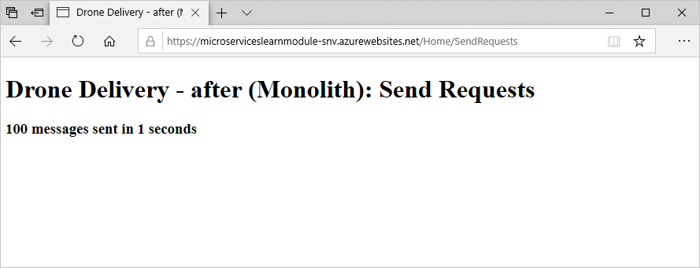

Now that Fabrikam has analyzed their application, they are now ready to start the refactoring process to actually move services out of their monolithic architecture into microservices. Let's modify the application to move the package processing service into a microservice.


## Refactor application

Before we deploy the updated application, let's take a look at how it was updated. The monolithic app has a service to process packages, *PackageProcessor.cs*. After analyzing the performance of the application, this service was identified as a performance bottleneck. As customers continue to increase the demand for drone deliveries, this service becomes heavily loaded while it handles the scheduling and logistics for drone deliveries. This service is also fully managed by a dedicated team, and moving this service to a microservice would not only help with performance, but with improved development agility.

Let's look closer at the actual changes that have been made.

### Drone Delivery before

The core functionality of the package processing is handled by the `PackageProcessor` class in the [*PackageProcessor.cs*](https://github.com/MicrosoftDocs/mslearn-microservices-architecture/blob/master/src/before/DroneDelivery-before/Services/PackageProcessor.cs) file. In this example, it performs some work that is resource intensive. You could imagine a real world scenario where this might be calculating delivery times, delivery routes, and updating data sources with this information.

```csharp
public class PackageProcessor : IPackageProcessor
    {
        public Task<PackageGen> CreatePackageAsync(PackageInfo packageInfo)
        {
            //Uses common data store e.g. SQL Azure tables
            Utility.DoWork(100);
            return Task.FromResult(new PackageGen { Id = packageInfo.PackageId });
        }
    }
```

As requests for this service increase, resource utilization increases and is capped at the physical resources allocated to the monolithic application. If deployed on App Service, we can scale this up and out, but you'd ideally like this heavily used resource to scale independently to optimize performance and costs. In this scenario, we'll use Azure Functions to do just that.

### Drone Delivery after

If you take a look at the [DroneDelivery-after](https://github.com/MicrosoftDocs/mslearn-microservices-architecture/blob/master/src/before/DroneDelivery-before/Services/PackageProcessor.cs) application code that we will deploy shortly, you'll see that the `PackageProcessor` class has been changed to a `PackageServiceCaller` class. It still implements the IPackageProcessor interface, but instead makes an HTTP call to the microservice.

```csharp
public class PackageServiceCaller : IPackageProcessor
    {
        private readonly HttpClient httpClient;

        public static string FunctionCode { get; set; }

        public PackageServiceCaller(HttpClient httpClient)
        {
            this.httpClient = httpClient;
        }

        public async Task<PackageGen> CreatePackageAsync(PackageInfo packageInfo)
        {
            var result = await httpClient.PutAsJsonAsync($"{packageInfo.PackageId}?code={FunctionCode}", packageInfo);
            result.EnsureSuccessStatusCode();

            return new PackageGen { Id = packageInfo.PackageId };
        }
    }
```

The microservice will be deployed on an Azure Function. Its code can be found in [*PackageServiceFunction.cs*](https://github.com/MicrosoftDocs/mslearn-microservices-architecture/blob/master/src/after/PackageService/PackageServiceFunction.cs) and contains the following code.

```csharp
public static class PackageServiceFunction
    {
        [FunctionName("PackageServiceFunction")]
        public static Task<IActionResult> Run(
            [HttpTrigger(AuthorizationLevel.Function, "put", Route = "packages/{id}")] HttpRequest req,
            string id, ILogger log)
        {
            log.LogInformation("C# HTTP trigger function processed a request.");

            //Uses common data store e.g. SQL Azure tables
            Utility.DoWork(100);
            return Task.FromResult((IActionResult)new CreatedResult("http://example.com", null));
        }
    }
```

By putting this code on an Azure Function, this service can scale independently as user load increases. This allows you to keep the services for the remaining application code optimized for the rest of the application, while allowing the package service to scale out as more requests for drone deliveries come in to the system.

Now let's redeploy the application. We'll deploy our refactored service on Azure Functions first, then deploy the refactored application on App Service, and point it to the function.

## Deploy Azure Function

1. Run this command to set up environment variables pointed to our services.

    ```azurecli
    APPSERVICENAME="$(az webapp list \
                        --resource-group <rgn>[sandbox resource group]</rgn> \
                        --query '[].name' \
                        --output tsv)"
    FUNCTIONAPPNAME="$(az functionapp list \
                        --resource-group <rgn>[sandbox resource group]</rgn> \
                        --query '[].name' \
                        --output tsv)"
    ```

1. Let's build and zip up the application code for the function.

    ```bash
    cd ~/mslearn-microservices-architecture/src/after
    dotnet build ./PackageService/PackageService.csproj -c Release
    cd PackageService/bin/Release/netcoreapp2.2
    zip -r PackageService.zip .
    ```

1. Run this command to push the code to the Azure Function.

    ```azurecli
    az functionapp deployment source config-zip \
        --resource-group <rgn>[sandbox resource group]</rgn> \
        --name $FUNCTIONAPPNAME \
        --src PackageService.zip
    ```

## Deploy the updated DroneDelivery application

Now that our service is running on an Azure Function, we need to point our drone application to that function.

1. We first need to get the access code for the function, so we can successfully call it from the application. Run the following commands to retrieve this code. You'll display the function app name and code, for use in the next steps.

    ```azurecli
    RESOURCEGROUPID=$(az group show \
                        --resource-group <rgn>[sandbox resource group]</rgn> \
                        --query id \
                        --output tsv)
    FUNCTIONCODE=$(az rest \
                        --method post \
                        --query default \
                        --output tsv \
                        --uri "https://management.azure.com$RESOURCEGROUPID/providers/Microsoft.Web/sites/$FUNCTIONAPPNAME/functions/PackageServiceFunction/listKeys?api-version=2018-02-01")
    echo "FunctionName - $FUNCTIONAPPNAME"
    echo "FunctionCode - $FUNCTIONCODE"
    ```

1. In Cloud Shell run these commands to open *appsettings.json* in the Code editor.

    ```bash
    cd ~/mslearn-microservices-architecture/src/after
    code ./DroneDelivery-after/appsettings.json
    ```

1. In the Code editor, there are two values you need to replace; `PackageServiceUri` and `PackageServiceFunctionCode`. In `PackageServiceUri` replace `<FunctionName>` with the name of your function.

    In `PackageServiceFunctionCode` replace the `<FunctionCode>` with function code you retrieved. Once complete, your *appsettings.json* file should look similar to this:

    ```json
    {
      "Logging": {
        "LogLevel": {
          "Default": "Warning"
        }
      },
      "AllowedHosts": "*",
      "PackageServiceUri": "https://packageservicefunction-abc.azurewebsites.net/api/packages/",
      "PackageServiceFunctionCode": "SvrbiyhjXJUdTPXrkcUtY6bQaUf7OXQjWvnM0Gq63hFUhbH2vn6qYA=="
    }
    ```

1. Press `Ctrl-s` to save the file, and `Ctrl-q` to close the Code editor.

1. Run this command to deploy the updated application to App Service.

    ```bash
    zip -r DroneDelivery-after.zip . -x \*/obj/\* \*/bin/\*
    az webapp deployment source config-zip \
        --resource-group <rgn>[sandbox resource group]</rgn> \
        --name $APPSERVICENAME \
        --src DroneDelivery-after.zip
    ```

1. With the site redeployed, refresh your page and you should see that it has been updated.

    

## Test performance of new architecture

Now that we have moved the resource constrained service to a microservice running on an Azure Function, let's see how this impacted application performance.

1. On the home page of your web site, select **Send Requests**. This will submit requests from your monolithic app to the microservice running on an Azure Function.

1. The first attempt may give similar results to the monolithic application. Refresh the page and resubmit the request if prompted. Do this several times, and you should see **100 messages sent in 1 second**.

    

The initial attempt was slower while the Azure Function started up. Once it was up and running, the response time was significantly better than when this code was running in the monolithic architecture. This piece of the architecture can now be scaled out almost infinitely while still providing the same performance. By running moving this application code to a microservice, we have improved performance by five to 10 times. Because Fabrikam has a dedicated development team for this service can also iterate on this microservice and realize the benefits of increased agility and feature releases.