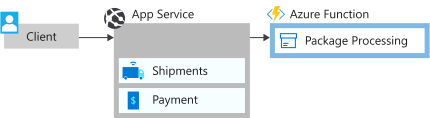

Now that Fabrikam is done analyzing their application, they're ready to start the refactoring process to move services out of their monolithic architecture into microservices. Let's modify the application to move the package processing service into a microservice.



## Refactor the application

Before we deploy the updated application, let's take a look at how it was updated. The monolithic app has a service to process packages, *PackageProcessor.cs*. After the performance of the application was analyzed, this service was identified as a performance bottleneck. As customers increase the demand for drone deliveries, this service becomes heavily loaded while it handles the scheduling and logistics for drone deliveries. A dedicated team fully manages this service, so moving it to a microservice helps with performance and provides improved development agility.

Let's look closer at the changes that were made.

### Drone delivery before

The `PackageProcessor` class handles the core functionality of the package processing in the [*PackageProcessor.cs*](https://github.com/MicrosoftDocs/mslearn-microservices-architecture/blob/master/src/before/DroneDelivery-before/Services/PackageProcessor.cs) file. In this example, it performs some work that is resource intensive. A real-world scenario might include calculating delivery times and delivery routes and updating data sources with this information.

```csharp
public class PackageProcessor : IPackageProcessor
    {
        public Task<PackageGen> CreatePackageAsync(PackageInfo packageInfo)
        {
            //Uses common data store e.g. SQL Azure tables
            Utility.DoWork(100);
            return Task.FromResult(new PackageGen { Id = packageInfo.PackageId });
        }
    }
```

As requests for this service increase, resource utilization increases and is capped at the physical resources allocated to the monolithic application. If this service is deployed on Azure App Service, we can scale it up and out. Ideally, you want this heavily used resource to scale independently to optimize performance and costs. In this scenario, we use Azure Functions to do just that.

### Drone delivery after

Let's take a look at the [DroneDelivery-after](https://github.com/MicrosoftDocs/mslearn-microservices-architecture/blob/master/src/before/DroneDelivery-before/Services/PackageProcessor.cs) application code before we deploy it. You can see that the `PackageProcessor` class was changed to a `PackageServiceCaller` class. It still implements the IPackageProcessor interface, but instead it makes an HTTP call to the microservice.

```csharp
public class PackageServiceCaller : IPackageProcessor
    {
        private readonly HttpClient httpClient;

        public static string FunctionCode { get; set; }

        public PackageServiceCaller(HttpClient httpClient)
        {
            this.httpClient = httpClient;
        }

        public async Task<PackageGen> CreatePackageAsync(PackageInfo packageInfo)
        {
            var result = await httpClient.PutAsJsonAsync($"{packageInfo.PackageId}?code={FunctionCode}", packageInfo);
            result.EnsureSuccessStatusCode();

            return new PackageGen { Id = packageInfo.PackageId };
        }
    }
```

The microservice is deployed on an Azure function. Its code can be found in [*PackageServiceFunction.cs*](https://github.com/MicrosoftDocs/mslearn-microservices-architecture/blob/master/src/after/PackageService/PackageServiceFunction.cs) and contains the following code.

```csharp
public static class PackageServiceFunction
    {
        [FunctionName("PackageServiceFunction")]
        public static Task<IActionResult> Run(
            [HttpTrigger(AuthorizationLevel.Function, "put", Route = "packages/{id}")] HttpRequest req,
            string id, ILogger log)
        {
            log.LogInformation("C# HTTP trigger function processed a request.");

            //Uses common data store e.g. SQL Azure tables
            Utility.DoWork(100);
            return Task.FromResult((IActionResult)new CreatedResult("http://example.com", null));
        }
    }
```

When you put this code on Azure Functions, this service can scale independently as user load increases. You can keep the services for the remaining application code optimized for the rest of the application. The package service scales out as more requests for drone deliveries come in to the system.

Now, let's redeploy the application. First, we deploy our refactored service on Azure Functions. Then, we deploy the refactored application on App Service, and point it to the function.

## Deploy the function app

1. Run the following command to set up environment variables pointed to our services.

    ```azurecli
    APPSERVICENAME="$(az webapp list \
                        --resource-group <rgn>[sandbox resource group]</rgn> \
                        --query '[].name' \
                        --output tsv)"
    FUNCTIONAPPNAME="$(az functionapp list \
                        --resource-group <rgn>[sandbox resource group]</rgn> \
                        --query '[].name' \
                        --output tsv)"
    ```

1. Let's build and zip up the application code for the function app.

    ```bash
    cd ~/mslearn-microservices-architecture/src/after
    dotnet build ./PackageService/PackageService.csproj -c Release
    cd PackageService/bin/Release/netcoreapp2.2
    zip -r PackageService.zip .
    ```

1. Run the following command to push the code to the function app.

    ```azurecli
    az functionapp deployment source config-zip \
        --resource-group <rgn>[sandbox resource group]</rgn> \
        --name $FUNCTIONAPPNAME \
        --src PackageService.zip
    ```

## Deploy the updated Drone Delivery application

Now that our service is running on Azure Functions, we need to point our drone application to that function app.

1. We first need to get the access code for the function app so that we can successfully call it from the application. Run the following commands to retrieve this code. You display the function app name and code for use in the next steps.

    ```azurecli
    RESOURCEGROUPID=$(az group show \
                        --resource-group <rgn>[sandbox resource group]</rgn> \
                        --query id \
                        --output tsv)
    FUNCTIONCODE=$(az rest \
                        --method post \
                        --query default \
                        --output tsv \
                        --uri "https://management.azure.com$RESOURCEGROUPID/providers/Microsoft.Web/sites/$FUNCTIONAPPNAME/functions/PackageServiceFunction/listKeys?api-version=2018-02-01")
    echo "FunctionName - $FUNCTIONAPPNAME"
    echo "FunctionCode - $FUNCTIONCODE"
    ```

1. In Azure Cloud Shell, run the following commands to open *appsettings.json* in the code editor.

    ```bash
    cd ~/mslearn-microservices-architecture/src/after
    code ./DroneDelivery-after/appsettings.json
    ```

1. In the code editor, replace the values `PackageServiceUri` and `PackageServiceFunctionCode`. In `PackageServiceUri`, replace `<FunctionName>` with the name of your function app.

    In `PackageServiceFunctionCode`, replace the `<FunctionCode>` with the function code you retrieved. Your *appsettings.json* file should look similar to this example:

    ```json
    {
        "Logging": {
        "LogLevel": {
            "Default": "Warning"
        }
        },
        "AllowedHosts": "*",
        "PackageServiceUri": "https://packageservicefunction-abc.azurewebsites.net/api/packages/",
        "PackageServiceFunctionCode": "SvrbiyhjXJUdTPXrkcUtY6bQaUf7OXQjWvnM0Gq63hFUhbH2vn6qYA=="
    }
    ```

1. Press <kbd>Ctrl+S</kbd> to save the file, and then <kbd>Ctrl+Q</kbd> to close the code editor.

1. Run the following command to deploy the updated application to your App Service.

    ```bash
    zip -r DroneDelivery-after.zip . -x \*/obj/\* \*/bin/\*
    az webapp deployment source config-zip \
        --resource-group <rgn>[sandbox resource group]</rgn> \
        --name $APPSERVICENAME \
        --src DroneDelivery-after.zip
    ```

1. With the site redeployed, refresh your page. It should now be updated.

    :::image type="content" source="../media/7-web-site-after.png" alt-text="Screenshot of the redeployed Drone Delivery website." loc-scope="other":::

## Test the performance of the new architecture

Now that the resource-constrained service is moved to a microservice that runs on Azure Functions, let's see how this change affected application performance.

1. On the home page of your website, select **Send Requests**. This action submits requests from your monolithic app to the microservice that runs on an Azure function.

1. The first attempt might give similar results to the monolithic application. Refresh the page, and resubmit the request if prompted. Do this step several times, and you should see **100 messages sent in 1 second**.

    :::image type="content" source="../media/7-web-site-fast.png" alt-text="Screenshot of performance of the Drone Delivery site after moving to a microservices architecture." loc-scope="other":::

The initial attempt was slower while the function app started up. After it was up and running, the response time was better than when this code was running in the monolithic architecture.

This piece of the architecture can now be scaled out almost infinitely while it still provides the same performance. By moving this application code to a microservice, we improved performance by 5 to 10 times. Because Fabrikam has a dedicated development team for this service, they can also iterate on this microservice and realize the benefits of increased agility and feature releases.
