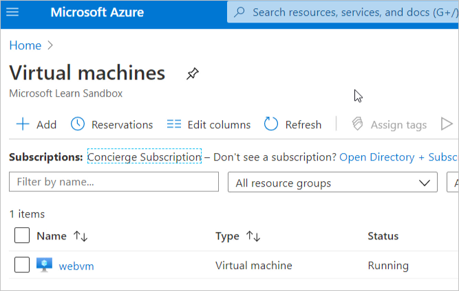
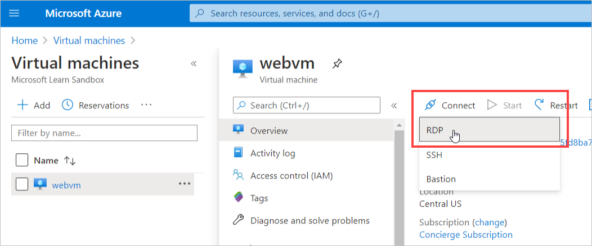
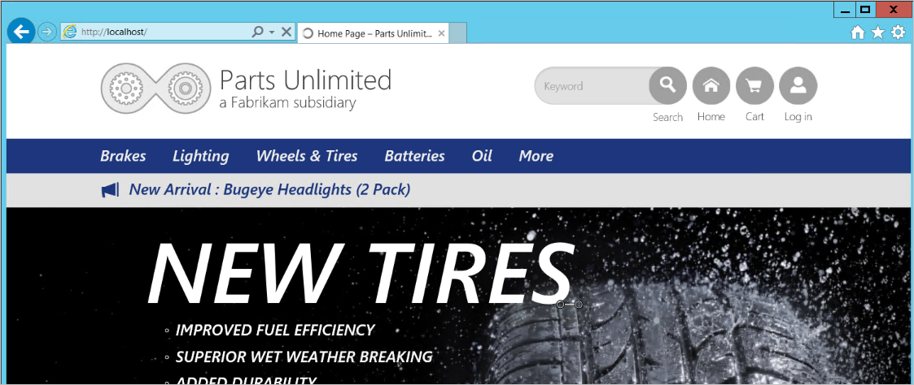
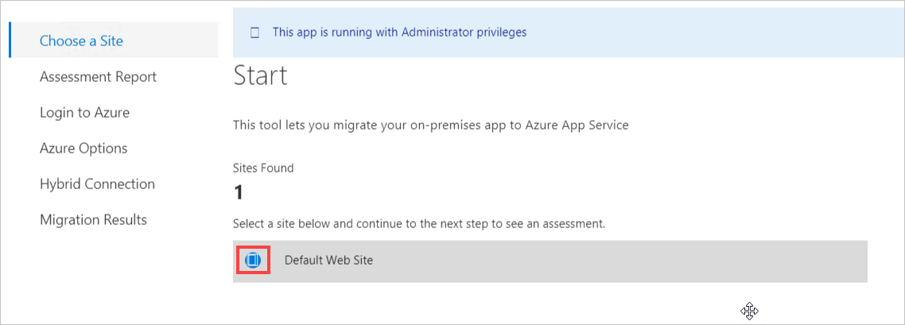

Now that you've deployed the virtual machine that contains your web application to the sandbox environment, you can use the Azure App Service Migration Assistant to perform an assessment and migration to Azure App Service.

> [!Important]
> This module assumes you've successfully completed the steps in unit 2 and have activated the sandbox and run the first setup script. If you haven't, go back and complete the unit titled "Exercise - Set up the environment" before continuing.

## Exercise steps

In this exercise, you'll complete the setup steps, sign in to your Azure account, and work in a sandbox environment provisioned for you. Connect remotely to the VM that was set up for this exercise, and perform an assessment by using the Azure App Service Migration Assistant already installed on the VM.

1. Copy and paste the following script into Azure Cloud Shell on the right, and run the script by pressing <kbd>Enter</kbd>.

    ```bash
    ./finish.sh
    ```

    This script waits for the previous script (from the second unit) to finish, so you might see the following message:

    "Waiting for provisioning to complete ..."

    When that script is finished, you should see the credentials for the VM that was provisioned in the sandbox.

2. Go to the [Azure portal](https://portal.azure.com/learn.docs.microsoft.com?azure-portal=true) on a new browser tab. Sign in with the same username and password that you used to sign in to activate the sandbox.

    In the upper-right corner, under your account username, you should see that you're logged in to the directory **Microsoft Learn Sandbox**.

3. Select the **Virtual machines** icon, after selecting **More services**. You should see a single VM named **webvm** listed.

    

4. Select the **webvm** item in the list. The details for the VM appear.

5. On the upper details toolbar, select **Connect**, and then select **RDP** from the dropdown list.  

    

    On the **Connect** pane, select **Download RDP File**.

    

    The file webvm.rdp is downloaded to your local computer.

6. Open the webvm.rdp file. You are prompted for the VM's security credentials in the **Windows Security** dialog box. Select **Use a different account**. Copy and paste the username and password from step 1 into the dialog box, and select **OK**.

   When the **Remote Desktop Connection** dialog box appears, and warns you about the remote computer's security certificate, select **Yes**. The remote desktop opens for the VM.

7. On the remote desktop, open Internet Explorer, and go to `http://localhost`. Confirm that the Parts Unlimited website is successfully running. This site is hosted in IIS in the virtual machine, and connects to an Azure SQL database. Over the course of this exercise, you'll perform a migration assessment on this site and then migrate it to App Service.

    

8. On the remote VM's desktop, double-click the icon to open the Azure App Service Migration Assistant. The user interface then lists the Migration Assistant's steps with the first step highlighted, **Choose a Site**. In the main area, the Migration Assistant informs that it found one site to assess.  

9. Select the **Default Web Site** option.  

    

    Then, select **Next** at the bottom of the dialog box. This begins the assessment of the site.

10. After a moment, the assessment report step should finish. You should see that all 13 assessments were successful with no warnings or errors. 

    You might take a moment to expand the chevron icon next to the label **Success (13)** to see the types of assessments that the Migration Assistant performed. We covered some of these assessments in an earlier unit.

You've successfully completed the exercise setup and the assessment of the website. Next, you'll learn about migration.
