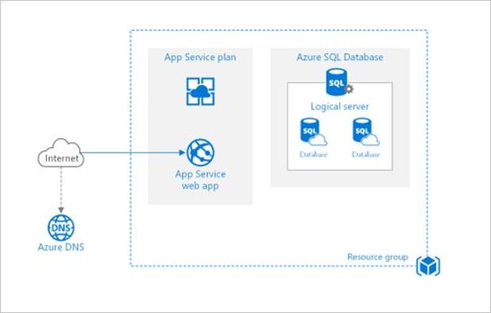
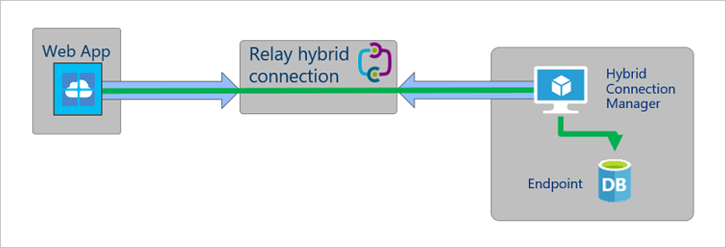

Now that the assessment has determined that you can migrate your web app to Azure App Service, you can complete the migration. But what does the Migration Assistant do? How does it work? And when it asks for you to choose various settings, what should you choose and why?

## How the Migration Assistant migrates your web app

The Migration Assistant begins the migration process by collecting key details from you about your Azure account and then performs the migration.  

First, sign in to your Azure account and associate your Migration Assistant session with your account by using a unique code. Next, choose the subscription, the resource group, and the website's domain name. You can choose to create a new App Service plan to host the app, or select an existing plan. The choice affects the geographical region from which your app is hosted. You can also associate this migration effort with an existing Azure Migrate project. (We'll talk about this in a moment.) Finally, you can either choose to skip database setup or choose to set up a hybrid connection to enable a database connection.

After the Migration Assistant collects and verifies your selections, it gets to work. It creates the needed App Service resources in the selected region and resource group. It zips up the web app's source files and uses the App Service deployment API to deploy them. Finally, it performs optional migration steps, like helping you set up a hybrid connection.

After a successful migration, you'll need to perform any post-migration tasks. They might include:

- Manually moving application settings and connection strings in your web.config file to Azure App Service.
- Migrating data from an on-premises SQL Server instance to an Azure SQL database.
- Setting up an SSL certificate.
- Setting up custom domain names.
- Setting up permissions in Azure Active Directory.

You might also decide to change the App Service hosting plan and other settings like autoscaling and deployment slots.  

### Migration scenario

The following diagram describes a typical web application that hosts an architecture where the web server is deployed in a perimeter network (also known as DMZ, demilitarized zone, and screened subnet). An application server (a web API accessible via HTTP) and a database server are hosted behind a firewall in an intranet zone.

After migration, the website and the web API would be hosted on a single App Service web app. The database would be moved to an Azure SQL Database instance. Both would be deployed to a single resource group.

As a result of the migration to Azure SQL Database, the customer would experience increased resiliency and redundancy.

## App Service plans

During migration, the Migration Assistant will:

- Create an App Service hosting plan.
- Deploy your web app to a single Premium P1v2 VM instance.

If you're new to Azure App Service, it's important to understand key distinctions between your web app, the hosting plan, and VM instances that will host your web app.

The App Service hosting plans are divided into tiers based on the intended workloads that they were designed to support. Hosting plans affect:

- The maximum number of virtual machine instances available to run your app, and the performance characteristics of those virtual machines.
- Availability of features like VPN hybrid connectivity, network isolation, and autoscale.
- The service-level agreement (SLA).

For example, the Free and Shared tiers are for small proofs of concept and testing, so there's no SLA and multiple apps share virtual machines. On the other end of the spectrum, the Isolated service plan is for mission-critical workloads that run in a private, dedicated virtual networked environment with state-of-the-art hardware, more RAM, and faster processors and SSD storage.

Within each hosting plan, you can select the instance size. Instance size affects:

- The number of cores, amount of RAM, and amount of disk storage.
- Pricing.

You can deploy multiple web apps to a single hosting plan (similar to running multiple web apps on a single instance of IIS). All web apps will share the same VM instances.

For more information, see [App Service overview](/azure/app-service/overview).

## Database migration

The Azure App Service Migration Assistant doesn't migrate your database to Azure SQL Database. In fact, you're not required to migrate your database to Azure at all. In that case, the Migration Assistant can help you set up a hybrid connection to your on-premises database as an optional step.  

Although you can use a hybrid connection in a production environment, you might want to consider the impact on performance. You might then think about a hybrid connection as a temporary, interim solution before you move your data to Azure SQL Database. Hybrid connections to your data might also be useful in a development or testing scenario.

If you select the **Setup a hybrid connection** option, the Migration Assistant will prompt you to download and run Hybrid Connection Manager on your server. Hybrid Connection Manager connects your web app running in Azure App Service to Azure Service Bus Relay to facilitate a connection with your on-premises database endpoint.  

The following diagram is a high-level overview of the relationship between your migrated web app, your on-premises database, Hybrid Connection Manager, and the Relay hybrid connection.

For more information, see [Azure App Service Hybrid Connections](/azure/app-service/app-service-hybrid-connections).

To perform a migration, you can use the Data Migration Assistant. For more information, see [Overview of Data Migration Assistant](/sql/dma/dma-overview?view=sql-server-2017).

You might be interested in another Learn module, [Assess and convert SQL Server Databases using the Data Migration Assistant (DMA)](/training/modules/assess-convert-sql-server-databases-using-dma/).

## What is an Azure Migrate project?

Earlier, we mentioned that you can associate your migration with an Azure Migrate project. Azure Migrate is a hub for matters related to migration. Organizations use Azure Migrate to capture information about all the servers and services that they hope to migrate to Azure. They can use this information as a form of discovery and assessment to determine the scope of their migration efforts. They can adequately plan, inform stakeholders, determine costs, track migration status, and so on.  

Azure Migrate supports key migration scenarios like:

- Migrating Windows and Linux servers (whether those servers are VMs hosted in VMware or Hyper-V, physical servers, or even other clouds).
- Migrating SQL Server and other databases, including the data.
- Migrating virtual desktops.
- Migrating web apps by using the Azure App Service Migration Assistant.

So, if you already have an Azure Migrate project setup, you can specify the name of the project during migration. This step will save the migration details and status in your Azure Migrate hub.

## Recap

In this unit, we covered several concepts:

- If the Azure App Service Migration Assistant assessment determines that the Migration Assistant can migrate your web app, it will collect information about your Azure account, create new App Service resources in Azure, and deploy your app to them.
- After the migration, you might need to take more steps to get your web app into working order.
- An App Service hosting plan determines the features, type of hardware, and SLA available to your web app. The instance size determines the number of cores, amount of RAM, and amount of available storage.
- A single instance can host multiple web apps. All apps are scaled on all instances.
- During migration, the Migration Assistant can help set up a hybrid connection to your on-premises database servers.
- During migration, the Migration Assistant can log its progress into an existing Azure Migrate project.
