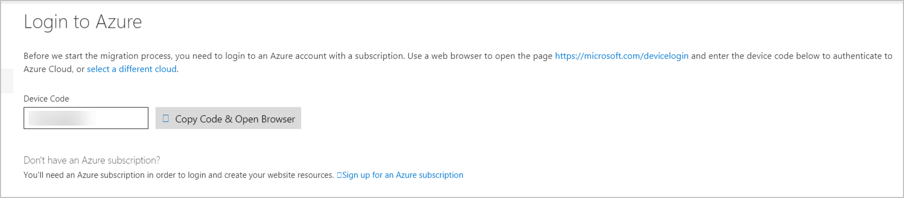
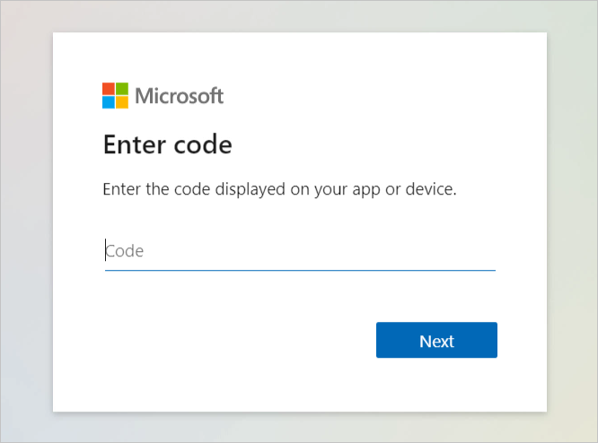
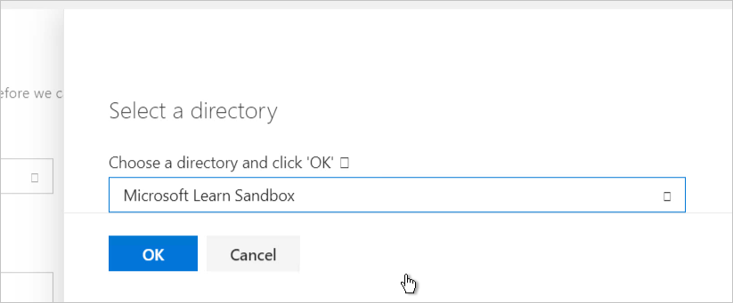
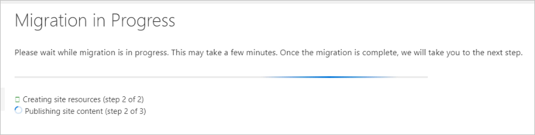

The last step is to perform the migration. In this unit, you sign in to your Azure account and associate your Migration Assistant session. Fill out the details for migration, and then watch as the Migration Assistant goes to work. Finally, you'll observe the web app running in Azure App Service and view the settings of your new Azure App Service account.

> [!Important]
> This module assumes you've successfully completed the steps in the previous units. If you haven't, go back and complete the previous units before continuing.

## Exercise steps

Here you'll continue the exercise from the point where you left off in a previous unit, on the assessment report for the **Default Web Site** option.

1. Select **Next** to display the **Login to Azure** step. Here you'll use a special code to associate this assessment on your server to your Azure account.  

    In the next few steps, you'll need to use the device code and sign in to your Azure account using your Azure credentials. You'll need to do this on your local computer. You'll copy the URL and the device code from your VM session and paste the URL and device code into a web browser on your local computer.

2. In the Migration Assistant, you'll see the **Login to Azure** page with a device code and a button. Copy the device code to the clipboard.

    

3. Go to the [device login service](https://microsoft.com/devicelogin?azure-portal=true). You should see the **Enter code** webpage on your local computer.

    

4. On your local computer, select **Next**. Sign in using the same account that you used to sign in to Learn and activate the sandbox. This step might require you to use two-factor authentication.

    After you sign in, you should see a confirmation message that you have successfully signed in to the Azure App Service Migration Assistant application on your device.

5. Back in the Migration Assistant running in the remote VM, the step **Azure Options** is displayed. Here, you'll enter details about the target App Service instance to which you'll move your app.  

    Select the link at the end of the text **Switch user directory**. Ensure that the **Microsoft Learn Sandbox** directory is selected.

    

6. Use the following table to make your selections:

    | Field | Your entry |
    | --- | ----------- |
    | Subscription | Select **Concierge Subscription**. |
    | Resource Group | Select the **Use Existing** option. This should automatically select an existing resource group prefixed with the word "learn." |
    | Destination Site Name | Enter a valid name for the destination site. |
    | App Service Plan | Select the **Use exiting** option. This automatically selects **Learn-Exercise-Plan**, which was created for you at the beginning of the exercise. |
    | Azure Migrate Project | Leave this field empty. |

    > [!Note]
    > In this exercise, you'll deploy to a free-tier App Service plan that was created for you as part of the exercise. This plan does not support the hybrid connection functionality that's needed to enable the database connectivity option for the Migration Assistant. When you use the Migration Assistant in your own environment, you can choose to deploy to an existing App Service plan or create a new one. After the Migration Assistant migrates your web app, you might want to change the service tier to adjust the pricing as desired.

7. Select **Migrate**. The **Migration in Progress** screen displays the current status of the migration. 

    

    After the migration is complete, you'll continue to the **Migration Results** step.  

8. Open the [Azure portal](https://portal.azure.com/learn.docs.microsoft.com?azure-portal=true) on a new tab on your local computer. Select **App Service** from the home page. From the list of deployed services, select the one that matches the name that you created earlier. This will display the settings for your new App Service account.

    From here, you can explore the features of your new App Service account. You can experiment by changing settings and viewing the logs and other diagnostic information.

9. Select the **Browse** button at the top of the overview page to browse to your migrated site running in Azure.

Congratulations! You have successfully migrated a web app running on IIS to Azure App Service by using the Azure App Service Migration Assistant.
