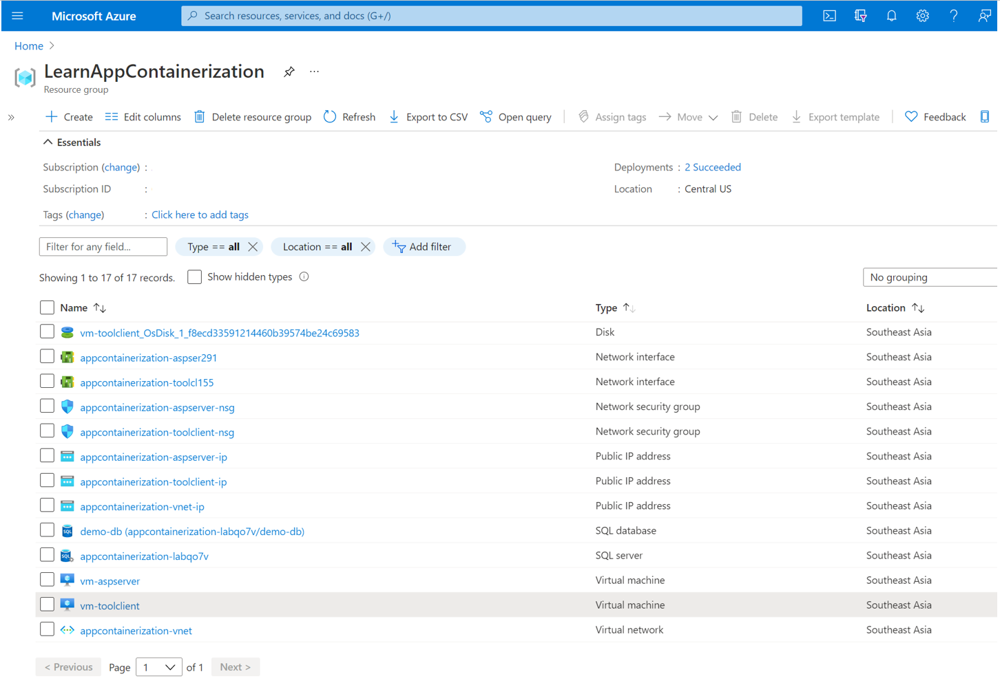
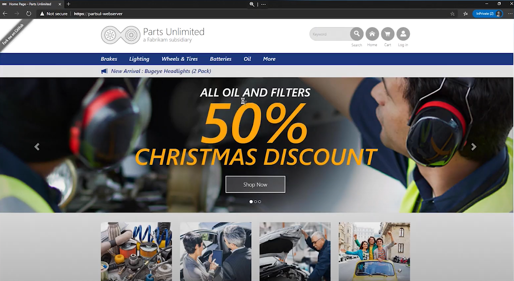

For this module, we will try to containerize and migrate the PartsUnlimited application. PartsUnlimited is an eCommerce storefront for the PartsUnlimited store for automobile parts. We will deploy PartsUnlimited in a two-tier configuration with the application front end built on .NET Framework running on a Windows Server and the application backend running on Microsoft Azure SQL Database.  

## Prepare your Azure account

If you don't have an Azure subscription, create a [free account](https://azure.microsoft.com/pricing/free-trial/) before you begin.

Once your subscription is set up, you'll need an Azure user account with:
- Owner permissions on the Azure subscription
- Permissions to register Azure Active Directory apps

If you just created a free Azure account, you're the owner of your subscription. If you're not the subscription owner, work with the owner to assign the permissions as follows:

1. In the Azure portal, search for "subscriptions", and under **Services**, select **Subscriptions**.

    

2. In the **Subscriptions** page, select the subscription in which you want to create an Azure Migrate project. 
3. In the subscription, select **Access control (IAM)** > **Check access**.
4. In **Check access**, search for the relevant user account.
5. In **Add a role assignment**, select **Add**.

    

6. In **Add role assignment**, select the Owner role, and select the account (azmigrateuser in our example). Then select **Save**.

    

7. Your Azure account also needs **permissions to register Azure Active Directory apps.**
8. In Azure portal, navigate to **Azure Active Directory** > **Users** > **User Settings**.
9. In **User settings**, verify that Azure AD users can register applications (set to **Yes** by default).

      

10.  In case the 'App registrations' settings is set to 'No', request the tenant/global admin to assign the required permission. Alternately, the tenant/global admin can assign the **Application Developer** role to an account to allow the registration of Azure Active Directory App. 

## Setup PartsUnlimited application

1. To deploy the workshop environment, begin by navigating to the [Azure portal](https://portal.azure.com).
2. In your Azure subscription, create a new resource group **LearnAppContainerization**.
3. Select the button below to deploy the resources for the application. Selecting this button will take you to the Azure portal to deploy a custom template.  

     [](https://portal.azure.com/#create/Microsoft.Template/uri/https%3A%2F%2Fraw.githubusercontent.com%2FMicrosoftDocs%2Fmslearn-azuremigrate-appcontainerization-aspnet%2Fmain%2FASP.NET%2520Containerization%2Ftemplate.json)

4. Once the deployment is complete, you will see the following resources in your resource group. 

    

5. You'll need to create the SQL database that the migrated application will connect to. Follow the steps to create the SQL database.

    1. Open PowerShell on your local machine and download the SQL database file using the following command.

        ```powershell
        invoke-webrequest -uri "https://appcontainerizationlearn.blob.core.windows.net/partsappdatabasemslearn/partsunlimiteddb.bacpac" -outfile./partsunlimited.bacpac
        ```

    1. Create a storage account **appcontainerizationsa**.
    1. Add a container **partsunlimiteddbcontainer** to the storage account. Select the **Blob** option for the public access level setting. 
    1. In the container, select the **upload** option and select the downloaded file. 
    1. Go to the SQL Server resource created in the **LearnAppContainerization** resource group. The SQL Server will have a name similar to "appcontainerization-lab0000".
    1. Select the **import database** option and enter the following values. 
        1. Database name: *partsunlimiteddb*
        1. Server admin login: *adminuser*
        1. Password: *Password@123* 

6. To browse the application, select **vm-aspserver** virtual machine resource, copy the public IP address of the server and paste it in a browser window.

    

## Download and install Azure Migrate: App Containerization tool

1. In your resource group, select **vm-toolclient** virtual machine resource and log in to it using bastion. Use **adminuser** as the username and **Password@123** for password. You'll be using this machine to run the Azure Migrate: App Containerization tool to migrate the Parts Unlimited application hosted on *vm-aspserver*.
2. After logging in, [download](https://go.microsoft.com/fwlink/?linkid=2134571) the Azure Migrate: App Containerization installer on the Windows machine.
3. Launch PowerShell in administrator mode and run the following commands to install the tool.

   ```powershell
   cd Downloads
   .\AppContainerizationInstaller.ps1
   ```
4. Open Microsoft Edge browser and launch the tool by browsing to **https://toolclient:44369**. If you encounter a warning, select **Advanced** and **Continue to toolclient**. 